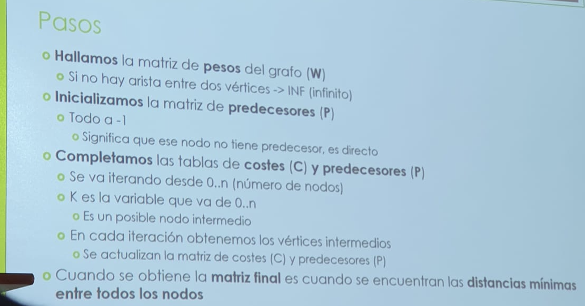

# 25 Marzo 2022 🎱
---
## Seminario 4
---
# Floyd-Warshall  y Dijkstra
- **Warshall:** O(n^3), para grafos pequeños o medios, basado en programación dinámica, con pesos positivos y negativos.
- **Dijkstra:** O(n^2), para grafos grandes o gigantes, basado en algoritmos voraces, con pesos sólo positivos.
---
## Floyd-Warshall, camino más corto
- Busca el camino mínimo en grafos dirigidos ponderados entre dos vértices.
- Matriz de pesos, costes y predecesores/caminos.

---
## Backtracking, camino más largo

---
# 8 Abril 2022 ✏️
---
## Seminario 5, Problema del viajero
---
 
 
 ### Camino Hamiltoniano
 
 
 ## Forma voraz
 Depende mucho del heurístico.
# EJ 1
 
 - SOL: Es la 2 

# Ej 2

# Soluciones

---
# Ejercicio de backtracking

- Backtracking tiene complejidad de O(N!) en el problema del viajero.

--- 
