>[!Tip]
>Te recomiendo que veas los siguientes archivos:
>- [Notas de Laboratorio ED 🍄](notas_laboratorio_ed.md)
>- [Seminarios ED 🚗](seminarios_ed.md) 
>- [Ejercicios y apuntes para Examen Teoría ED 🍑](ejercicios_y_apuntes_para_examen_teoría_ed)

# Mayo 2020

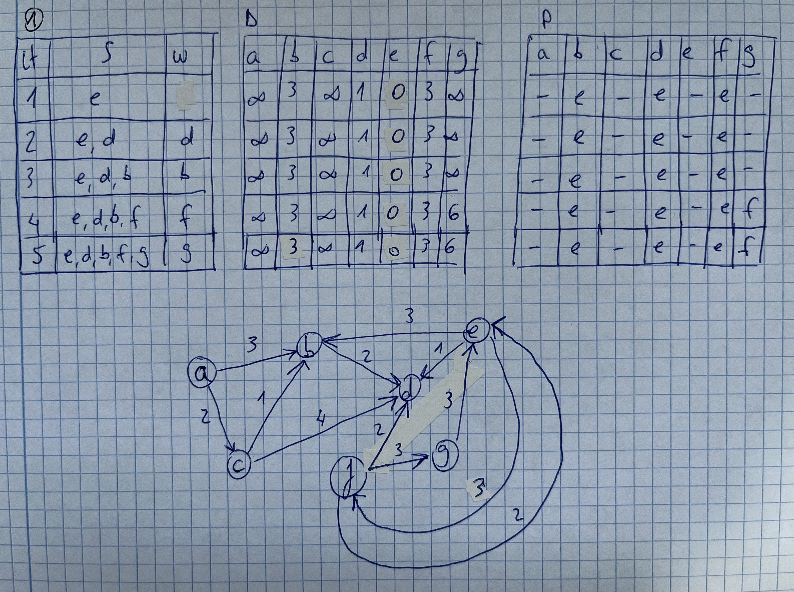

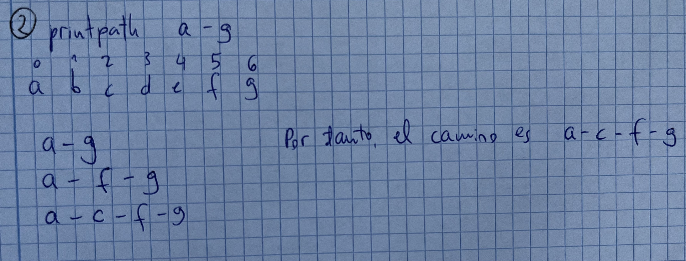

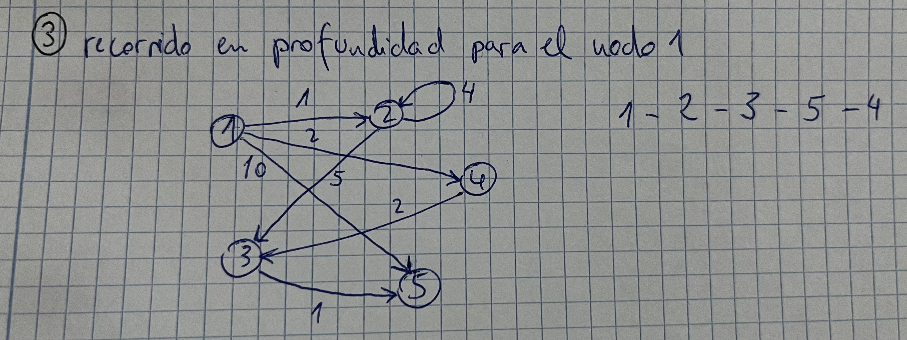

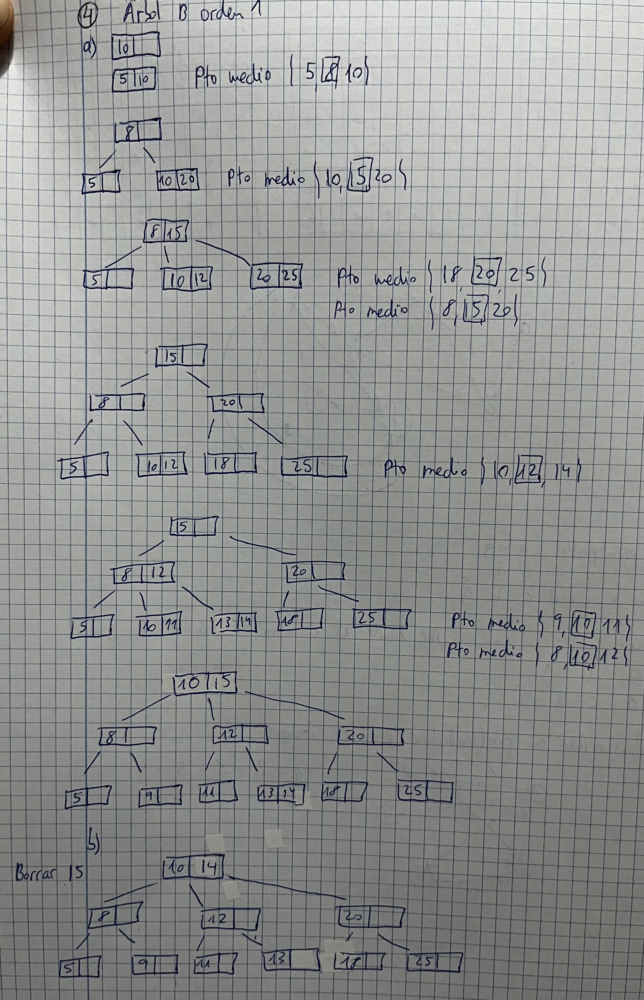

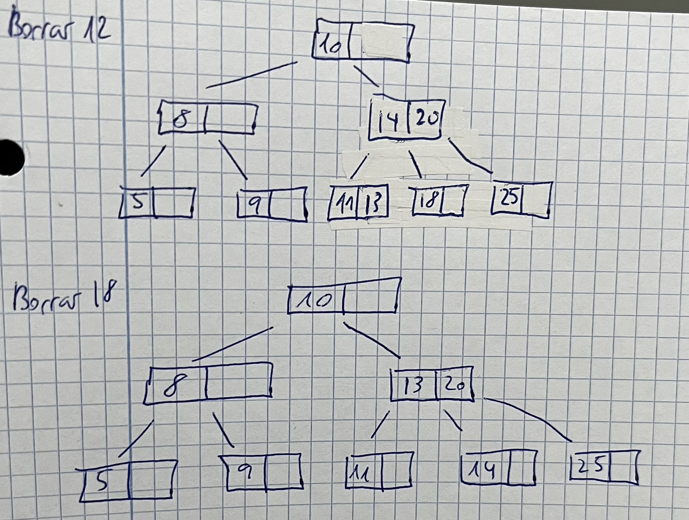

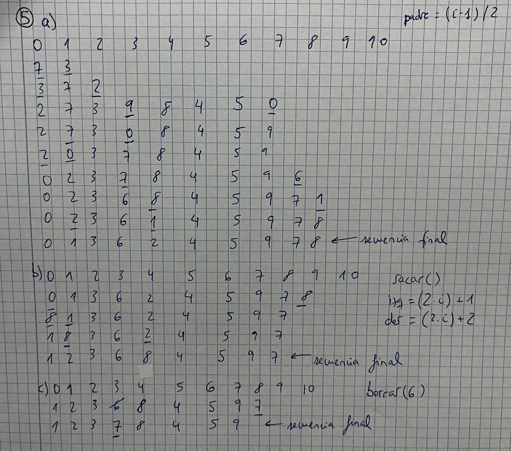

# Junio 2020

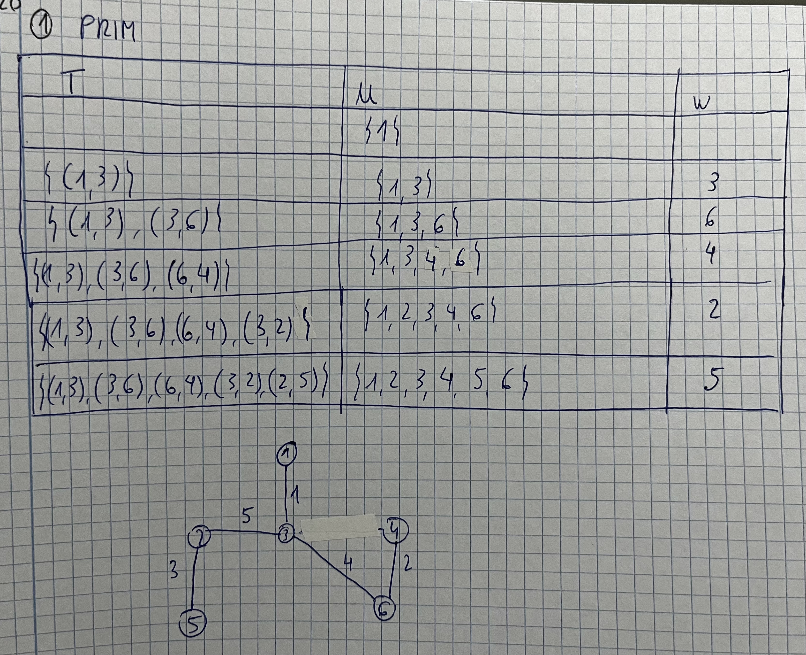

*NOTA: la excentricidad de un nodo v es el máximo de los costes de todos los caminos de coste mínimo con destino v*

*NOTA: el centro de un grafo se encuentra en aquel nodo de mínima excentricidad*

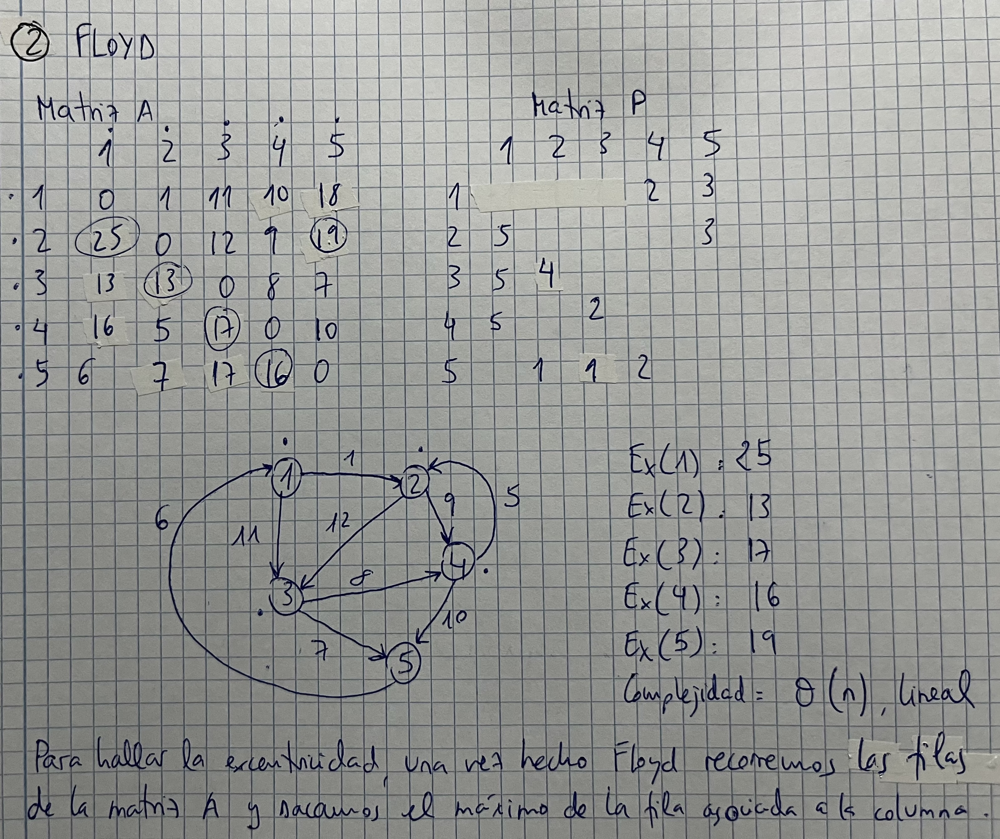

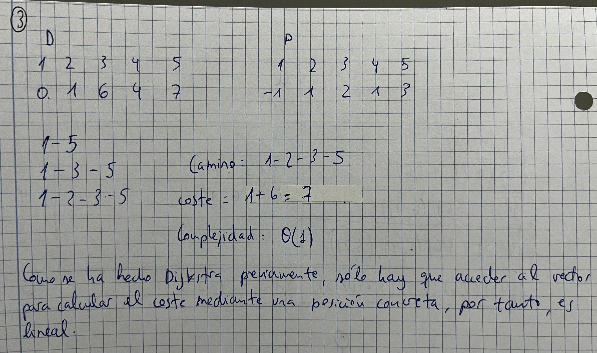

*NOTA: por lo general, el elemento que sustituye al elemento borrado es el mayor del subárbol derecho, pero aquí cambia*

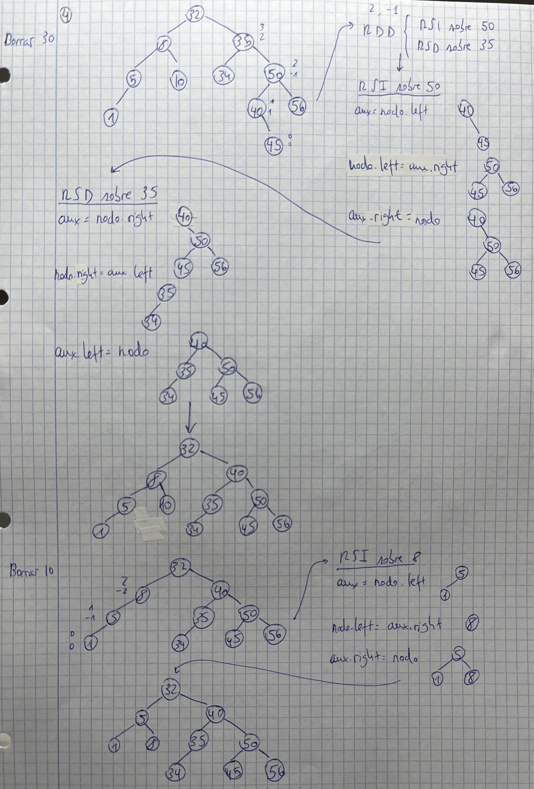

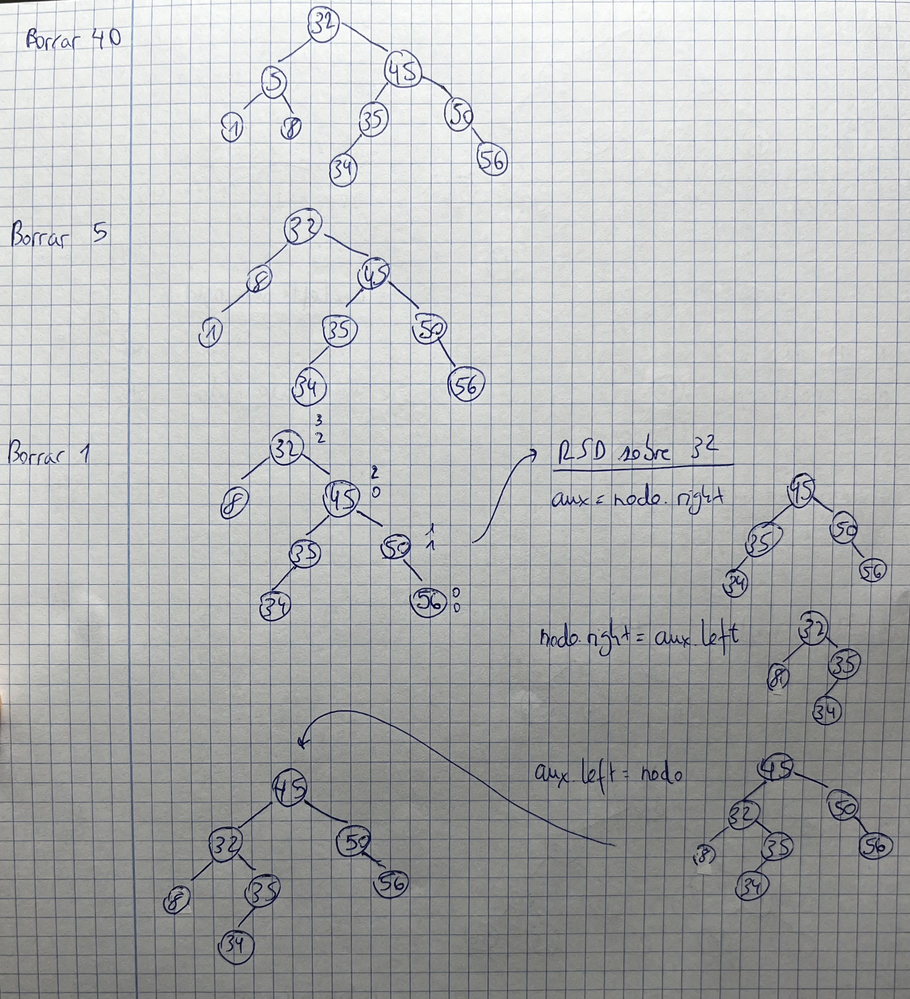

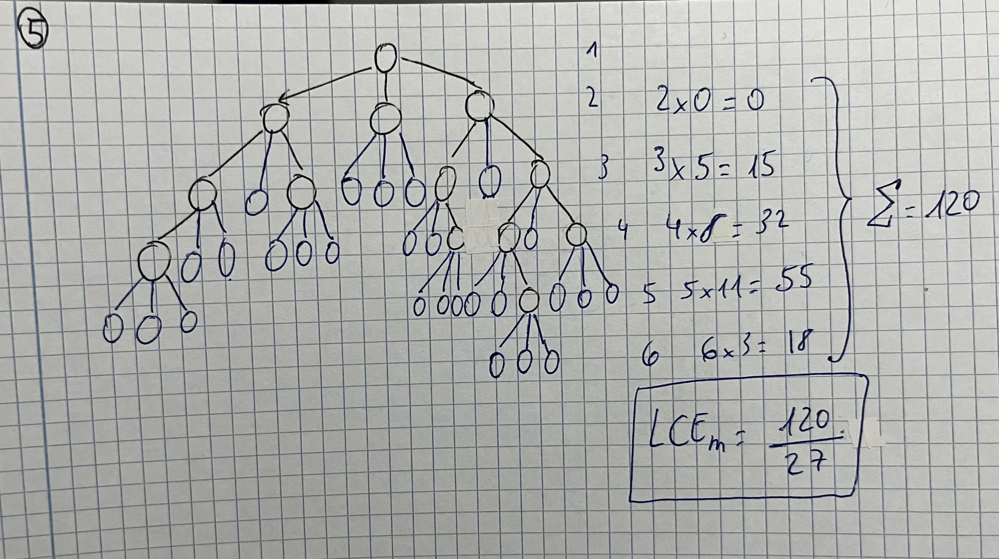

*NOTA: LCI sería dividir todos los nodos juntos que hay con los que faltan por cada nivel entre el total de nodos que hay, es decir, 120/13*

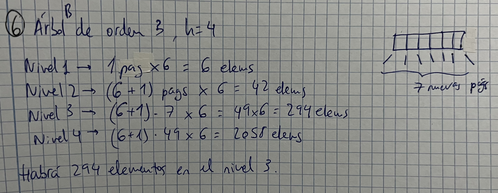

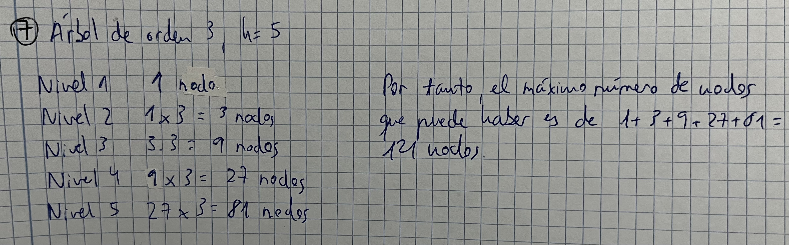

- Es un AVL porque todos los factores de balance están comprendidos en el intervalo -1 <= BF <= 1
- No es un árbol perfectamente equilibrado (APE), pues la diferencia en valor absoluto del número de nodods del subárbol izquierdo entre el subárbol derecho es mayor que 1
- Es de altura mínima pues al ser un árbol AVL los nodos no se pueden colocar de otra manera