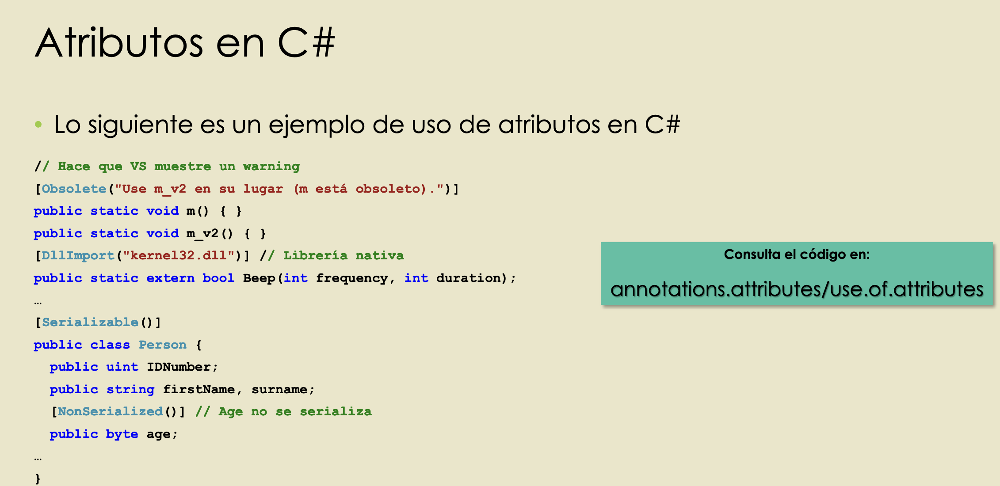

♻️ Parte anterior -> [[Programación concurrente y paralela (clase)🔫]]
# 31 Marzo 2022 🥝
---
## Tipado Dinámico 
- Es el proceso de posoponer la comprobación de inferencia de tipos en tiempo de ejecución
Inconvenientes
- No se detectan errores en tiempo de compilación.
- Peor rendimiento.
Ventajas
- Adaptabilidad y flexibilidad del código.
- Mayor nivel de abstracción.

- En c# se usa dynamic.
- Cualquier tipo se puede convertir en dynamic y viceversa.
````
Código en dynamic.typing/dynamic
````
- Se pospone la comprobación e inferencia de tipos en tiempo de ejecución.
---
## Duck Typing
- El estado dinámico de un objeto determina qué operaciones pueden realizarse con él.
---
# 7 Abril 2022 🌋
---
## Reflexión
- Capacidad de un sistema de razonar por sí mismo.
- Tipos de reflexión:
	- **Introspección:** se puede consultar pero no modificar.
	- **Intercesión:** se permite modificar.
	- **Estructural:** la información es la estructura de un programa
	- **De comportamiento:** si un lenguaje tiene reflexión de comportamiento se puede cambiar la semántica de dicho lenguaje. Para entender mejor ver -> https://www.hedonisticlearning.com/posts/behavioral-reflection.html .
	
---
	


---
## Generación dinámica de código
- Capacidad de generar programas en tiempo de ejecución.
- Se hace en .NET a través de Roslyn.
```
Código en reflection/generative.programming
```
---
## Metaprogramación
- Capacidad de escribir programas que escriban o manipulen otros programas.