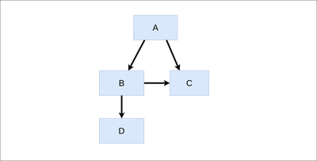

1. ¿Cuál es la primera ley de la arquitectura del software?
- ==Todo en arquitectura es una solución de compromiso==
2. ¿Cuál es la segunda ley de la arquitectura de software?
- ==El por qué es más importante que el cómo==
3. La mayoría de decisiones de la arquitectura del software vienen determinadas por
- ==Los atributos de calidad o requisitos no funcionales==
4. Las restricciones...
- ==Es bueno conocerlas porque limitan alternativas a considerar==
5. Los stakeholders...
- ==Son personas interesadas en el proyecto==
6. Un sistema greenfield...
- ==Es un proyecto nuevo==
7. ¿Existe arquitectura de software ágil?
- ==Sí, cuando la arquitectura puede reaccionar a cambios en el entorno==
8. Etimológicamente, arquitecto viene de...
- ==Creador jefe==
9. La "building block view" de Arc42...
- ==Puede contener varios diagramas de cajas negras y blancas combinadas==
10. La mayoría de decisiones de arquitectura del software vienen determinadas por...
- ==Los atributos de calidad o requisitos no funcionales==
11. ¿Quién dijo que los pilares de una buena arquitectura eran Utilidad, durabilidad y elegancia?
- ==Vitruvio en 15 al 30 a. de C.==
12. Big design Up-front
- ==Es un problema al generar demasiados documentos o diagramas innecesarios==
13. Los requisitos funcionales
- ==Son una entrada que el arquitecto de software puede considerar==
14. ISO-25010 contiene...
- ==Una lista de posibles atributos de calidad==
15. Una representación del sistema respecto a ciertas preocupaciones...
- ==Es una vista==
16. Es posible utilizar bocetos para documentar una vista?
- ==Sí, pero se recomienda que se registren, aunque sea con una foto==
17. Un ADL es un...
- ==Lenguaje de descripción de arquitecturas==
18. ¿Cuál de las siguientes NO es una propuesta para la documentación de arquitecturas software?
- ==Modelo 5+1 de Kruchten==
19. Los sistemas brownfield...
- ==Son proyectos que consisten en cambiar sistemas ya existentes==
20. ¿Cuántos diagramas de contexto se suelen incluír en Arc42?
- ==Dos: el de negocio que es obligatorio y el técnico que es opcional==
21. ¿Cómo se definen los requisitos de calidad?
- ==Mediante escenarios de calidad==
22. En Arc42...
- ==Las 3 primeras secciones describen el problema, las 8 siguientes la solución==
23. La primera sección de Arc42...
- ==Consta de repaso de requisitos, objetivos de calidad y stakeholders==
24. La segunda sección de Arc42...
- ==Describe las restricciones==
25. La vista de despliegue en Arc42...
- ==Contiene un mapeo de los bloques de construcción software e infraestructura==
26. En Arc42...
- ==Hay una sección específica para riesgos y deuda técnica==
27. Un buen arquitecto de software intenta...
- ==Mover cosas que no sabe que no sabe a cosas que sabe que no sabe==
28. En general, un buen arquitecto de software tiene...
- ==Más amplitud técnica que profundidad==
29. Según Google, los 3 pilares de una buena interacción social son:
- ==Humildad, confianza y respeto==
30. El factor del autobús es...
- ==Número de personas que si son atropelladas por un autobús, el proyecto fracasa==
31. Un arquitecto de software efectivo debe encontrar un balance entre...
- ==Friki de control y arquitecto de sillón==
32. Según la ley de Conway, las organizaciones que diseñan sistemas...
- ==producen diseños que son copias de las estructuras de estas organizaciones==
33. La maniobra inversa de conway consiste en...
- ==Evolucionar equipos para promover la arquitectura deseada==
34. La pérdida por proceso es...
- ==Diferencia entre potencial de grupo y productividad actual del equipo==
35. Se produce ignorancia colectiva cuando
- ==Todos están públicamente de acuerdo en algo pero privadamente no==
36. La difusión de responsabilidad puede hacer que
- ==Exista confusión sobre quién es responsable de qué==
37. Las preocupaciones de los stakeholders
- ==Pueden ser contradictorias==
38. Los atributos de calidad
- ==Cualifican la funcionalidad==
39. Un taller de atributos de calidad
- ==Es una reunión con stakeholders para identificar atributos de calidad==
40. Una técnica para representar atributos de calidad es
- ==Un diagrama MindMap==
41. ¿Cuál de las siguientes frases es correcta?
- ==Muchos atributos de calidad tienen significados vagos==
42. La calidad de un sistema es
- ==El grado en que un sistema satisface unas necesidades==
43. Un escenario de calidad define
- ==Un estímulo y respuesta medible a dicho estímulo==
44. Los escenarios de calidad pueden clasificarse en...
- ==Escenarios de uso, de cambio o moficación y de fallo==
45. Los escenarios de calidad deben...
- ==Priorizarse de acuerdo a la importancia para el éxito y la dificultad==
46. En ISO-25010, la calidad...
- ==Se divide en 2 dimensiones: Calidad de producto y calidad en uso==
47. MTBF y MTBR
- ==Son tiempo medio entre fallos y tiempo medio de recuperación==
48. La complejidad ciclomática de McCabe...
- ==Es una métrica de la complejidad de un código==
49. En arquitecturas del software evolutivas...
- ==Puede definirse la función de encaje que mide atributos de calidad==
50. Las métricas de software
- ==Son medidas objetivas de ciertos aspectos de calidad==
51. **ATAM** (Architecture Trade-off Analysis Method)
- ==Es una técnica para evaluar arquitecturas usando atributos de calidad==
52. **CBAM** (Cost Benefit Analysis Method)
- ==Cuantifica costes y beneficios de estrategias arquitectónicas==
53. Las tácticas en arquitectura del software...
- ==Dependen del atributo de calidad==
54. Se recomienda que los registros de decisiones arquitectónicas sean
- ==Inmutables==
55. ADD es una...
- ==Metodología para crear una arquitectura basada en atributos de calidad==
56. Algo malo que podría ocurrir pero que todavía no ha ocurrido es...
- ==Un riesgo==
57. Una deuda técnica...
- ==Puede ser de varios tipos: código, diseño, implementación...==
58. Para mitigar el deterioro arquitectónico puede utilizarse...
- ==Código arquitectónicamente evidente==
59. Una diferencia entre estilo y patrón arquitectónico es...
- ==Que los estilos suelen ser independientes entre sí y los patrones no==
60. **COTS** (Commercial Off The Self)
- ==Se refiere a software comercial ya existente==
61. BDD
- ==Realiza pruebas de aceptación con historias de usuario==
62. La recomendación FIRST se refiere a...
- ==Que las pruebas sean Fast, Independent, Repeatable, Self-Checking y Timely==
63. La integración continua
- ==Automatiza la ejecución de las pruebas en entornos externos==
64. La gestión de configuraciones de software
- ==Permite observar la evolución del software==
65. ¿Cuál es la CCD en el esquema de módulos de la figura?
Nota: El CCD es la suma de dependencias de todos los componentes (cada componente depende de sí mismo)

- ==8==
66. ¿Cuál es la CCD en el esquema de módulos de la figura?

- ==13==
67. ¿Cuál de los siguientes es un sistema de control de versiones distribuido?
- ==git==
68. Utilizando versionado semántico, al pasar de la versión 1.2.3 a 1.3.0
- ==Se espera una nueva funcionalidad compatible con la anterior==
69. En git, el nombre del primer repositorio remoto que se clona es...
- ==origin==
70. ¿Cuál es el comando que permite cambiar de una rama a otra en git?
- ==checkout==
71. ¿Cuál de los siguientes NO es un sistema de automatización de la construcción?
- ==groovy==
72. Los ficheros de configuración usados en Maven...
- ==Son ficheros XML==
73. Las dependencias de paquetes en npm se declaran en...
- ==Fichero package.json==
74. La diferencia entre "npm install paquete" y "npm install -g paquete"
- ==El primero instala dependencias en carpeta node_modules y el segundo lo hace de forma global==
75. Integration hell se produce cuando...
- ==Se espera mucho tiempo sin integrar código de diferentes desarrolladores==
76. La inercia en el estilo Big ball of mud hace que...
- ==Unos pocos desarrolladores "de prestigio" sepan mantener el sistema==
77. ¿Tiene algún atributo de calidad positivo el estilo big ball of mud?
- ==Sí, el time-to-market y el bajo coste inicial==
78. La S de SOLID indica que...
- ==No debe haber más de un motivo para cambiar un módulo==
79. El principio de Liskov indica que...
- ==Los subtipos deben respetar el contrato de los supertipos==
80. Según el principio de segregación de interfaces
- ==Los clientes no deberían depender de métodos que no utilicen==
81. Según el principio de inversión de dependencia
- ==Los módulos de alto nivel no dependen de módulos de bajo nivel==
82. Se recomienda...
- ==Alta cohesividad y bajo acoplamiento==
83. En la métrica LCOM
- ==Cuanto menor sea, mejor, porque hay más cohesividad==
84. Dada una clase como la de la figura, ¿cuál sería el valor de LCOM?

- ==1==
85. Según los principios de cohesividad de Robert Martin, REP se refiere a 
- ==Equivalencia entre unidad de reutilización y de release==
86. Según los principios de cohesividad de Robert Martin, CCP se refiere a
- ==Juntar en un módulo las unidades que cambian por la misma razón==
87. Según diagrama de tensión de cohesividad de componentes, un fallo de CRP supone...
- ==Demasiadas releases innecesarias==
88. Según el principio de acoplamiento SDP de Robert Martin
- ==Un componente debería depender de componentes más estables==
89. Según el diagrama de módulos de la figura, la inestabilidad de B y C son...

- ==I(B)=0.5, I(C)=0==
90. Según la figura del principio de abstracciones estables, la zona de inutilidad
- ==Son módulos abstractos e inestables==
91. El conacimiento entre 2 elementos puede hacer que
- ==Un cambio en uno obliga a un cambio en otro para mantener el sistema correcto==
92. El principio de Robustez de Postel recomienda que
- ==Un módulo sea liberal en lo que acepta y conservador en lo que envía==
93. La ley de Demeter recomienda...
- ==Que un módulo invoque elementos de módulos cercanos==
94. La variante laxa del estilo de capas
- ==Indica que la capa N puede acceder a elementos de las capas 1 a N -1==
95. Un ejemplo de "crosscutting concern" es
- ==Logging==
96. En Domain Driven Design se pone gran énfasis en identificar
- ==Un lenguaje ubicuo entre expertos de dominio y desarrolladores==
97. Una restricción en Domain Driven Design es
- ==Que los Objetos valor sean inmutables==
98. ¿Cuál de los siguientes estilos son similares?
- ==Estilo hexagonal y arquitectura limpia==
99. En la propuesta naked objects
- ==La aplicación se genera automáticamente a partir de objetos de dominio==
100. En el estilo hexagonal
- ==La base de datos y frameworks está en el exterior==
101. Una ventaja del estilo batch es
- ==Bajo acoplamiento==
102. En el estilo pipes and filters
- ==Se admite la ejecución concurrente de hilos==
103. Backpressure ocurre cuando
- ==Los consumidores reciben más datos de los que pueden procesar==
104. ¿Cuál es una de las ventajas de pipes and filters con una interfaz uniforme?
- ==Reconfigurabilidad==
105. Uno de los beneficios de Master-slave es
- ==Computación paralela==
106. Una ventaja de MVC
- ==Facilidad para crear nuevas vistas y controladores==
107. En PAC
- ==Se utiliza una jerarquía de agentes==
108. ¿Cuál puede ser un reto a resolver en el estilo Datos compartidos?
- ==Punto de fallo único==
109. En el estilo Blackboard se utilizan
- ==Fuentes de conocimiento que resuelven parcialmente un problema==
110. Una de las ventajas de los sistemas basados en reglas es
- ==La utilización de conocimiento declarativo de expertos de dominio==
111. Una restricción del estilo cliente-servidor es
- ==Los clientes se comunican con el servidor, no al revés==
112. En la variante cliente-servidor sin estado
- ==Ante la misma petición se devuelve siempre la misma respuesta==
113. En Event-driven architecture
- ==Un evento es algo que ha sucedido==
114. Publish-subscribe es una variante de 
- ==Modelos basados en eventos==
115. Una ventaja de los modelos de actores es
- ==Paralelismo==
116. CQRS separa el interfaz en
- ==Comandos que realizan acciones y consultas que leen datos==
117. Event sourcing captura los cambios de estado mediante
- ==Eventos inmutables==
118. Una ventaja de Event sourcing es que
- ==Si aparecen errores se puede reconstruir la Base de datos==
119. Una ventaja de utilizar plugins es
- ==La adaptación del sistema a recursos impredecibles en el futuro==
120. Un problema del estilo Microkernel es
- ==Punto de fallo único==
121. Reflection permite
- ==Realizar cambios al sistema sin detener la ejecución==
122. ¿Cuál de las siguientes NO es una ventaja de los DSLs?
- ==Rendimiento==
123. Código móvil
- ==Es código que se transfiere de una máquina a otra para que lo ejecute==
124. Habitualmente, código bajo demanda
- ==Es código que se transmite del servidor al cliente==
125. Los agentes móviles consisten en
- ==Código y datos que se envía de una máquina a otra para su ejecución==
126. ¿Cuál de las siguientes NO es una falacia de la computación distribuida?
- ==La invocación a un procedimiento remoto puede pasar parámetros==
127. Hub and spoke
- ==Es una topología de mensajería con un bróker central==
128. Una consecuencia del patrón Bróker es
- ==Separación de incumbencias==
129. Una consecuencia de Peer-to-peer es
- ==Evita el single point of failure==
130. ¿Cuál de las siguientes NO es una ventaja de SOA?
- ==Seguridad==
131. En `WS-*`
- ==Se proponía UDDI como páginas amarillas para publicar servicios web==
132. En REST, la operación DELETE
- ==Es idempotente pero no segura==
133. HATEOAS
- ==Incluye URIs en respuestas con más opciones del estado de la aplicación==
134. En las arquitecturas basadas en servicios
- ==Existen varios frameworks disponibles para facilitar el time-to-market==
135. En la propuesta de microservicios
- ==Cada microservicio gestiona su propia base de datos==
136. Un microservicio trabaja
- ==Con un dominio acotado==
137. El deterioro estructural de microservicios puede aparecer al utilizar
- ==Demasiadas librerías compartidas entre microservicios==
138. En la propuesta Serverless
- ==Se persigue escalabilidad automática==
139. ¿Cuál de las siguientes NO es una ventaja de Serverless?
- ==Vendor lock-in==
140. Los tipos de la función map y reduce en MapReduce son:
- ==`map: (K1,V1) => [(K2, V2)] reduce: (K2,[V2]) => (K2,V2)`==
141. MapReduce
- ==Utiliza un sistema de ficheros distribuido con replicación==
142. La arquitectura Lambda
- ==Permite procesar big data en tiempo real==
143. En la arquitectura lambda, la serving layer
- ==Combina las vistas en tiempo real con las vistas precomputadas batch==
144. La arquitectura Kappa utiliza
- ==Un log distribuido y replicado como almacenamiento de eventos==
145. En la arquitectura Kappa
- ==Un reto son requisitos de espacio al duplicarse el log y la base de datos==
146. Una desventaja de la coordinación mediante transferencia de ficheros es
- ==Bajo acoplamiento porque productor y consumidor pueden ser independientes==
147. ETL
- ==Consiste en 3 fases: extracción, transformación y carga==
148. En la coordinación mediante Mensajería
- ==Se suele utilizar una comunicación asíncrona==
149. La escalabilidad en aplicaciones microservicios puede conseguirse mediante
- ==Distribución de microservicios en servidores y replicación bajo demanda==
150. Una variante peer-to-peer es
- ==El uso de super-peers==
151. Cuando la computación se realiza "on premises"
- ==Es necesario invertir en hardware, licencias, espacios...==
152. En un diagrama de despliegue
- ==Se asocian artefactos a cajas que representan nodos computacionales==
153. Cuando la computación se realiza en la nube
- ==Se facilita el acceso a hardware caro==
154. La metáfora "pets vs cattle"
- ==Identifica a los servidores tradicionales como mascotas==
155. Edge computing
- ==Pretende mejorar la latencia y el ancho de banda==
156. Los multi-armed bandits
- ==Ajustan dinámicamente el tráfico para ofrecer buenas alternativas==
157. ¿Cuál de los siguientes sistemas puede utilizarse para realizar pruebas de carga?
- ==Gatling==
158. ¿Cuál de las siguientes frases es verdadera?
- ==Docker se basa en el aislamiento de procesos a nivel de kernel==
159. La arquitectura de alto nivel de docker 
- ==Se basa en cliente-servidor==
160. Una imagen docker es
- ==Una plantilla de sólo lectura con instrucciones para crear 1 contenedor==
161. El modelo de capas de docker
- ==Permite crear imágenes a partir de otras imágenes==
162. El concepto de infraestructura inmutable permite
- ==Describir los estados deseados de una infraestructura en imágenes==
163. Una ventaja de utilizar contenedores es
- ==Rendimiento==
164. ¿Cuál de las siguientes frases es verdadera?
- ==Kubernetes puede utilizarse para la orquestación de contenedores==
165. El concepto de "deployment pipeline" promueve
- ==la automatización de las tareas de construcción, despliegue, pruebas, etc==
166. El lema del "continuous deployment" es
- ==Si duele, hazlo más frecuentemente==
167. El patrón timeout añade un limitador temporal a
- ==las peticiones para detenerlas y, a veces, reintentarlas==
168. En el patrón circuit breaker, cuando se producen...
- ==demasiados errores se deja de atender peticiones x tiempo==
169. Con el patrón bulkhead se pretende
- ==seguir el funcionamiento aunque una parte falle==
170. Una solución basada en "steady state" o estado estacionario es
- ==Limpiar los recursos del sistema automáticamente==
171. El patrón "Fail fast" promueve chequear
- ==que recursos necesarios estén disponibles para no realizar trabajo inútil==
172. Alguna de las condiciones para que se pueda aplicar el patrón "Let it crash" es
- ==Que los componentes puedan sustituirse rápidamente por otros==
173. El patrón Handshaking
- ==Permite realizar un control cooperativo de las demandas computacionales==
174. ¿Cuál de las siguientes NO es una estrategia para backpressure?
- ==Balanceo de carga==
175. En el patrón Governor se puede
- ==ralentizar la velocidad de acciones automatizadas para permitir acción humana==
176. Las propuestas de Ingeniería del caos
- ==introducen fallos en un sistema a propósito para probar resiliencia==
177. Un "canary release" consiste en
- ==introducir nuevas releases progresivamente a subconjuntos de usuarios==
178. El uso de "Feature toggles" permite
- ==modificar comportamiento del sistema sin cambiar código==
179. ¿Cuál de las siguientes es una expectativa sobre un arquitecto de software?
- ==Comprender y navegar la política empresarial==
180. ¿Cuál de los siguientes NO forma parte del rol del arquitecto de software?
- ==Definir la estrategia empresarial y de negocio==
181. En las compañías basadas en producto en dominios diferentes del software
- ==Se produce un compromiso entre departamento IT interno o outsourcing==
182. Un arquitecto empresarial
- ==da soporte a la estrategia de negocio y soluciones TI==
183. El marco Zachman
- ==Es una técnica de arquitectura empresarial basada en un modelo==
184. TOGAF
- ==Es un marco y metodología de arquitecturas empresariales==
185. La parte superior de la curva en las representaciones de Gartner
- ==Es el pico de expectativas sobredimensionadas==
186. Una posible ventaja de adoptar ERP para una empresa
- ==Calidad y eficiencia utilizando mejores prácticas==
187. ABAP
- ==Es un lenguaje de dominio específico utilizado en SAP==
188. El software que gestiona los calls centers se enmarca en la categoría
- ==CRM==
189. ¿Qué tipo de software puede utilizarse para control de inventario?
- ==SCM==
190. ¿Qué tipo de software puede utilizarse para la gestión automatizada de almacenes?
- ==WMS==
191. Los gestores documentales se enmarcan en
- ==ECM==
192. BPM
- ==Se utiliza para gestionar el ciclo de vida de procesos de negocio==
193. OLAP
- ==Son herramientas de inteligencia de negocios con análisis multidimensional==
194. BPMN
- ==Es una notación visual para la definición de procesos de negocio==
195. PLM 
- ==Engloba herramientas que gestionan el ciclo de vida de productos==
196. EAI
- ==Engloba herramientas de integración de software empresarial==
197. Las líneas de producto software requieren
- ==Identificar soluciones genéricas a problemas comunes de varios productos==
198. ¿Cuál de las siguientes afirmaciones es correcta?
- ==Un SLO es un objeto para un SLI==
199. La ley de cambio continuo de Lehman dice que
- ==Un sistema debe adaptarse continuamente o cada vez es menos satisfactorio==
200. Refactorizar consiste en
- ==Modificar la estructura de software preservando su comportamiento externo==
201. Un proyecto "legacy"
- ==Suele ser software valioso que se tiene miedo a cambiar==
202. Un "hotspot" en el análisis de comportamiento de software es+
- ==Un componente complejo que cambia frecuentemente==
203. Las funciones de encaje
- ==Se utilizan en las arquitecturas evolutivas para analizar la evolución==
204. ¿En qué año se acuñó el término hipertexto?
- ==1965==
205. ¿En qué año se inventó la web?
- ==1989==
206. ¿En qué año nace el World Wide Web Consortium?
- ==1994==
207. ¿En qué año nace Javascript?
- ==1995==
208. ¿En qué año nace Amazon?
- ==1995==
209. ¿Cuáles son los 3 pilares de la web?
- ==Protocolo HTTP, URIs y lenguajes de representación==
210. ¿Cómo se denomina el tipo asociado a los recursos en la Web?
- ==MIME==
211. curl es una herramienta que permite
- ==navegar por la web sin navegador==
212. ¿Qué es el árbol DOM?
- ==Una representación en memoria del contenido de una página web==
213. HTML nació como un vocabulario de...
- ==SGML==
214. ¿Cuál es la etiqueta que permite en HTML indicar un elemento de cabecera de primer nivel?
- ==h1==
215. Las declaraciones CSS están formadas por...
- ==selector de elementos y lista de propiedades y valores==
216. ¿En cuál de los siguientes lenguajes podemos definir nuestro propio vocabulario de etiquetas?
- ==XML==
217. Los documentos XML pueden ser validados mediante
- ==DTDs o XML Schema==
218. ¿Cuál de los siguientes es un vocabulario XML?
- ==SVG==
219. Un archivo JSON
- ==Representa un objeto Javascript==
220. Javascript
- ==Se usa para computación en el cliente y servidor==
221. express
- ==Es un framework javascript sobre nodejs==
222. En el fichero package.json
- ==Se declaran dependencias que srán resueltas al ejecutar npm install==
223. Para la computación en el servidor
- ==Hay mucha libertasd para elegir lenguajes y frameworks==
224. NodeJs
- ==Es un entorno de ejecución de Javascript en servidor==
225. npm 
- ==Es un gestor de paquetes para NodeJs==
226. REST
- ==Es un estilo de arquitectura basado en el uso de recursos==
227. La operación DELETE
- ==Es idempotente pero no segura==
228. Una buena práctica al hacer code-review es...
- ==Centrarse en el código==
229. ¿Cuál de los siguientes aspectos puede considerarse deuda técnica?
- ==Errores detectados que cuya solución se pospone==
230. La U de propuesta CUPID consiste en
- ==proponer seguir filosofía UNIX==
231. ¿Qué dos modelos existen de infraestructura como código?
- ==Imperativos o declarativos==
232. ¿Cuál de las siguientes herramientas se utiliza para análisis de comportamiento de código?
- ==CodeScene==
233. La ley de Lehman de Crecimiento continuo establece que
- ==La funcionalidad de un sistema aumenta para satisfacer a los usuarios==
234. Los micro-frontends son aplicaciones...
- ==de front-end entregadas independientemente y se componen para generar otra==
235. ¿Cuál de los siguientes puede ser un problema de los sistemas serverless?
- ==Cold-start==
236. ¿Cuál de las siguientes es una de las 4 métricas claves?
- ==Tiempo medio de recuperación==
237. En la propuesta reciente de Web3
- ==se sustituye el backend por persistencia basada en blockchain==
238. Los mapas Wardley representan
- ==en un eje el valor para el usuario y en otro la evolución==
239. ¿Cuál de los siguientes es un patrón de Microservicios?
- ==El patrón "Estrangulador"==

## Preguntas de seminarios
240. ¿Cuál de los siguientes puede formar parte de la deuda técnica?
- ==Todo el código, incluido el código de pruebas==
- Sólo el código que forma parte del ejecutable
- Sólo el código que aparece en la cobertura de código
- Sólo el código de las dependencias

241. ¿Qué lenguaje usa internamente la librería libCurl?
- ==PHP==
- C
- Java
- Rust

242. ¿Cuál de las siguientes sirve para mejorar la productividad de los desarrolladores?
- ==DX==
- UX
- XML
- RDF

243. Según John Ousterhout, una buena descomposición modular utiliza módulos...
- ==profundos, con poca interfaz y mucha funcionalidad==
- anchos, con poca interfaz y mucha funcionalidad
- redondos, con muchas dependencias cíclicas
- concretos y estables

244. ¿Cuál de las siguientes es una falacia de la computación distribuida?
- ==La latencia es cero==
- La latencia aumenta con el tiempo
- La latencia disminuye con el tiempo
- La latencia es negativa

245. Un ejemplo de antipatrón DevOps es:
- ==Fatiga por alerta==
- Cultura por consenso
- Caja de herramientas completa
- Cortocircuito

246. Disponer de una capacidad para cometer errores cumpliendo con los SLOs se conoce como
- ==Presupuesto de error (Error budget)==
- SLA
- SLI
- Error de latencia

247. Un ejemplo de sistema que cumple con la arquitectura inmutable sería
- ==Blockchain==
- Bases de datos relacionales
- Linux
- Windows

248. El software con el que se implementó eBay
- ==Se re-escribió varias veces en varios lenguajes==
- Se diseñó usando arquitectura de microservicios
- Es un ejemplo de arquitectura basada en 3 capas
- Está implementado en PHP

249. En el proyecto Software Heritage Archive
- ==Se utiliza un identificador único intrínseco para cada objeto==
- Se utiliza un registro de identificadores extrínsecos
- Se almacena la lista de mejores arquitectos de software
- No es necesario utilizar identificadores únicos

## Preguntas examen 2021/22
250. CQRS separa el interfaz en 
- peticiones y respuestas
- ==comandos que realizan acciones y consultas que leen datos==
- comandos que realizan acciones y consultas que escriben datos

251. MTBF y MTTR 
- ==Son tiempo medio entre fallos y tiempo medio de recuperación ==
- Son dos técnicas utilizadas para identificar stakeholders 
- Se utilizan para medir la complejidad ciclomática

252. El conacimiento entre 2 elementos puede hacer que 
- un cambio en uno obliga a crear el otro para que el sistema sea correcto 
- ==un cambio en uno obliga a un cambio en otro para mantener sistema correcto ==
- sea necesario crear ambos al mismo tiempo

253. En Event-driven architecture 
- Los consumidores de eventos esperan que los productores envíen eventos 
- Los eventos son invocaciones síncronas 
- ==Un evento es algo que ha sucedido==

254. La arquitectura Kappa utiliza 
- ==un log distribuido y replicado como almacenamiento de eventos ==
- una capa batch para almacenar los logs distribuidos 
- un log de eventos que pueden modificarse durante la ejecución

255. En las compañías basadas en producto en dominios diferentes del software 
- El software es lo más importante de la empresa 
- La inversión suele ser realizada por business angels o capital riesgo 
- ==Se produce un compromiso entre departamento IT interno o outsourcing==

256. La Vista de bloques de construcción de Arc42 
- Se basa en diagramas de despliegue de UML 
- Contiene un único diagrama que combina cajas blancas y negras 
- ==Puede contener varios diagramas de cajas blancas y cajas negras combinados==

257. El modelo de capas de docker 
- ==Permite definir imágenes a partir de otras imágenes ==
- Permite que los contenedores estén aislados 
- Permite crear un dockerd a partir de una imagen

258. ¿Quién dijo que los pilares de una buena arquitectura eran Utilidad, durabilidad y elegancia? 
- Martin Fowler en el s. XX 
- ==Vitruvio en 15 al 30 a. de C. ==
- Aristóteles en 300 a. de C.

259. Una solución basada en "steady state" o estado estacionario es 
- Crear una réplica del servidor 
- Utilizar un monitor que limite las peticiones que ocupan mucho tiempo 
- ==Limpiar recursos del sistema automáticamente==

260. Las líneas de producto software requieren 
- técnicas de análisis del comportamiento del código 
- ==identificar soluciones genéricas a problemas comunes de varios productos ==
- crear sistemas que evolucionan con el tiempo

261. Se recomienda que los registros de decisiones arquitectónicas sean 
- Revisados y actualizados continuamente 
- Actualizados en cada etapa del desarrollo 
- ==Inmutables==

262. En las arquitecturas de microservicios, cuando hay varios nodos computacionales, la escalabilidad se obtiene 
- replicando todos los microservicios en cada nodo 
- ==replicando cada microservicio de forma independiente en diferentes nodos ==
- utilizando la ley de Conway

263. La Ley de Lehman de Crecimiento Continuo establece que 
- El número de usuarios de un sistema software aumenta con el tiempo 
- ==La funcionalidad de un sistema aumenta para satisfacer a los usuarios ==
- El número de desarrolladores de un sistema software aumenta con el tiempo

264. En REST, la operación PUT 
- No es ni idempotente ni segura 
- ==Es idempotente pero no segura ==
- Es idempotente y segura

265. Los mapas de Wardley representan 
- en un eje la capacidad computacional y en otro la época 
- ==en un eje el valor para el usuario y en otro la evolución ==
- tipos de arquitecturas basadas en serverless

266. La diferencia entre "npm install paquete" y "npm install -g paquete" 
- El segundo instala dependencias en carpeta node_modules 
- ==El primero instala dependencias en carpeta node_modules ==
- El primero instala paquetes en node y el segundo en docker

267. En los escenarios de calidad 
- se identifican stakeholders 
- se crean diagramas de cajas blancas/negras relacionando componentes con nodos computacionales 
- ==se definen estímulos, respuestas y medidas esperadas de dichas respuestas==

268. Según la ley de Conway, las organizaciones que diseñan sistemas... 
- producen diseños que copian el resto de organizaciones 
- ==producen diseños que son copias de las estructuras de estas organizaciones ==
- producen diseños basados en 3 capas

269. Una restricción en Domain Driven Design es 
- ==Que los Objetos valor sean inmutables ==
- Que los aspectos capturen crosscutting concerns 
- Que el modelo de dominio sea independiente del sistema de persistencia

## Preguntas examen 2018/19

270. La arquitectura serverless 
- Propone aplicaciones descentralizadas en las que no exista un servidor único 
- Consiste en que los desarrolladores gestionan la escalabilidad de las aplicaciones 
- ==Se conoce también como function-as-a-service==

271. La especificación ISO25010: 
- ...define una lista de restricciones que toda arquitectura del software debe satisfacer 
- ==...define un modelo de calidad que incluye una lista de atributos de calidad ==
- ...define la lista de requisitos funcionales del sistema

272. Un escenario de calidad debe especificar: 
- Las restricciones del software 
- ==Una medida de la respuesta ==
- El patrón arquitectónico que se va a utilizar

273. La deuda técnica… 
- …es una restricción impuesta por los stakeholders 
- …consiste en utilizar arquitecturas de referencia 
- ==…es el efecto de tomar una decisión de diseño equivocada==

274. Un profiler 
- Es un sistema de control de versiones con integración continua 
- ==Es una herramienta que informa sobre el uso de recursos durante la ejecución de un software ==
- Es una herramienta utilizada para BDD

275. Utilizar canary releases consiste en: 
- Desarrollar versiones de software en ramas que puedan ser borradas posteriormente 
- ==Introducir nuevas versiones mostrando cambios lentamente a un subconjunto de los usuarios== 
- Utilizar integración continua para producir versiones de forma continua con pruebas de aceptación

276. La ley de Conway dice que… 
- ..."es necesario definir módulos que sean liberales en lo que aceptan de otros y conservadores en lo que envían" 
- ==..."las organizaciones que diseñan sistemas acaban produciendo sistemas que son copias de las estructuras de comunicación de dichas organizaciones" ==
- ..."los subtipos deben seguir el contrato de los supertipos"

277. ¿Cuál de los siguientes sistemas tiene un estilo arquitectónico peer-to-peer? 
- Asciidoctor 
- Mocha 
- ==IPFS==

278. Una ventaja del estilo arquitectónico Batch es: 
- ==Acoplamiento débil entre componentes ==
- Interactividad 
- Concurrencia

279. ¿Cuál de las siguientes frases es correcta?: 
- ==Todos los atributos de calidad son buenos. ==
- Los atributos de calidad tienen un valor booleano, o se cumplen o no. 
- Los atributos de calidad son independientes entre sí.

280. La ingeniería del caos…
- …es un antipatrón de arquitectura del software que puede surgir al no utilizar control de versiones 
- ==…propone inyectar fallos adrede en sistemas distribuidos para comprobar la resiliencia ==
- …consiste en realizar pruebas de carga hasta que el sistema no tenga más capacidad

281. Un WMS: 
- Es un sistema de balanceo de carga en aplicaciones Web 
- Es un sistema de gestión del conocimiento de una empresa 
- ==Es un tipo de software que permite gestionar almacenes==

282. Gherkin
- ==Es un lenguaje utilizado para definir historias de usuario==
- Es un sistema de integración continua 
- Es una herramienta para realizar pruebas de navegación en aplicaciones Web

283. En Arc42, una vista estática del sistema formada por una jerarquía de cajas blancas y negras es la… 
- Vista en tiempo de ejecución ó runtime view 
- ==Vista de bloques de construcción ó building block view ==
- Vista de despliegue ó deployment view

284. Un escenario de calidad… 
- …es una restricción del sistema planteada por uno de los stakeholders 
- …es también conocido como deuda técnica o technical debt 
- ==…describe qué debería ocurrir cuando llega un estímulo==

285. ATAM 
- ==Es un método de evaluación de arquitecturas del software ==
- Es un patrón arquitectónico 
- Es una metodología de desarrollo de software ágil

---
