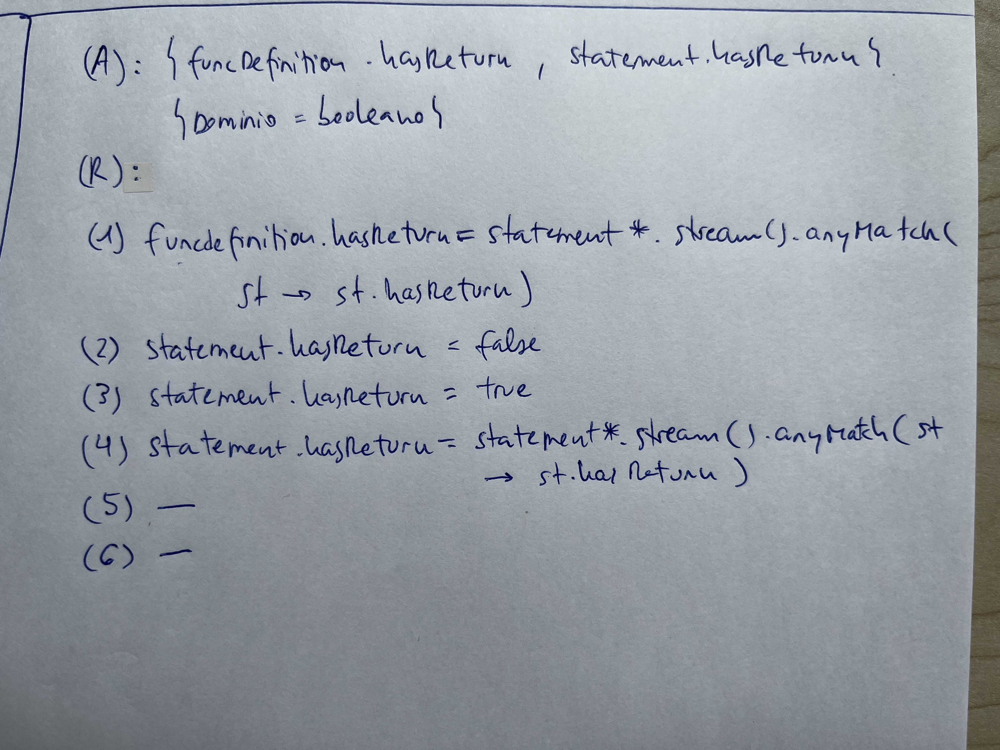

# Léxico
1. Hacer el analizador léxico del siguiente lenguaje usando ANTLR.

```java
edad = 65;	 # Comentario de una línea
print a
read b;
print "fin"
```


# Sintáctico

1. Hacer el árbol AST:


2. Decir si es una sentencia válida y hacer el árbol concreto:
 


3. Dada la siguiente gramática, implementar un parser de la misma utilizando la técnica _recursiva descendente_.

```g4
prog ⟶ decl decl

decl ⟶ variables | typedef

variables ⟶ VAR IDENT restoIdents

restoIdents ⟶ ‘,’ IDENT restoIdents
	     | ‘:’ tipo

tipo ⟶ INT | FLOAT

typedef ⟶ TYPE IDENT restoIdents
```

```java
public class RecursiveParser {
    private Lexicon lex;
    private Token token;
	
	public RecursiveParser(Lexicon lex) throws ParseException{
		this.lex = lex;
		advance();
	}

	private void advance(){
		tokent = lex.nextToken();
	}

	private void error() throws ParseException{
		throw new ParseException("Error sintáctico.");
	}

	void match(int tokenType) throws ParseException{
		if(token.getType() == tokenType)
			advance();
		else
			error();
	}

	//--------

    public void prog() throws ParseException {
        decl();
        decl();
        match(Lexicon.EOF);
    }

    void decl() throws ParseException {
        if (token.getType() == Lexicon.VAR)
            variables();
        else if (token.getType() == Lexicon.TYPE)
            typedef();
        else
            error();
    }

    void variables() throws ParseException {
        match(Lexicon.VAR);
        match(Lexicon.IDENT);
        restoIdents();
    }

    void restoIdents() throws ParseException {
        if (token.getType() == Lexicon.COMA) {
            match(Lexicon.COMA);
            match(Lexicon.IDENT);
            restoIdents();
        } else if (token.getType() == Lexicon.PUNTOS) {
            match(Lexicon.PUNTOS);
            tipo();
        } else
            error();
    }

    void tipo() throws ParseException {
        if (token.getType() == Lexicon.INT)
            match(Lexicon.INT);
        else if (token.getType() == Lexicon.FLOAT)
            match(Lexicon.FLOAT);
        else
            error();
    }

    void typedef() throws ParseException{
        match(Lexicon.TYPE);
        match(Lexicon.IDENT);
        restoIdents();
    }
}
```

4. Hacer una especificación ANTLR para un lenguaje con las siguientes características:
- Una entrada tendrá sólo una única sentencia 'print' seguida de una expresión y un punto y coma.


- Primero implementamos el léxico del lenguaje:
```java
lexer grammar Lexicon;

NUM : [0-9]+;
IDENT : [a-zA-Z0-9_]+;

WS : [ \t\r\n]+ -> skip;
```
- Ahora la gramática:
```java
grammar Grammar;

import Lexicon;

start : 'print' expr ';';

expr:
	NUM
	| IDENT
	| '(' expr ')'
	| expr ('*' | '/') expr
	| expr ('+' | '-') expr
	| expr ('==' | '!=') expr
	| expr '&&' expr
	| expr '||' expr
	;
```

5. Crear la gramática abstracta para el lenguaje del ejemplo.


```g4
programa ⟶ defVariable* sentencia*
defVariable ⟶ nombre:string tipo

intType:tipo ⟶  ε
realType:tipo ⟶ ε

escritura:sentencia ⟶ expresion
if:sentencia ⟶ condicion:expresión cierto:sentencia* falso:sentencia*

exprBinaria:expresion ⟶ left:expresión operator:string right:expresion
invocacion:expresion ⟶ nombre:string args:expresion*
variable:expresion ⟶ lexema:string
literalInt:expresion ⟶ lexema:string
literalReal:expresion ⟶ lexema:string
```

6. Dada la siguiente especificación sintáctica en ANTLR y la gramática abstracta que define los nodos del AST, añadir la especificación de ANTLR el código que cree el AST de las entradas:
Abstracta:
```
programa ⟶ definicion print;

definicion ⟶ tipo nombre:string;

tipoInt:tipo ⟶  ;
tipoReal:tipo ⟶ ;

print ⟶ expr:expresion;

variable:expresion ⟶ nombre:string;
literalEntero:expresion ⟶ valor:string;
```
Gramática
```g4
start
	: definicion print EOF
	;

definicion
	: tipo IDENT ';'
	;

tipo
	: 'int'
	| 'float'
	;

print
	: 'print' expr ';'
	;

expr
	: IDENT
	| LITENT
	;
```

El parser sería:
```java
@parser::header {
    import ast.*;
}

start returns[Programa ast]
	: definicion print EOF { $ast = new Programa($definicion.ast, $print.ast); }
	;

definicion returns[Definicion ast]
	: tipo IDENT ';' { $ast = new Definicion($tipo.ast, $IDENT.text); }
	;

tipo returns[Tipo ast]
	: 'int'		{ $ast = new TipoInt(); }
	| 'float'	{ $ast = new TipoReal();}
	;

print returns[Print ast]
	: 'print' expr ';' { $ast = new Print($expr.ast); }
	;

expr returns[Expresion ast]
	: IDENT		{ $ast = new Variable($IDENT.text); }
	| LITENT	{ $ast = new LiteralEntero($LITENT.text); }
	;
```

7. Hacer una gramática en BNF de un lenguaje con las siguientes características:
-   Un conjunto está formado por uno o más elementos entre paréntesis separados por comas.
-   Cada elemento puede ser un número u otro conjunto.
-   Los números están formados por dígitos de 1 al 3, pudiendo haber espacios entre ellos. Suponer que el analizador léxico devuelve los tokens _UNO_, _DOS_ y _TRES_.
-   Los números están formados por un número impar de dígitos y son [_capicúa_](https://es.wikipedia.org/wiki/Capic%C3%BAa).

Ejemplos de entradas válidas serían:

```
(131)
(3, 222, 12 313)
(12121, 2, (333), (2, 3, 1111111))
(2132312, ( ( (1, 2), 2, 131), 1, 2), 3322233)
```

Se pide hacer una gramática BNF usando las construcciones anteriores. Anotar en cada regla qué construcción sigue.

```java
conjunto: '(' elementos ')'                     // Secuencia

elementos: elemento | elementos ‘,’ elemento    // Lista
elemento: num | conjunto                        // Dos secuencias

num: UNO            // Composición
    | DOS
    | TRES
    | UNO num UNO
    | DOS num DOS
    | TRES num TRES
```

8. Sea un lenguaje para la definición de variables.

```java
int a, b;
double x;
```

Requisitos:

-   Sólo hay dos tipos: entero (_int_) y real (_double_).
-   En una sola definición, pueden definirse varias variables del mismo tipo.
-   En un programa puede haber varias definiciones, pero también sería válido que no hubiera ninguna.

Se pide especificar la sintaxis de dicho lenguaje en BNF y en EBNF.


9. Dada la gramática en ANTLR y la gramática abstracta siguientes, añadir al fichero de ANTLR las acciones que construyan el AST.

```java
start
    : sentences EOF
    ;

sentences
    : sentence*
    ;

sentence
    : 'print' expr ';'
    | left=expr '=' right=expr ';'
    ;

expr
    : left=expr op=('*' | '/') right=expr
    | left=expr op=('+' | '-') right=expr
    | '(' expr ')'
    | IDENT
    ;
```

```cs
program → sentences:sentence*;

print:sentence → expression;
assignment:sentence → left:expresión right:expression;

arithmetic:expression → left:expresión operator:string right:expression;
variable:expression → name:string;
```

Solución: 
```java
start returns[Program ast]
    : sentences EOF { $ast = new Program($sentences.list); }
    ;

sentences returns[List<Sentence> list = new ArrayList<Sentence>()]
    : (sentence { $list.add($sentence.ast); })*
    ;

sentence returns[Sentence ast]
    : 'print' expr ';' { $ast = new Print($expr.ast); }
    | left=expr '=' right=expr ';' { $ast = new Assignment($left.ast, $right.ast); }
    ;

expr returns[Expression ast]
    : left=expr op=('*' | '/') right=expr { $ast = new Arithmetic($left.ast, $op.text, $right.ast); }
    | left=expr op=('+' | '-') right=expr { $ast = new Arithmetic($left.ast, $op.text, $right.ast); }
    | '(' expr ')' { $ast = $expr.ast; }
    | IDENT { $ast = new Variable($IDENT.text); }
    ;
```

# Semántico

1. 


2. Dada la siguiente CFG, definir una gramática atribuida para realizar la fase de Identificación. Nota, se puede usar el objeto **st** del ejercicio anterior.
**(G):**


3. 


4.  Comprobar que las funciones tengan **return** en la siguiente gramática. Crear la AG correspondiente:


Solución:


# Generación de código

1. Dado el siguiente programa de alto nivel:
```java
a = 3;
b = a;
```
Escribir el código destino MAPL.
Suponer que:
- Las direcciones de memoria de a y b son 0 y 2
- Ambas son variables enteras

```assembly
PUSHA 0 //meto una direccion
PUSHI 3 //meto un 3 ocupando 2 bytes
STOREI //escribo un 3 ocupando 2 porciones de memoria
PUSHA 2
PUSHA 0
LOADI //va a la dirección 0 y lo deja en el tope de la pila
STOREI
```

2. 

```assembly
//read myInteger;
pusha 0
ini
storei

//real = myInteger * 3.4 -7;
pusha 2
pusha 0
loadi
i2f
pushf 3.4
mulf
pushi 7
i2f
subf
storef

//write real;
pusha 2
loadf
outf
```

3. 


4. 


5. 


6. Implementar las plantillas de código para las asignaciones. Usar la (G) del ejercicio anterior.


7. Define las plantillas de código para apilar el valor de las siguientes expresiones:


8. Especificar las plantillas de código de los arrays.


Estas plantillas vienen de esta explicación:


9. Especificar las plantillas de código para calcular las direcciones de memoria de los campos de los registros


10. Escribir la plantilla de código de un bucle While.


11. Escribir la plantilla de código de un bucle Do/While.


12. Escribir la plantilla de código de un bucle For.


13. Escribir la plantilla de código de un If/Else.


14. Escribir las plantillas de código para la invocación de funciones.


15. Switch:
```java
/**
     * execute[[Switch: statement -> expression statement* case*]]() =
     * int labelFinal = cg.getLabel() //finalSwitch
     * case*.forEach(c -> {
     *     int labelCase = cg.getLabel()
     *     c.labelCase = labelCase
     *     <label> labelCase
     *     value[[expression]]
     *     execute[[c]]
     *     c.labelFinalSwitch = labelFinal
     * });
     * int label1 = cg.getLabel() //default
     * <label> label1
     * statement*.forEach(s -> execute[[s]])
     * <label> labelFinal
     * @param e
     * @param t
     * @return
     */
    @Override
    public Void visit(Switch e, FuncDefinition t) {
        cg.newLineComment(e.row);
        int labelFinalSwitch = cg.getLabel();
        for(Case c: e.cases){
            int labelCase = cg.getLabel();
            c.labelCase = labelCase;
            cg.label(Integer.toString(labelCase));
            e.expression.accept(this.valueVisitor,t);
            c.accept(this,t);
            c.labelFinalSwitch = labelFinalSwitch;
        }
        int labelDefault = cg.getLabel();
        cg.label(Integer.toString(labelDefault));
        for(Statement s: e.defaultStatements){
            s.accept(this,t);
        }
        cg.label(Integer.toString(labelFinalSwitch));
        return null;
    }


    /**
     * execute[[Case: case -> expression statement* BREAK?]]() =
     * Type superType = expression.type.superType(expression.type)
     * cg.convertTo(expression.type,superType)
     * value[[expression]]
     * cg.convertTo(expression.type,superType)
     * <eq> superType.suffix()
     * <jz> case.labelCase+1
     * statement*.forEach(s -> execute[[s]])
     * if(case.break)
     *      <jmp> case.labelFinalSwitch
     *
     *
     * @param e
     * @param t
     * @return
     */
    @Override
    public Void visit(Case e, FuncDefinition t) {
        cg.newLineComment(e.row);
        Type superType = e.expression.getType().superType(e.expression.getType());
        cg.convertTo(e.expression.getType(),superType);
        e.expression.accept(this.valueVisitor,t);
        cg.convertTo(e.expression.getType(),superType);
        cg.comparationOperation(superType,"==");
        cg.jz(Integer.toString(e.labelCase+1));
        for(Statement s: e.statements){
            s.accept(this,t);
        }
        if(e.breakPoint)
            cg.jmp(Integer.toString(e.labelFinalSwitch));
        return null;
    }


}
```


---