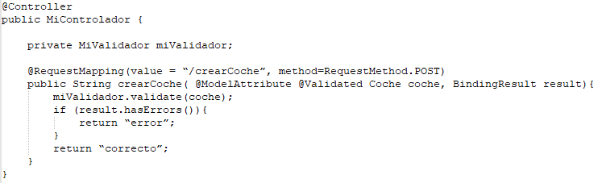

1. ¿Dónde se ejecutan los Servlets?
==En el contenedor de Servlets localizado en el servidor de aplicaciones==

2. Un contenedor recibe 2 peticiones desde dos IPs diferentes para el mismo Servlet.
¿Cuántas instancias se crearán?
==Una==

3. Un servlet recibe 10 peticiones simultaneas en la misma IP, ¿cuántos Hilos se
ejecutarán desde que se crea el servlet?
==10==

4. Dónde se ejecuta un JSP…
==ES compilado en un servlet y el servlet es ejecutado dentro del contenedor==

5. ¿Cuál/es de las siguientes afirmaciones es correcta?
a) El ámbito del contexto siempre dura menos que el resto
b) ==El ámbito sesión suele durar más que el request==
c) El ámbito request suele durar más que el contexto
d) El ámbito sesión puede durar más que el resto

6. Indica la respuesta correcta.
a) Servlets son más adecuados para presentación que JSP
b) JSP y Servlets son igualmente adecuados para presentación
c) JSP es más adecuado para lógica de negocio
d) ==JSP son más adecuados para presentación==

7. ¿En qué se convierten los componentes una vez escaneados para poder ser
inyectados en diferentes partes de la aplicación?
==En Beans==

8. ¿Cuál es la diferencia entre un @Controller y un @RestController?
==Un Controller retorna referencias a plantillas y un RestController retorna objetos==

9. ¿En qué tipo de componentes se implementa la lógica de negocio de la aplicación
según el patrón N-Capas?
==En los servicios==

10. ¿Qué diferencia hay entre el operador $ y operador # de thymeleaf?
==# manipula utilidades y mensajes, $ manipula expresiones==

11. ¿Qué anotación de Spring Boot se incluye en la clase principal que inicia la aplicación?
==@SpringBootApplication==

12. ¿Cuál o cuales de las siguientes anotaciones NO se corresponden con componentes:
@Controller, @Service, @Bean, @Entity, @Configuration?
==@Bean y @Entity==

13. Para poder usar objetos de las clases que aparecen en el siguiente fragmento de código se usaría:
````java
@Configuration
public class WebSecurityConfig extends WebSecurityConfigurerAdapter {
@Bean
public BCryptPasswordEncoderbCryptPasswordEncoder(){
	...
}
````
==IoC e Instalación manual según el caso==

14. ¿Según la siguiente configuración que se requiere para que una petición pueda acceder a la URL/persona/detalles?
````java
http.authorizeRequests()
.antMatchers("/persona/**").authenticated()
.antMatchers("/persona/borrar").hasAuthority(“ROLE_USUARIO”)
.antMatchers("/persona/detalles").hasAuthority(“ROLE_ADMIN”)
.anyRequest().permitAll()
````
==Se requiere que el usuario esté autenticado==

15. ¿Cuáles son los 3 parámetros mas significativos de la clase Userdetails de Spring security?
==Username, password y el HashSet de autorizaciones==

16. ¿Con qué propósito se usa comúnmente la anotación @Bean?
==Para declarar Objetos de configuración o funcionalidad transversal==

17. El siguiente fragmento de código trata de utilizar un validador, para validar los datos facilitados por el usuario en la entidad “Coche” ¿Hay algún error en la implementación? Indica la respuesta correcta.



==El Bean del validador miValidador no ha sido inyectado==
==Faltan errores por mencionar==

18. Desde Thymeleaf, ¿cómo se colocaría el valor de un mensaje con clave
“tienda.titulo” en un elemento H1? Incluir únicamente código thymeleaf
==Se indica así:== `<h1 th:text="#{tienda.titulo}"></h1>`

19. ¿Quién recibe antes una petición, un controlador o un interceptor?
==El interceptor recibe antes la petición siempre==

20. Nombra dos atributos contenidos en el objeto Pageable.
==Número de página solicitada y Número de elementos por página==

21. ¿Quién crea, dónde se almacena y como se traza un objeto de sesión?
==Se crea a solicitud del servidor, se almacena en el servidor y se suele trazar basado en una cookie única para cada usuario que queda almacenada en su navegador==

22. El siguiente Servicio debería permitir que un usuario vea los detalles de una de sus propias asignaturas, ¿hay algún aspecto de seguridad que puede ser mejorado?
````java
@Service
public MiServicio{
	public Asignatura getMiAsignatura(Long id){
		Asignatura asignatura = asignaturasRepository.findOne(id);
		return asignatura;
	}
}
````
==Si. No parece que el servicio esté comprobando si la asignatura pertenece al usuario==

23. ¿Por defecto, cómo tiene ligar la instanciación de un objeto que se inyecta en varias partes del código de un mismo proyecto?
==Se crea el objeto, y se inyecta la misma referencia a dicha instancia en todas las partes==

24. Explica en qué consisten las pruebas de Interface en Web Testing
==Consiste en la prueba de las conexiones entre el servidor de aplicaciones y otros servidores==

25. Cuál es la diferencia entre los test de carga y los test estrés:
==Los test de carga prueban los calores de carga normales y altos, mientras que los de estrés prueban los valores límite==

26. Indica cuales son casos de prueba de compatibilidad válidos en proyectos web:
==Navegadores, SSOO y Dispositivos móviles==

27. ¿Qué elemento de una aplicación JEE se encarga de recibir las peticiones HTTP y redireccionarlas a servlets específicos?
==El contenedor de servlets==

28. En un ciclo de vida de un servlet ¿cuántas veces se podría ejecutar (mínimo y máximo) la función **init()** y **doGet()**?
|función|mínimo|máximo|
|---|---|---|
|init()|1|1|
|doGet()|0|las que se quiera|

29. Desed un servlet, explica cuál es la diferencia funcional entre obtener un valor "nombre" con:
**a) request.getPArameter("nombre")
b) request.getSession.getAttribute("nombre")**
==El ámbito es diferente:
a) obtiene el parámetro nombre de la petición actual
b) obtiene el atributo nombre de la sesión del cliente ==

30. ¿Sobre qué elemento básico de JEE se construye una JSP?
==Cada JSP se transforma en un Servlet==

31. ¿Cuál es la principal ventaja de los JSP sobre las tecnologías anteriores?
==Mayor separación entre presentación y lógica de negocio, pues:
- ==Generar HTML por código dificultaba la separación entre lógica y diseño==

32. ¿Qué 3 tipos de elementos puede contener una JSP?
==DIrectivas, acciones y scripting(elementos de secuencia)==

33. ¿En la siguiente directiva JSP qué es "gestorCanciones"?
`«jspisetProperty name= "gestorCanciones" property= "canciones "value= "27>`
==Es un Bean / identificador / nombre de un Bean==

34. ¿En una arquitectura MVC en JEE qué elemento se utilizaría para implementar el modelo (lógica de negocio y datos)?-> servlets, beans y JSPs
==Los Beans (clases Java) son los que se encargan de la lógica de negocio==

35. ¿En qué consiste el patrón fachada? ¿Cuál es su principal ventaja?
- ==Interfaz único simplificado con los servicios más generales del sistema
- ==Interfaz simple para un subsistema capa / compleja
- ==Reduce el acoplamiento==

36. 
==Fachada==

37. 
==Presentación y persistencia no pueden comunicarse entre ellas==

38. 

39. ¿Quién recibe antes una petición, un controlador o un interceptor?
	- ==El interceptor recibirá antes la petición==

40. ¿Cuál es la función del LocaleChangeInterceptor en los sistemas de internacionalización?
	- ==Se utiliza para detectar si las peticiones incluyen el parámetro que indica el idioma, ej Lang=es==

41. 

42.  ¿Según la siguiente configuración que se requiere para que una petición pueda acceder a la URL /barco/eliminar?, razona la respuesta.
http .authorizeRequests ()
==.antMatchers ("/barco/add") .authenticated ()==
vantMatchera ("/barco") .hasAuthority ("ROLE USUARIO")
.antMatchers (*/barco/as*) .hasAuthority ("ROLE ADMIN")
anyRequest () . permitAlI ()

43. 

44. ¿Qué dos tipos de validaciones de datos de entrada podríamos aplicar? Nómbralos y explícalos brevemente. ¿Cuáles son más seguras?
- ==**cliente**: utilizan código de script que valida los datos de entrada en el propio navegador del diente antes de enviar los datos al servidor
- ==**servidor**: son comprobaciones en el servidor sobre los datos enviados por el cliente.
- ==Las **validaciones en el servidor** son más seguras.==

45. 

46. 1) ¿Qué es el objeto sesión? 2) Pon un ejemplo de uso común.
- ==Es un objeto propio de cada cliente / usuario
	- ==Se identifica con una ID única que viaja en cada petición realizada por el navegador.
	- ==En el objeto sesión se pueden almacenar/recuperar datos por claves
- ==Almacenar productos temporalmente en el carrito de la compra==

47. Completa el siguiente código, se debe utiliza HttpSession para guardar la fecha del último inicio de cada usuario:


48. ¿Cómo afectaría a los formularios de la aplicación incluir protección contra ataques CSRF
- ==deberían incluir un parámetro nuevo con el token CSRF
- ==El token es generado por la aplicación==

49. 
- ==asignaturasRepository.findOne solo recibe el ID de la nota
- ==El repositorio debería recibir también una referencia al usuario==

50. 

51. 
- ==El método ha de llevar la notación @Transactional==

---

# Pequeñas definiciones con apuntes

## WebTesting con Selenium

- Tipos de tests:
	- **Funcional**: pruebas de la funcionalidad de la aplicación
	- **Usabilidad**: pruebas de la interacción humana con la aplicación
	- **Interface**: pruebas de las conexiones entre servidores aplicación-web y servidores aplicación-base de datos
	- **Copatibilidad**: pruebas de compatibilidad con distintos navegadores
	- **Rendimiento**: 
		- Pruebas de carga: un alto volumen de peso a la página
		- Pruebas de estrés: llevar las pruebas al límite de la página
	- **Seguridad**

