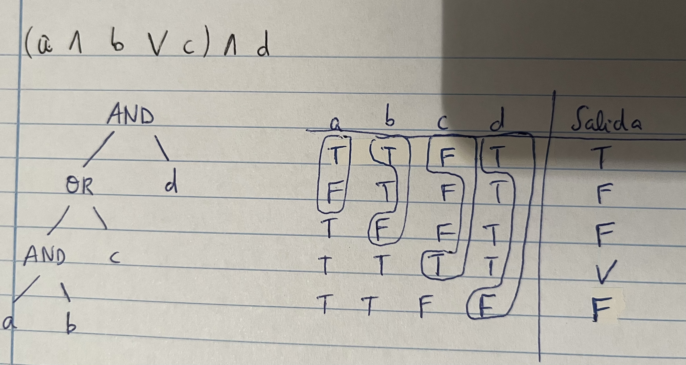

# Preguntas de exámenes

1. ***Diferencia entre fallo, error y defecto. ¿Con qué tipo de pruebas se relacionan? ¿Quiénes son capaces de detectarlos?***

- **Error**: acción humana que produce un resultado incorrecto. Las pruebas no son capaces de detectarlos. Son detectados por los desarrolladores.
- **Defecto**: manifestación de un error. Desperfecto en un componente o sistema que puede causar que el software no realice su función requerida. Se identifican mediante pruebas de carácter estático. Son detectados por los testers.
- **Fallo**: desviación en un componente o sistema de su comportamiento esperado. Se identifican mediante pruebas de carácter dinámico. Son detectados por el cliente.

2. ***¿Qué implica conseguir calidad?***

- Hemos hecho las cosas correctamente: el producto satisface los requisitos: Funcionales y de rendimiento (explícitos), de Calidad (implícitos)
- Hemos hecho el sistema correcto: Los requisitos corresponden a las necesidades del usuario

3. ***Definición de calidad*** 

**Calidad**: capacidad de un producto, servicio, sistema, componente o proceso para cumplir necesidades, expectativas o requisitos del cliente o usuario. Hay dos tipos de calidad:
- **Calidad del producto**: grado en el que el producto software cumple los requisitos y necesidades
- **Calidad del proceso**: indica en qué medida se sigue el proceso y si se cumplen los estándares

4. ***Di que está mal o incompleto en la siguiente afirmación: "La denominada pirámide de test sirve para representar los diferentes niveles de prueba, de forma que tenemos que completar todas las pruebas de un nivel para comenzar con el siguiente"***

- La primera parte está incompleta, pues no sólo representa niveles de prueba, sino también tipos de prueba
- La segunda parte está mal, pues no necesitamos completar todas las pruebas de un nivel para comenzar con el siguiente

5. ***¿Qué dice la estrategia de los "Three Amigos"? ¿Qué ventajas ofrece?***

- Esta estrategia consiste en una reunión entre el analista de negocio y/o dueño del producto, los desarrolladores y los testers.
- Su objetivo está relacionado especialmente con la planificación de sprint (más Kanban que Scrum)
- Sus ventajas son:
	- Se discuten características nuevas y se revisa la especificación
	- Entendimiento y vocabulario compartido
	- Identificación de requisitos no definidos y definición de pruebas
	- Se realizan antes de que la característica se considere lista para el desarrollo y es asignada en un sprint

6. ***¿De qué dos factores principales depende la clasificación en una organización de CMMI? ¿Qué se debe hacer en relación con estos factores para progresar al siguiente nivel?***

- Depende de cuáles son los procesos que estoy cumpliendo, porque cada nivel tiene establecidos una serie de procesos que debes cumplir. Además, depende del nivel de capacidad más bajo de esos procesos
- Para progresar al siguiente nivel se necesita incorporar todos los procesos que incluye el nivel al que se quiere avanzar, es decir, ampliar los procesos (con los de ese nivel) y aumentar el nivel

7. ***Diferencia entre nivel de prueba y tipo de prueba. Nombra tres ejemplos de cada uno. Di si las siguientes frases son verdaderas o falsas***

- **Nivel de prueba**: grupo de actividades de prueba organizadas y gestionadas en conjunto. Ej: *integración, sistema y aceptación*
- **Tipo de prueba**: grupo de actividades de prueba para un componente o sistema enfocadas en un objetivo específico de prueba. Un tipo de prueba puede usarse en uno o más niveles de prueba. Ej: *funcional, de rendimiento, regresión*

- ***a) Un tipo de prueba puede relacionarse con multiples niveles de prueba.*** VERDADERO
- ***b) Un nivel de prueba puede relacionarse con multiples tipos de prueba.*** FALSO

8. ***Además de defectos, ¿qué buscan las pruebas de software?***

Buscan encontrar fallos, además de determinar que el sistema satisface la especificación de requisitos y cumple con su propósito (satisface las necesidades y expectativas del cliente)

9. ***Diferencia entre Verificación y Validación***

- **Verificación**: confirmación, a través de pruebas objetivas, de que se han cumplido los requisitos especificados. Consiste en comprobar el programa frente a sus atributos de calidad
- **Validación**: confirmación, a través de pruebas objetivas, de que se han cumplido los requisitos para un uso concreto. Consiste en comprobar que es lo que el cliente espera

En la **validación** podemos preguntarnos *¿estamos haciendo el producto adecuado?*, mientras que en la **verificación** podemos preguntarnos *¿estamos haciendo el producto de forma correcta?*

En la **verificación** se comprueba que el sistema cumple con la especificación de requisitos, mientras que en la **validación** se comprueba que las necesidades del usuario se satisfacen

>[!Note]
>*Relación entre calidad, verificación y validación*

**Calidad**: capacidad de un producto, servicio, sistema, componente o proceso para cumplir necesidades, expectativas o requisitos del cliente o usuario.

En términos de calidad, la **verificación** se centra en asegurar que el producto es construido correctamente, mientras que la **validación** asegura que se ha construido el producto correcto

10. ***Define prueba. ¿Qué es para ti un buen caso de prueba?***

- **Definición clásica**: La prueba (testing) es el proceso de ejecutar un programa con la intención de encontrar fallos
	- Un buen caso de prueba es el que tiene una alta probabilidad de detectar un nuevo fallo
	- Un caso de prueba con éxito es el que detecta un nuevo fallo

11. ***Completa la siguiente tabla sobre la presencia de tipos de pruebas en verificación y validación***

| Tipos de pruebas | Consiste en         | Verificación | Validación |
| ---------------- | ------------------- | ------------ | ---------- |
| Estáticas        | Sin ejecutar código | Si           | No         |
| Dinámicas        | Ejecutando código   | Si           | Si         |
| Caja negra       | Sin conocer código  | Si           | Si         |
| Caja blanca      | Conociendo código   | Si           | Si         |

12. ***Da un resumen sobre la técnica de Partición en Clases de Equivalencia***

- **Clase de Equivalencia**: representa un conjunto de datos para los que se supone que el programa tiene un comportamiento similar
- Identificación de clases de equivalencia:
	- Se examina cada condición de entrada
	- Cada condición se divide en clases de equivalencia (enumeraciones, rangos o valores lógicos)
	- Si hay razones para creer que los elementos de una clase no se tratarán de la misma forma, dividir la clase en otra más pequeña (jerarquía de clases)
- Derivación de casos de prueba:
	- Estrategia típica: minimizada, que consiste en crear el menor número de casos que cubran las clases válidas (habitualmente uno por cada una de las inválidas para evitar enmascaramiento de defectos)
- Comprobar que: Nº situaciones > Nº casos > Nº bases de datos

13. ***¿Qué son las pruebas negativas?***

- Son aquellas que intentar ver si se hace algo que no se debería de poder hacer. Ej: *acceder a los datos bancarios de otra persona en una plataforma bancaria sin tener las credenciales*

14. ***Define Workflow***

- Define un modelo de ramificación estricto, útil para gestionar proyectos largos
- Asigna roles a las ramas y establece cuándo y cómo deben interactuar
	- Master: todo commit que se haga en esta rama debe estar listo para ser subido a producción
	- Development: en esta rama se aloja el código que conforma la siguiente versión planificada del proyecto
	- Una rama por característica o desarrollador
- Las ramas deben mantenerse limpias y organizadas

15. ***¿Qué es Gitflow?***

- Es un conjunto de extensiones útiles para la creación y mantenimiento de flujos de trabajo

16. ***Detalla el procedimiento de las pruebas de caminos simples***

- Formular la especificación en términos de un modelo: diagrama de flujo o de transición de estados
- Se considera el modelo como la condición de entrada
- Las situaciones a cubrir son cada uno de los caminos/transiciones
- Comprobar cuántos casos de prueba necesitamos
- Derivar casos de prueba para cubrir cada uno de los caminos (secuencia de pasos)
- Casos de prueba como secuencia de pasos

17. ***Detalla el procedimiento de las pruebas de caminos pares (o de pares de caminos)***

- Probar con mayor intensidad usando los "pares de caminos"
- Las situaciones a cubrir son cada par de caminos adyacentes
- Definir casos de prueba para cada uno de los pares
- Se requieren más casos, pero la prueba es más completa

18. ***¿Para qué escenario son útiles las combinaciones con Tablas de Decisión? ¿Y con árboles de clasificación?***

- Las combinaciones con Tablas de Decisión son útiles para probar reglas de negocio complejas en función de combinaciones de diferentes valores. Cada regla será una situación a cubrir
- Los ﾃ〉boles de clasificación son útiles cuando hay muchas entradas

19. ***¿Qué son las técnicas estáticas? Di qué dos grandes grupos de técnicas estáticas hay***

- Son aquellas que no requieren ejecución de software. Pueden realizarse muy pronto y sirven para una detección temprana de defectos, lo que reduce el coste. 
- Dos grupos: *revisiones, análisis estático*

20. ***¿En qué consiste el análisis estático?***

Consiste en analizar artefactos en busca de defectos
- Mediante herramientas automáticas
- Muchas veces antes de las revisiones manuales
- Comprobación de requisitos y trazabilidad, estándares de codificación, vulnerabilidades...
- Ejemplos de herramientas: *SonarQube*, *OWASP Dependency Check*

21. ***Modelo en V***

22. ***Di todo lo que sepas sobre el Proceso de Reporting***

- Para cada problema detectado:
	- Ejecutar y anotar el resultado provisional (pasa, falla...)
	- Verificar que es realmente un fallo, reproducir, aislar
	- Incorporar información útil para resolución
	- Comprobar duplicados. No perder credibilidad
	- Determinar causa probable
	- Determinar severidad provisional, título, descripción concisa y completa
- Otras pruebas:
	- Anotar fallos no buscados explícitamente
	- Explorar zonas problemáticas con más detalle
- Revisar los resultados (completitud y precisión) e informar (reporting)

23. ***Indica qué debe incluir el Reporting***

Ha de incluir:
- El último objetivo es conseguir que los problemas se solucionen. Hay que vender el report (Bug advocacy)
- Título corto
- Resumen conciso del problema
- Detalles sobre el proceso llevado a cabo para reproducir el problema y lo que se observa frente a lo que se debería
- Proporcionar la máxima información con las mínimas palabras
- Proporcionar información adicional (configuración, datos para reproducción...)
- Nunca usar genericidades como "no funciona", pues podemos obtener respuestas como "a mi si"

24. ***¿En qué consiste TDD? ¿Qué significa? ¿Cuáles son sus ventajas?***

- Significa Test Driven Development
- Consiste en definir las pruebas antes de ponerse a codificar. Requiere disciplina por parte de los programadores
- Sus ventajas son
	- Incremental al extremo
	- Regresión y refactorización

25. ***¿En qué consiste BDD? ¿Qué significa?***

- Significa Behaviour Driven Development
- Es similar a TDD pero las pruebas son de más alto nivel
- Consiste en definir el comportamiento deseado que se traduce a pruebas ejecutables
- Consta de un lenguaje cercano al cliente
- Las pruebas siguen un patrón: Dado... Cuando... Entonces...

26. ***Indica si las siguientes afirmaciones son ciertas o falsas***

a) Las teﾌ…nicas basadas en clases de equivalencia son teﾌ…nicas de caja negra y las teﾌ…nicas basadas en condiciones son de caja blanca.
FALSO. Ambas técnicas pueden ser de caja blanca y de caja negra

b) Las teﾌ…nicas anteriores son para validacioﾌ］ y las teﾌ…nicas estaﾌ》icas son para verificacioﾌ］.
FALSO. Las técnicas anteriores son dinámicas, que se usan tanto para verificación como para validación. Las estáticas si que son exclusivas de la verificación

27. ***¿Qué debería hacer una empresa que quiere mejorar su perfil de madurez en la metodología CMMi?***

- Debería satisfacer todas las metas apropiadas del área o conjunto de áreas de proceso que son objeto de la mejora

28. ***Además de BDD y TDD ¿qué otras pruebas se realizan en Scrum y cuándo? Explica en qué consisten***

- Scripted Testing y Exploratory Testing. Se usan antes de entregar la release
- **Scripted Testing**: las acciones a realizar por el tester son prescritas en el caso de prueba. La preparación (diseño e implementación) están claramente separadas de la ejecución
- **Exploratory Testing**: el aprendizaje, diseño y ejecución son simultáneos. Es necesario personal muy experimentado. No tienen por qué documentarse todas las técnicas, aunque sí se registrarán los resultados

29. ***¿En qué consiste el estándar ISO/IEC 29119?***

- Proporciona las directrices para las pruebas cubriendo todos los aspectos del ciclo de vida:
	- Composición consistente de definiciones, procesos, procedimientos y técnicas para las pruebas de software
	- Soluciona la dispersión existente actual
	- Cubre los huecos no cubiertos por otros estándares existentes
	- Adoptado por los comités de normalización nacionales

30. ***¿Qué dos técnicas se usan? Explícalo con tus propias palabras***

En primer lugar, cobertura de transiciones. Vemos el modelo e identificamos las transiciones, de manera que los casos de prueba cubras las transiciones. De ahí sacaríamos dos casos de prueba.

Ahora, si aplicamos MCDC:

| `a=0` | `b=0` | `a=0 AND b=0` | SALIDA |                        |
| ----- | ----- | ------------- | ------ | ---------------------- |
| T     | T     | T             | 1-3    | MODELO DE TRANSICIONES |
| T     | F     | F             | 1-4    | MCDC                   |
| F     | T     | F             | 2-4x   | MODELO DE TRANSICIONES |

Con MCDC podemos sacar el caso extra

31. ***Probar todos los pares de caminos usando todos los casos de prueba necesarios mínimos***

Pares de transiciones:
- S0-S1-S2
- S0-S1-S4
- S1-S4-S5
- S4-S5-S1
- S5-S1-S2
- S5-S1-S4
- S1-S2-S3
- S1-S2-S5
- S2-S5-S1

Caminos:
- S0-S1-S4-S5-S1-S2-S3
- S0-S1-S2-S5-S1-S4-S5-S1-S2-S3

Con dos caminos se recorren todos los pares de transiciones

32. Probar todos los pares de transiciones usando todos los casos de prueba necesarios/mínimos

Pares de transiciones:
- S0-S1-S2
- S0-S1-S4
- S1-S4-S5
- S4-S5-S1
- S5-S1-S2
- S5-S1-S4
- S1-S2-S3

Caminos:
- S0-S1-S4-S5-S1-S2-S3
- S0-S1-S2-S3

Con dos caminos recorremos todos los pares de transiciones

33. ***Aplicar MCDC a la siguiente expresión (ejemplo teoría)***

>[!Note]
>Fijarse esta otra forma de hacerlo (*Masking MCDC*)

34. ***Aplicar MCDC a la expresión: (a AND b OR c) AND d***

NOTA: la V es un True, que se me coló `-_^`

35. ***Aplicar MCDC a la expresión: a OR b AND c OR d***

36. ***Aplicar MCDC y Valores límite: a=1 AND (b=2 OR c<4) AND d > 4***

37. ***Di qué tipos de prueba existen***

- Funcionales
- No funcionales (otros atributos de calidad)
	- Interoperabilidad
	- Seguridad
	- Rendimiento, carga, estrés
	- Usabilidad, accesibilidad
	- Fiabilidad, Eficiencia, Portabilidad
- Relativas a cambios
	- Confirmación (retest): defectos han sido solucionados
	- Regresión: los cambios no han afectado a otras partes

38. ***Di qué niveles de prueba existen***

NOTA: recordar CISA

- **Componente**: por separado, principalmente funcionalidad
- **Integración**: interfaces entre componentes e interacciones con otras partes del sistema
- **Sistema**: comportamiento del sistema global, funcional y no funcional (suele ser el último paso de la verificación)
- **Aceptación**: determinar si el sistema está listo para ser liberado (validación)

39. ***Estrategias para los casos de prueba***

- **Minimizada (each choice)**: por defecto. Implica no combinar. Se cubren todas las situaciones con el menor número de casos de prueba
- **Base choice**: permite probar la sensibilidad ante pequeños cambios. Se elige una combinación base y el resto son iguales salvo un cambio en una de las situaciones
- **Combinaciones parciales**: algunas condiciones de prueba son más importantes que otras
- **Multiple combination**: fuerza bruta. Se combina todo con todo

40. ***Explica la diferencia entre caso de prueba lógico y físico***

- **Lógico**: describe en términos lógicos las circunstancias en las que se probará el comportamiento del sistema, incluyendo las situaciones a cubrir
- **Físico**: elaboración concreta del caso lógico. Valores exactos de entradas, salidas y configuración

41. ***Dibuja la pirámide de test***

Concepto inicial de *Mike Cohn*

42. ***¿Para qué se usan los Mocks?***

Se usan cuando tenemos que probar un sistema con un servicio externo que aún no está implementado, o cuando queremos probar la lógica de negocio independiente a ese servicio. El Mock se usa para sustituir a ese componente o API

43. ***Modelo de Procesos de pruebas***

44. ***Agile Testing Quadrants, Lisa Crispin***

45. ***En qué consiste Exploratory Testing***

Diseño, ejecución y aprendizaje simultáneo:
- Planificación previa (test charter): declaración breve del alcance y objetivos para una prueba en una ventana de tiempo limitado (ej: 2 horas)
- Diseño y ejecución se realizan en paralelo
	- Se profundiza en conocimiento del sistema según se ejecuta
	- Se aplican técnicas, aunque no siempre se documenta
	- Se registra lo que se aprueba y los problemas encontrados
- Otros aspectos
	- No es test ad-hoc o improvisado
	- Necesita personal muy experimentado
	- Session-Based Testing: Más estructurado

46. ¿En qué consiste el Page Object Model?

- Consiste en encapsular en clases todas las acciones Selenium sobre una página
	- Simplifica el test, centrándolo en la lógica a probar
	- Evita dispersión de las mismas acciones en varios tests
	- Mayor facilidad de cambios cuando cambie el marcado de la página
- Aspectos clave:
	- En general, no contienen asserts
	- Los "locators" se suelen definir como variables para simplificar código
	- Los métodos incluyen los waits que sean necesarios
	- La navegación se realiza ejecutando la acción con Selenium y devolviendo el page object de la página destino

47. ¿En qué consiste el shift left y shift right? ¿De qué forman parte?

Forman parte del Continuous Testing.
- **Shift left**: realizar las pruebas lo antes posible
- **Shift right**: monitorizar y probar en producción

48. ¿Qué tipos de Revisiones existen?

- **Revisión de Gestión** (Management Review): Monitorización de progreso, estado de planes, etc.
- **Recorrido** (Walkthrough): Presentación del documento por parte del autor para obtener un conocimiento común, comentarioes, etc.
- **Revisión técnica** (Technical Review): Discusión detallada para determinar consenso/discrepancias en los contenidos técnicos.
- **Inspección** (Inspection): La más formal, con un procedimiento muy definido para detectar defectos.
- **Auditoría** (Audit): Independiente, para determinar conformidad con especificaciones, estádnares, u otros criterios

# Preguntas de cuestionarios

1. 

2. 

Con el menor esfuerzo:
- ==S0-S1-S2-S4-S1-S2-S3-S1-S4==

3. 

4. 

5. 

- ==Ninguna es correcta==

6. 

- ==Aunque es una práctica más de Kanban, es útil utilizarla en Scrum==
- ==Se puede usar, entre otros, para realizar el "Backlog Grooming"==

7. 

8. 

- ===Ninguna es correcta=

9. ¿Cuáles son ciertas?

10. ¿Cuáles son falsas?

11. ¿Cuáles son ciertas?

12. Dado a,b,c ...

13. Indica cuáles no son válidos:

14. Dado el siguiente diagrama, da la secuencia de transiciones con menor esfuerzo:

15. ¿Cuál es cierta?

16. ¿Cuáles de las siguientes son falsas en relación al modelo en V?

