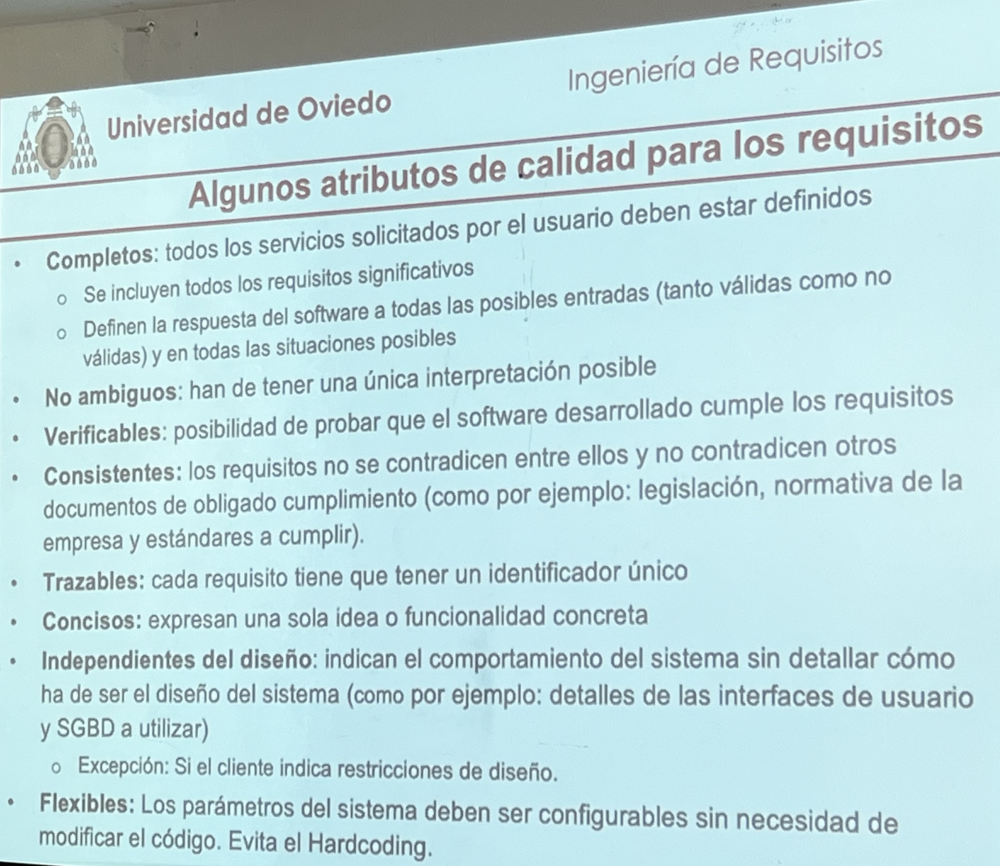

# Taller 1 

- La parte más difícil de construir de un sistema software es decidir qué construir
- Se parte de un problema/necesidad real y además propuesto por un cliente (no informático) que lo expresa en sus propios términos y necesidades, y que incluso pueden no ser realistas
- **Objetivo**: Queremos obtener una solución de calidad desde el punto de vista de la Ingeniería de Requisitos

## ¿De dónde obtener los requisitos?

- De los StakeHolders
- Del producto referencia

## Ejemplo de funcionalidad

- El sistema debe comprobar que el valor introducido por el comprador es un entero positivo <= número de unidades disponibles para el artículo que solicite

## Normas de un requisito

- Los requisitos deben tener un identificador único
- No es lo mismo expresar una funcionalidad que un requisito
- El ingeniero de requisitos deberá descubrir funcionalidades no obvias y por tanto, requisitos cuya obtención no es trivial

## Algunos atributos de calidad para los requisitos

- **Completos**: todos los servicios solicitados por el usuario deben estar definidos
    - Se incluyen todos los requisitos significativos
    - Definen la respuesta del software a todas las posibles entradas (tanto válidas como no válidas) y en todas las situaciones posibles
- **No ambiguos**: han de tener una única interpretación posible
- **Verificables**: posibilidad de probar que el software desarrollado cumple los requisitos
- **Consistentes**: los requisitos no se contradicen entre ellos y no contradicen otros documentos de obligado cumplimiento (como por ejemplo: legislación, normativa de la empresa y estándares a cumplir).
- **Trazables**: cada requisito tiene que tener un identificador único
- **Concisos**: expresan una sola idea o funcionalidad concreta
- **Independientes del diseño**: indican el comportamiento del sistema sin detallar cómo ha de ser el diseño del sistema (como por ejemplo: detalles de las interfaces de usuario y SGBD a utilizar)
	-  **Excepción**: Si el cliente indica restricciones de diseño.
- **Flexibles**: Los parámetros del sistema deben ser configurables sin necesidad de modificar el código. Evita el Hardcoding.

# Taller 2

# Taller 3

# Taller 4

- Funcionalidad: **Gestión de Monedero**
- Requisito de alto nivel: 
	- GM1 Ingresar dinero 
	- GM2 Sacar dinero
	- GM3 Ver saldo
	- GM4 Ver histórico de movimientos

## Funcionalidades de IRBet

- Primarias
	- Gestión de Monedero
	- Registro de usuarios
	- Identificación de usuarios
	- Jugar a la primitiva 
	- Jugar al joker
	- Gestión de sorteos (Ver premios, gestión de recaudación, gestionar pagos y gestión escrutinio)
	- Categorización de premios de la primitiva
	- Categorización de premios del joke

- Secundarias
	- Gestión de informes
	- Gestión de estadísticas

# Taller 5

## Requisitos funcionales:

(hay que completar con los datos)

- **Gestionar sorteos**
	- Crear el sorteo
	- Modificar sorteo
	- Eliminar el sorteo
	- Generar informe de apuestas realizadas destinada a la Junta Superior de Control
	- Generar informe de dinero recaudado
	- El sistema permitirá a los usuarios empleados de SELAE añadir números agraciados al sistema
	- Hacer Escrutinio
	- Generar informe para la Junta superior de control donde se almacene la información de apuestas ganadoras por categoría de premio
	- Pagar las apuestas premiadas a los usuarios ganadores
	- Generar un informe resumen a la Agencia Tributaria
- **Cálculo de premios**
	- asignar el porcentaje destinado a premios
	- distribución de dicho porcentaje entre las diferentes categorías
- **Jugar a la lotería primitiva**
	- Cumplimentación del boleto
	- Pago del boleto
	- Generación del reintegro
	- Generación del resguardo de haber apostado
- **Jugar al joker** (igual que la loteria)
- **Gestión del Monedero** 
	- Meter dinero
	- Sacar dinero
	- Configuración del saldo del monedero
		- Límite de 2500€
		- Cada jugador puede configurar su monedero para poner un saldo máximo diario, semanal y mensual
	- Ver movimientos
	- Permitir al usuario pagar una o varias apuestas (compulsar apuesta)
- **Registro de usuarios**
	- solicitar datos al usuario (no incluir la palabra formulario)
	- comprobar que el usuario no esté en la lista de ludópatas
	- guardar en la base de datos al usuario
	- el sistema envia un correo electrónico conforme a que se creo la cuenta correctamente
	- si el usuario es ludópata, el sistema envía al usuario un mensaje explicandole por que no puede jugar
	- si el sistema falla, indicarlo mediante mensaje
- **Identificación de usuarios**
	- permitir a usuario no identificado jugador iniciar sesion
	- permitir a un usuario identificado cerrar sesión
	- permitirle recuperar la contraseña
	- debe permitir a un usuario no identificado empleado de selae identificarse (tendrá que ir a una pantalla distinta que un usuario sin privilegios)
	- realizar la validacion de si el usuario es o no ludópata

# Taller 6

- ==Pregunta que va a caer en el primer parcial==
	- **Diagrama de casos de uso** (habría que hacerlo)

- usar sistema de persistencia en lugar de base de datos
- para la contraseña no hay que explicar su formato

- [Cómo hacer Diagramas de casos de uso](https://emctwo.home.blog/2022/10/22/)

# Taller 7

- Mejor decir usuario registrado jugador
- Configuración Monedero. <--- Extends:
	- Importe semanal
	- Diario
	- Mensual
	- Configuración de juego responsable
	- Configuración carga de monedero

- NOTA: un monedero no paga el premio, pero sí lo recibirá

# Taller 9

- Hacer los UML de las funcionalidades que faltan
- **Perspectiva de producto**: el software que yo estoy haciendo como encaja en el sistema de la compañía (como encaja con el sistema antiguo)
- **Requisitos de interfaces externas**: sistemas que ya son de terceros, que no forman parte del sistema de loterías