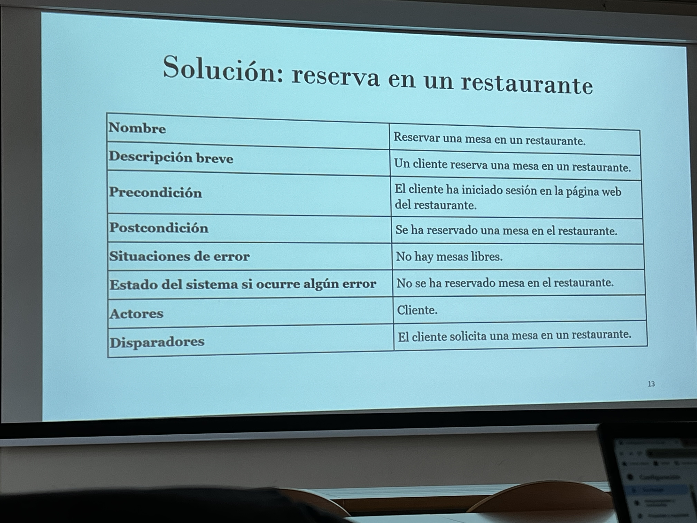
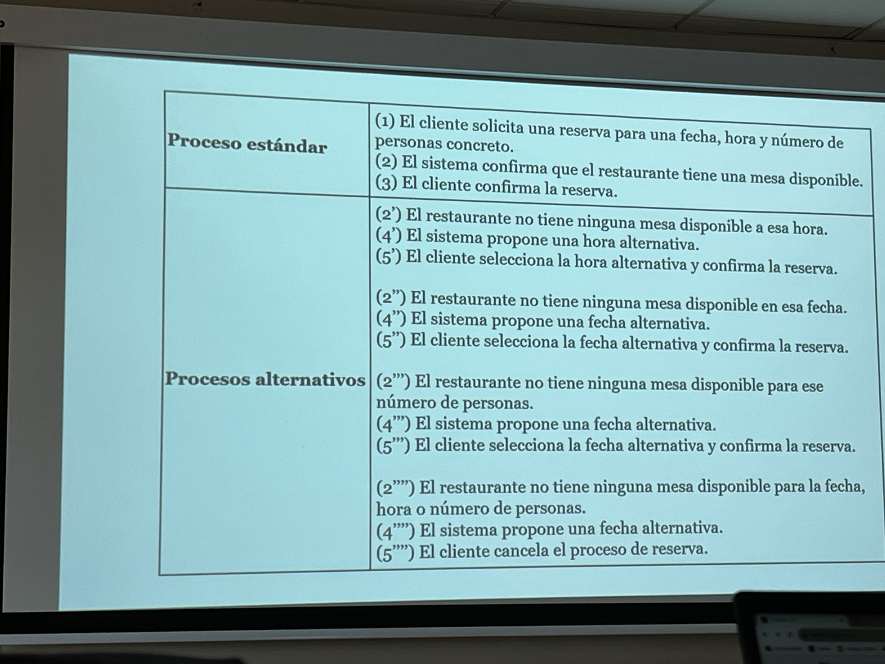
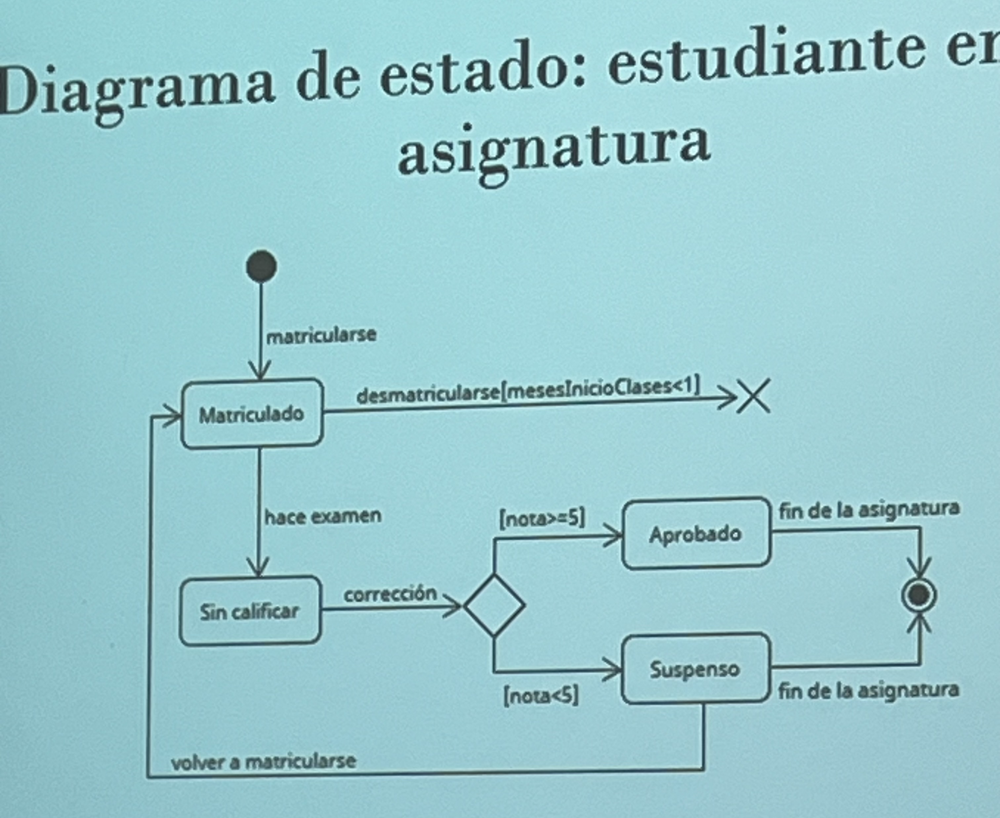
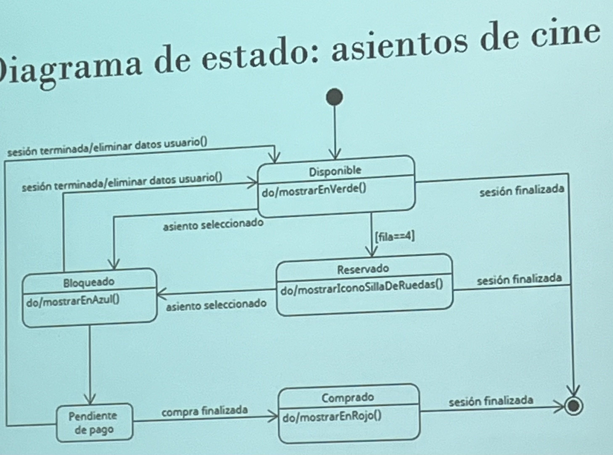

# Seminario 1

## Ejercicio 1: Identificar los stakeholders

- S1 Todo el personal médico
- S2 Personal de administración
- S3 Personal centralita
- S4 Usuarios no registrados
- S5 El usuario administrador del sistema IRMed
- S6 Todos los centros de salud de Asturias
- S7 El cliente (Conserjería de Salud)
- S8 El equipo de desarrollo del proyecto
- S9 Usuarios registrados (pacientes)
- S10 Equipo de traducción
- S11 Equipo de marketing
- S12 Proveedor de dominios
- S13 Proveedor de certificados

## Ejercicio 2

|Funcionalidad|S1|S2|S3|S4|S5...|
|---|---|---|---|---|---|
|Traducción a español e inglés|||||X|
|Todo usuario con tarjeta sanitaria puede registrarse en la aplicación|||||||
|Todo usuario registrado podrá realizar reservas que se verán en el calendario de reservas|||||||
|Los usuarios no registrados no podrán realizar reservas|||||||
|Todo usuario (registrado y no registrado) podrá ver el calendario de reservas|||||||
|El personal médico del centro podrá ver el calendario de reservas, pero no podrá hacer modificaciones|||||||
|La aplicación tendrá un único usuario administrador|||||||
|El administrador puede añadir roles a los administrativos del centro de salud|||||||
|El administrador puede dar permisos a los administrativos del centro de salud en caso de nuevas incorporaciones|||||||
|Gestión de cuentas de usuario|||||||

Ir marcando los stakeholders interesados con una x.

# Seminario 2

## Requisitos no funcionales

- **Requisitos no funcionales**: Son restricciones a las funcionalidades que ofrece el sistema

## Requisitos de producto

- De Usabilidad
- De Eficiencia
- De Dependencia
- De Seguridad

## Ejercicio clasificar requisitos de producto

- RNF1: usabilidad
- RNF2: seguridad
- RNF3: dependencia
- RNF4: eficiencia
- RNF5: dependencia
- RNF6: dependencia
- RNF7: eficiencia
- RNF8: usabilidad

## Requisitos organizacionales

- Derivan de políticas de la empresa cliente y de la empresa desarrolladora

- De entorno
- Operacionales
- De desarrollo

## Requisitos externos

- Derivados de factores externos al sistema

- Regulatorios
- Éticos
- Legislativos

## Ejercicio clasificación requisitos

- RNF9: organizacional - desarrollo
- RNF10: externo - ético
- RNF11: organizacional - entorno

## Ejercicio: Identificar requisitos no funcionales

- RNF1: El mensaje le tiene que llegar al otro usuario en un tiempo menor a 2 segundos
- RNF2: El sistema hará una copia de seguridad de los datos periódica
- RNF3: El sistema debe permitir autenticación 2FA con datos biométricos

# Seminario 3. Casos de uso

- Un caso de uso es la descripción de una funcionalidad

- Cada caso de uso está asociado con el objetivo de un actor

## Stakeholders vs actores

- Todos los stakeholders son actores, pero no todos los stakeholders interactúan con el sistema

## Ejercicio Caso de uso

# Seminario 4. Diagramas de estado

# Seminario 5. Verificación y validación

|Requisito|Defecto|Acciones recomendadas|
|---|---|---|
|R1.|No conciso|Se debería separar el requisito en tres, uno para añadir usuarios, otro para eliminar, y para actualizar|
|RNF1.|Incompleto|Especificar navegadores|
|RNF2.|Incompleto, ambiguo, no verificable|Se debe especificar qué es fácil de usar|
|RNF3.|Inconsistente|Modificar RNF1 o eliminar RNF3|
|RNF4.|No conciso|Se ha de especificar una medida de respuesta|
|RNF5.|Ambiguo||