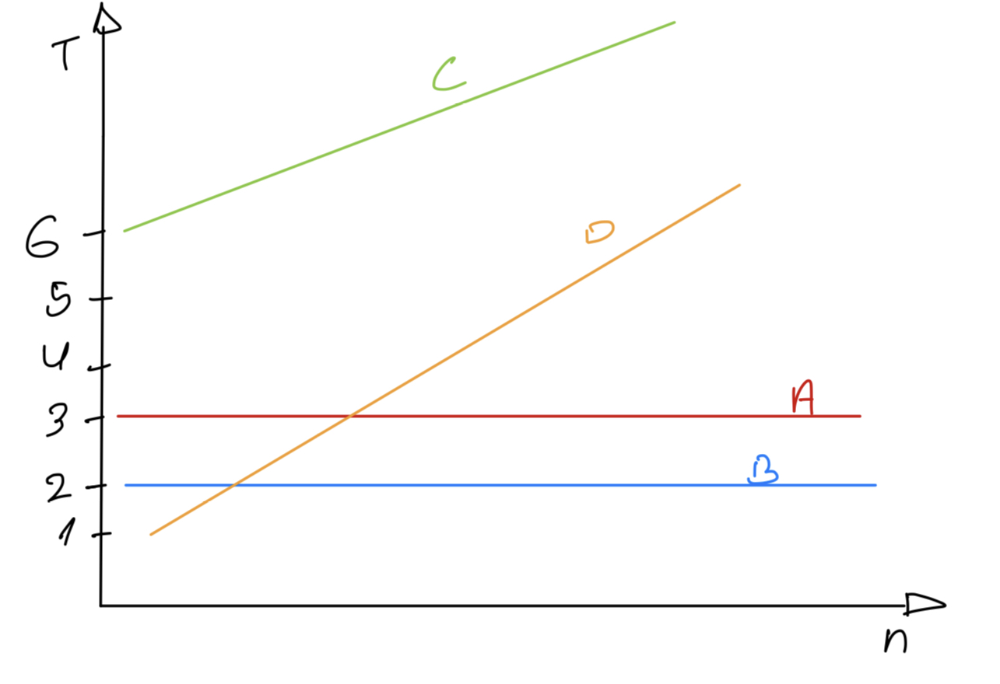

# Elementos importantes de un algoritmo

- Tiempo de ejecución 
- Ocupación de memoria 

- Se puede sacrificar tiempo de ejecución por memoria y viceversa

# Estrategia

- Conocer y acotar el problema
- Encontrar un modelo que represente el problema (abstracción)
- Formular el algoritmo sobre el modelo

# Objetivo de un Programa

- Identificar medios para almacenar datos y diseñar algoritmos que resuelvan la tarea asignada a los procesos

# Tipo de dato

- Dato: conjunto de valores que puede asumir una propiedad de una clase
- Los tipos de datos que ya conocemos de un lenguaje de programación:
	- Número entero o real 
	- Carácter  
	- Booleano  
	- Referencia

# Estructura de datos

- Una **estructura de datos** es una colección de datos que se caracterizan por su organización y las operaciones que se definen en ellos
- Un **dato de tipo estructurado** es una entidad, con un solo identificador, constituida por datos de otro tipo, de acuerdo con las reglas que definen cada una de las estructuras de datos
- Ejemplos:  
	- Cadena: Sucesión de caracteres
	- Matriz: Datos simples organizados en filas y columnas  
	- Archivo: Conjunto de registros formados por datos simples

# Tipos de datos estructurados

# Principales estructuras de datos

# Algoritmia y complejidad

- La algoritmia consiste en la búsqueda de soluciones a un problema concreto 
- Un algoritmo es un conjunto ordenado y finito de operaciones simples de tal forma que todas ellas en su conjunto permiten la resolución de un problema
- La complejidad algorítmica es una métrica teórica que permite describir el comportamiento de un algoritmo en términos de tiempos de ejecución y de memoria requerida

# Complejidad

- Ot(n) --> (**temporal**: velocidad de los algoritmos asociados)
- Om(n) --> (**espacial**: ocupación en memoria de la estructura)

# Ejemplos

1. 3 --> O(1)
2. 5n + 1 --> O(n)

1. 2n^2 + 1 -> O(n^2)
2. 2(log2(n) + 1) + 1 -> O(log2(n))

- El tiempo de ejeución es constante, no depende de la carga del algoritmo --> O(A) = 3, O(B) = 7
- Tiempo no constante, que depende de la carga del algoritmo -> O(C) = 4n + 1, O(D) = 5n + 2

Gráfico:

# Principio de invarianza de un algoritmo

- *Un algoritmo se comporta de la misma manera independientemente del equipo en el que se ejecute (de forma asintótica, no empírica: al gráfica (complejidad) es la misma pero los tiempos reales son diferentes)*

---

