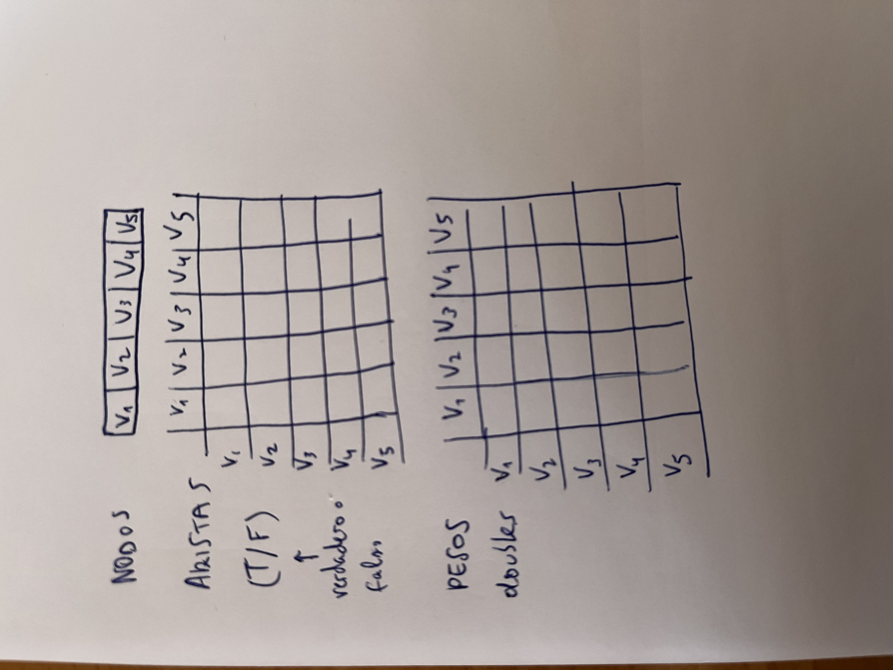

- **Arista**: relación entre nodos en la que existe un orden (grafo dirigido: --->, <---)
- **Arco**: relación entre nodos en la que no existe un orden (grafo no dirigido: ---)

# ¿Qué es un grafo?

- Un grafo es un modelo matemático que permite representar relaciones arbitrarias entre objetos.


## Tipos de grafos


# Definición formal


# Conceptos básicos

- **Bucle**: Arco u arista con igual origen que destino.
- **Grado de un nodo**: Número de arcos u aristas conectados al nodo. 
	- **Grado de Entrada (gE) de un nodo**: Número de arcos o aristas que tienen al nodo como destino
	- **Grado de Salida (gS) de un nodo**: Número de arcos o aristas que tienen al nodo como origen.


- V3 es un **nodo fuente** (nodo que se conecta con todo el mundo)
- V4 es un **nodo sumidero** (nodo que no se conecta con nadie pero que es accesible para todo el mundo)
- V5 es u **nodo aislado** (ningún grado de entrada ni ninguno de salida)


# Capacidad de un grafo

- n = número de nodos de un grafo


- Número mínimo de arcos en un grafo = 0 (todos aislados)
- Número máximo de arcos en un grafo = n^2 (todos conectados con todos (con bucles))


# Representación en memoria
## Densidad de un grafo


# Clase Grafo (Matriz de adyacencias)


- Hay que almacenar los nodos (de cualquier tipo), las aristas y los pesos

|Matrices adyacencias|Listas adyacencias|
|---|---|
|- Usan memoria estática |- Usan memoria dinámica|


# Análisis de eficiencia


# Listas de adyacencia


## Análisis de Eficiencia


# Clase Grafo. Métodos básicos
## Matriz de adyacencia


- Complejidad 0(1)

## getNode()


- Complejidad O(n)
````java
public int getNode (T node)
{
	for (int i=0; i<size; i++)
		if (nodes[i].equals(node))
			return (i); // returns the node’s position
	return (-1); // search fails, node does not exist
}
````

## addNode()


- Complejidad O(n)
````java
public void addNode (T node)
{
	// precondition: node does not exits and there is
	// available space for the node.
	if (getNode(node)== -1 && size<nodes.length)
	{
		nodes[size] = node;
		//inserts void edges
		for (int i=0; i<=size; i++)
		{
			edges[size][i]=false;
			edges[i][size]=false;
			weight[size][i]=0;
			weight[i][size]=0;
		}
		++size;
	}
}
````


## removeNode()


- Complejidad O(n)
````java
public void removeNode (T node){
	int i = getNode(node);
	
	if (i>=0) {
		--size;
	if (i != size+1) { // it is not the last node
	
		nodes[i] = nodes[size]; //replaces by the last node
		
		//replace elements in the vectors edges and weights
		for (int j=0; j<=size; j++) {
			 edges[j][i]=edges[j][size];
			 edges[i][j]=edges[size][j];
			 weight[i][j]=weight[size][j];
			 weight[j][i]=weight[j][size];
		}
		
		 // loop (diagonal)
		 edges[i][i] = edges[size][size];
		 weight[i][i] = weight[size][size];
	}  
}
````

## existsEdge()


- Complejidad O(n)
````java
public boolean existsEdge (T origin, T destination)
{
	int i=getNode(origin);
	int j=getNode(destination);
	
	// precondition: both nodes must exist. // if don’t... should we throw an exception?
	
	if (i>=0 && j>=0)
		return(edges[i][j]);
	else
		return (false); 
}
````

## addEdge()


- Complejidad O(n)
````java
public void addEdge (T origin, T destination, double
edgeWeight)
{
	// precondition: the edge must not already exist.
	if (!existEdge(origin, destination))
	{
		int i=getNode(origin);
		int j=getNode(destination);
		
		edges[i][j]=true;
		
		weight[i][j]=edgeWeight;
	}
	
	else
	; // what about throwing an exception here?
}
````

## removeEdge()


- Complejidad O(n)
````java
public void removeEdge (T origin, T destination){
	// precondition: the edge must exist.
	if (existsEdge(origin, destination)) {
		int i=getNode(origin);
		int j=getNode(destination);
		
		edges[i][j]=false;
		
		weight[i][j]=0.0;
	}
	
	else
	; // what about throwing an exception?
}
````

## print()


- Complejidad O(n^2)
````java
public void print(){

	for (int k=0; k<size; k++)
		nodes[k].print();
	
	for (int i=0; i<size; i++) {
		for (int j=0; j<size; j++) {
		
		System.out.print(edges[i][j] + “(“);
		
		System.out.print(weight[i][j] + “) “);
	}
	
	System.out.println();
}
````

# Más conceptos básicos


# Algoritmo de Dijkstra


- Va de un nodo origen al resto


## Ejemplo 


## Inicialización


- Dijkstra es un **algoritmo devorador** (una vez que ha elegido a un nodo, no lo vuelve a usar)

## Ejemplo


## Ejercicio Dijkstra


## Ejercicio


## Conclusiones


- Dijkstra tiene una complejidad cuadrática O(n^2)

# Algoritmo de Floyd-Warshall


## Inicialización de la Matriz A


## El algoritmo


- k es el pivote
- i es el origen
- j es el destino

## Ejemplo 1 de Floyd-Warshall


- Lo marcado en rojo es el nodo intermedio a usar (Ej: Ir desde V1 hasta V6 usando como nodo intermedio V3)

## Ejercicio 2


- Para hallar el camino inverso:


- Para ir del nodo V1 al nodo V5, usa el nodo intermedio V4
- Para ir del nodo V1 al nodo V4, hay camino directo (-)
- Para ir del nodo V4 al nodo V5, usa el nodo intermedio V3
- Para ir del nodo V3 al nodo V5, hay camino directo (-)

# Algoritmo para almacenar la secuencia de nodos que forman todos los caminos de coste mínimo

- Se puede usar para hallar el camino inverso


````java
private void printPath(int i, int j)
	{
	int k = P[i][j];
	if (k>0) {
		printPath (i, k);
		System.out.print ('-' + k);
		printPath (k, j);
	}  
}

System.out.print (departure);
printPath (departure, arrival);
System.out.println ('-' + arrival);
````

# Floyd para rutas especiales


- ==Este ejercicio cayó en un examen==

````java
for (int k=0; k<size; k++)
	if (k in L){
		for (int i=0; i<size; i++){
			for (int j=0; j<size; j++){
				if (A[i][k] + A[k][j] < A[i][j])
				{
					A[i][j] = A[i][k] + A[k][j];
					P[i][j] := k;
				}
			}
		}
	}
}
````

# Centro de un grafo dirigido y excentricidad


## Ejercicio: Obtener el centro de un grafo


## Ejercicio: Hacer Floyd


FALTA

# Recorrido en profundidad de un grafo (DFPrint)


````java
boolean [] visited = new boolean [size];

public void resetVisited ()
{
	for (int i=0; i<size; i++)
		setVisited(i, false);
}
````


## Ejercicio DFPrint


- Recorrido en profundidad V1: Saca por pantalla V1 V2 V4 V3
- Recorrido en profundidad V2: Saca por pantalla V2 V4 V3
- Recorrido en profundidad V3: Saca por pantalla V2 V4
- Recorrido en profundidad V2: Saca por pantalla V4 V3 V2

# Búsqueda primero en profundidad
- Detiene el recorrido una vez se cumple una condición


# Más conceptos básicos
- Nodo fuertemente conexo y grafo fuertemente conexo


- árbol abarcador


- árbol libre abarcador de coste mínimo


# Algoritmo de Prim


- Sólo se aplica a grafos no dirigidos
- Busca cómo conectar todos los nodos del grafo con el árbol mínimo abarcador con el menor coste

## Inicialización


## Ejercicio 1


- Usaremos el criterio de la última arista escogida (porque tienen el mismo coste)


## Ejercicio 2


## Conclusiones

- Prim tiene complejidad O(n^3)


## Optimización


