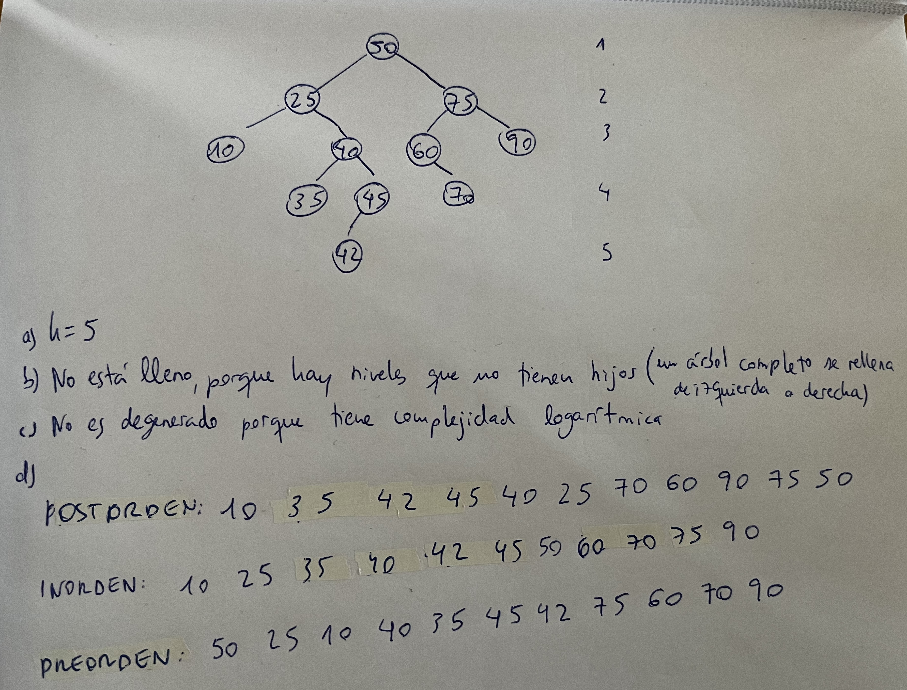
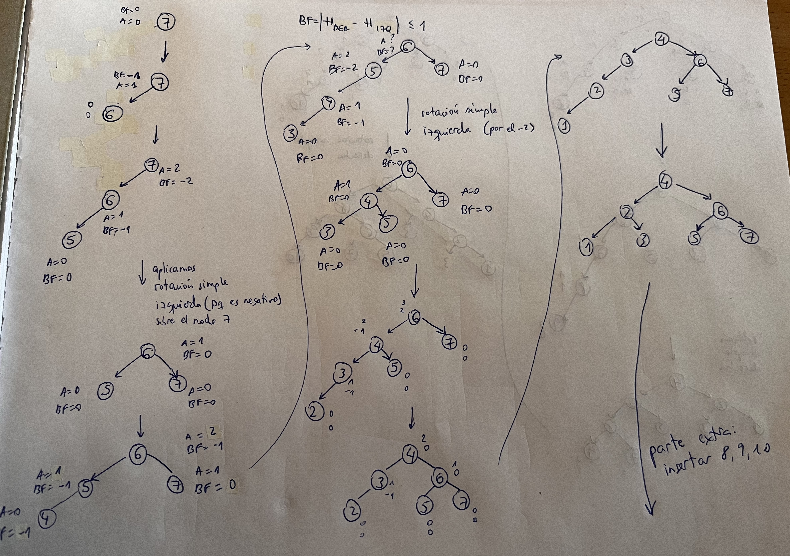
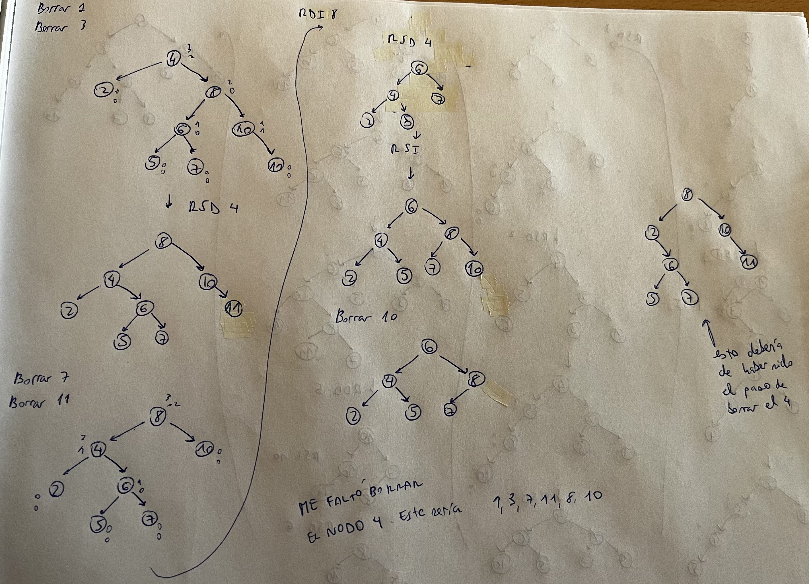
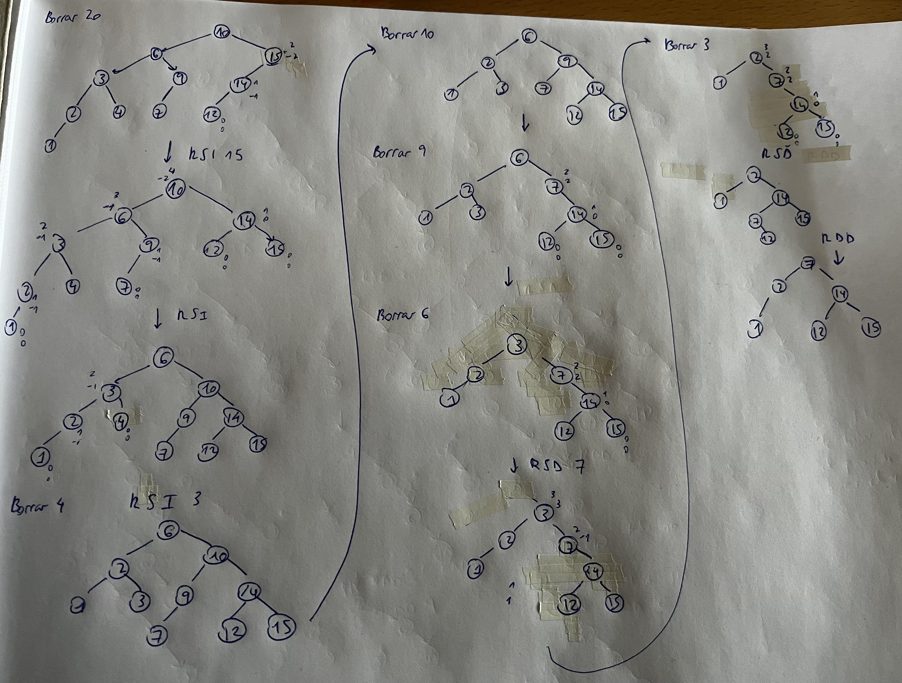

# Árboles

- Ejemplo de octavos de final - árbol binario


## ¿Qué es un árbol?


## Elementos de un árbol


- Raíz: A
- Hijo (descendiente directo): B,C
- Padre (ascendiente directo): A, B
- Hoja (nodo terminal): D, F, G, C
- Nodo interior: B, E
- Grado de un nodo: 2
- Grado de un árbol: 2
- Nivel de un nodo: A(1), B(2), E(3), F(4) 
- Altura (profundidad): 4

## Árbol completo


- Número medio de accesos que voy a tener que hacer es la altura (*h*)

## Caminos de búsqueda. Interno y Externo


- LCI: longitud de un camino interno


# Árbol Binario. Árbol de grado 2


- De grado 2 significa que tiene 2 hijos

## Árbol Binario Completo


- Si quito el 12 o el 19 ya no es completo
- Si los quito a la vez sigue siendo completo

## Árbol Binario lleno


- **Complejidad**: log(nodos+1) (en base 2 porque el grado es 2, pero si el grado fuera más sería más)

## Árbol binario degenerado


# Árbol Binario de Búsqueda (ABB)


# Implementación de un ABB

## Estructura de datos para definir un nodo


- Lo vamos a llamar BSTNode
````java
public class BSTNode<T extends Comparable<T>>{
	private T info;
	private BSTNode<T> left;
	private aBSTNode<T> right;
}
````

## Estructura de datos para definir un árbol


- Lo vamos a llamar BSTree
````java
public class BSTree<T extends Comparable<T>>{
	private BSTNode<T> source;//la raíz
}
````

## Añadir un nodo al árbol


## Ejercicios


## 1


- La complejidad es esa porque depende de la altura del árbol y del número de nodos

## 2


## Buscar un nodo en un árbol


````java
//Tiene complejidad log(n) en base 2
public BSTNode<T> searchNode(BSTNode<T> node){
	if(this.source == null)
		return null;
	if(node.compareTo(this.source) == 0)
		return this.source;

	return searchNodeRecursive(this.source, node);
}

private BSTNode<T> searchNodeRecursive(BSTNode<T> source, BSTNode<T> target){
	if(source == null)
		return null;
	if(source.compareTo(target) < 0)
		return searchNodeRecursive(source.getLeft(), target);
	else if(source.compareTo(target) > 0)
		return searchNodeRecursive(source.getRight(), target);
	else
		return source;
}
````

## Eliminar un nodo del árbol


## Buscar el máximo


````java
public T buscarMaximo(BSTNode node){
	if(node == null)
		return null;
	if(node.getRight() == null)
		return node.info;
	return buscarMaximo(node.getRight());
}
````

## Recorridos


## Recorridos. Ejercicios




````java
public String preOrder() {
	String cadena = recorridoPreOrderRecursivo(this.raiz);
	return cadena.substring(0, cadena.length() - 1);
}

private String recorridoPreOrderRecursivo(BSTNode<T> nodoraiz) {
	if (nodoraiz == null)// si la raíz es nula devolverá la cadena vacía
		return "";
	String cadena = nodoraiz.getInfo().toString();
	cadena += "\t";
	cadena += recorridoPreOrderRecursivo(nodoraiz.getLeft());
	cadena += recorridoPreOrderRecursivo(nodoraiz.getRight());
	return cadena;
	}
````

## ABB Eficiencia


# Árbol de altura mínima


# Árbol perfectamente equilibrado (APE)


## Problemas de los árboles APE


# Árboles AVL


- Se habla de alturas, no de nodos como en APE

## Ejercicios


- Es de altura mínima, porque para 5 nodos necesito un árbol de 3 de altura
- También es un APE, ya que `|#Izq - #Der| <= 1`
- También es AVL, ya que `|hIzq - hDer| <= 1`


- No es de altura mínima, porque para 6 nodos necesito un árbol de 3 de altura
- No es un APE, ya que no se cumple `|#Izq - #Der| <= 1` para el 25
- No es AVL, ya que no se cumple `|hIzq - hDer| <= 1` para el 25


- Es de altura mínima, porque para 5 nodos necesito un árbol de 3 de altura
- No es un APE, ya que no se cumple `|#Izq - #Der| <= 1` para 50
- Es AVL, ya que `|hIzq - hDer| <= 1`


- Si es de altura mínima, porque para 8 nodos necesito un árbol de 3 de altura
- No es un APE, ya que no se cumple `|#Izq - #Der| <= 1` para el 25
- No es AVL, ya que no se cumple `|hIzq - hDer| <= 1` para el 25


- No es de altura mínima, porque para 8 nodos necesito un árbol de 3 de altura
- No es un APE, ya que no se cumple `|#Izq - #Der| <= 1` para el 25
- No es AVL, ya que no se cumple `|hIzq - hDer| <= 1` para el 25

## Resumen Ahmin, APE, AVL


# Árboles de Fibonacci


## Ejemplo


## Resultados


# Implementación de un AVL

## Factor de Balance (BF)


## AVL. Añadir una clave a un árbol


## Rotación Simple Derecha


## Rotación simple izquierda (RSI)


- Tiene complejidad O(1)

## Ejercicios Rotación simple


1. 

2. 


La complejidad de insertar los nodos (salvo el raíz que es O(1)) es Olog(n)

## Rotación doble derecha (RDD)


## Rotación doble izquierda (RDI)


## Ejercicios Rotación doble


1. 

## Borrar una clave de un AVL


## Ejercicios Borrado AVL


1. Está hecho sin borrar el 4 porque no lo vi xd *missclick*



Solucion: 2 5 6 8 (el del ejercicio bien hecho)




- El caso peor en un árbol avl tiene complejidad O(log(n))

## AVL Eficiencia

