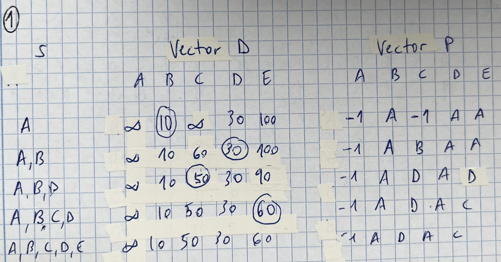
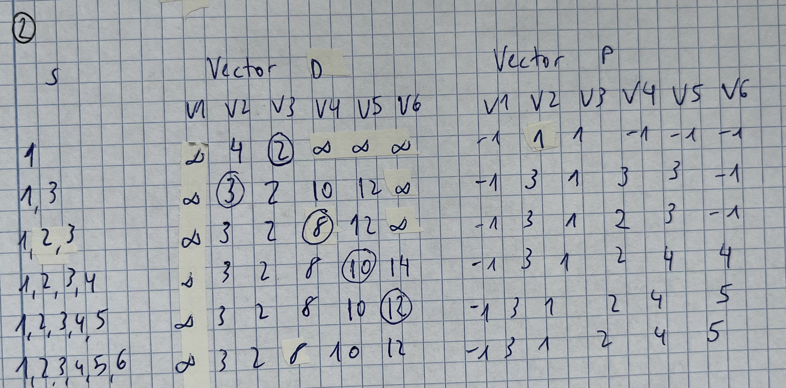
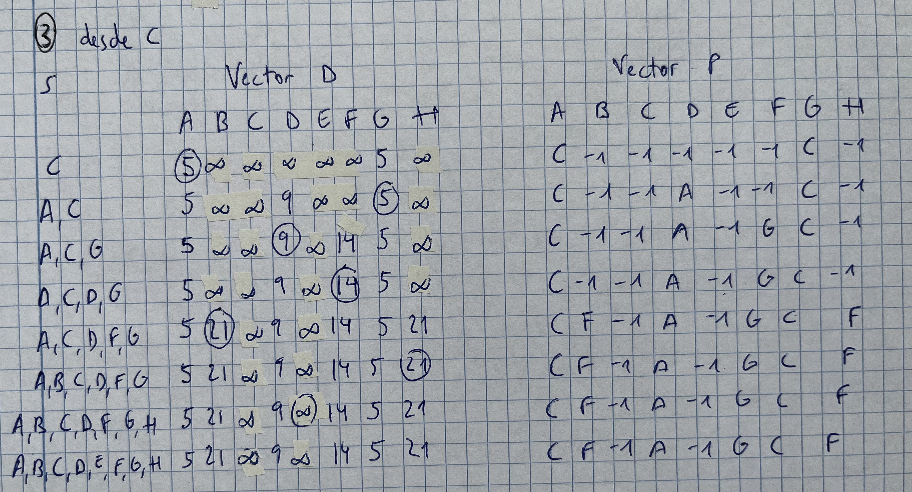
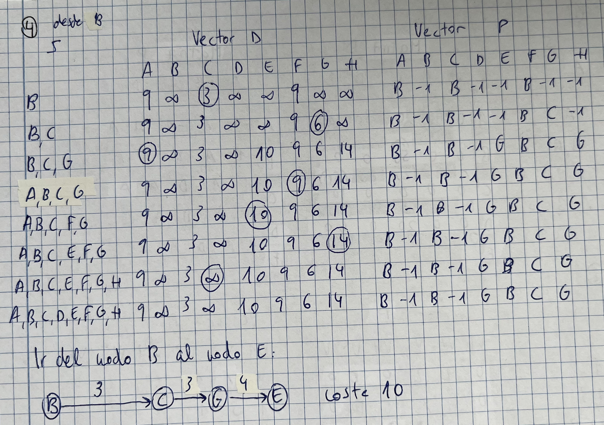

*En este documento están todos los ejercicios de seminario resueltos y hay algunas definiciones que considero interesantes para el examen de teoría*
# Seminario 2. Grafos

## Dijkstra

- Algoritmo de caminos mínimos
- Objetivo: determinar el camino más corto desde el nodo origen al resto de los nodos del grafo
- Aplicaciones: 
	- Encadenamiento de paquetes por los routers
	- Reconocimiento del lenguaje hablado
	- Enrutamiento de aviones y tráfico aéreo

## Dijkstra. Ejercicio 1

## Dijkstra. Ejercicio 2

## Dijkstra. Ejercicio 3

## Dijkstra. Ejercicio 4

# Seminario 3. Grafos

