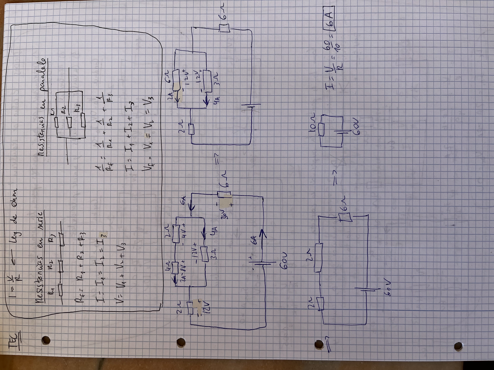
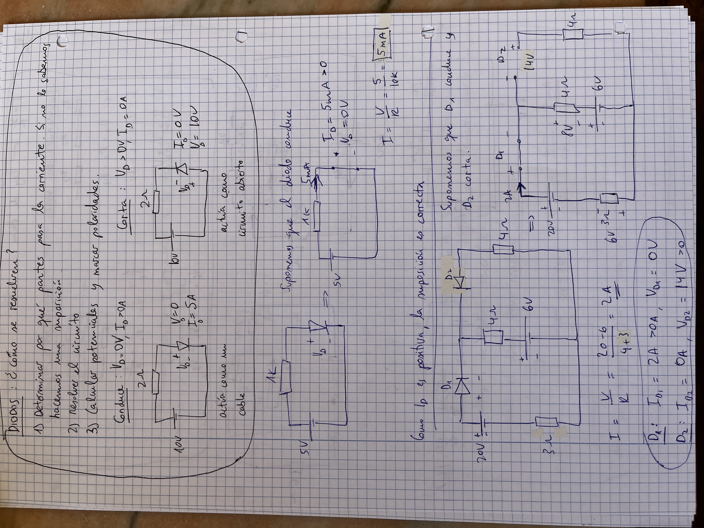
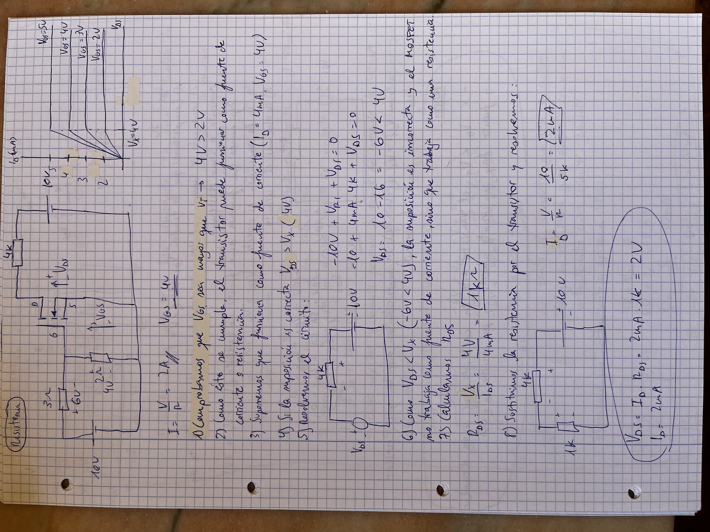
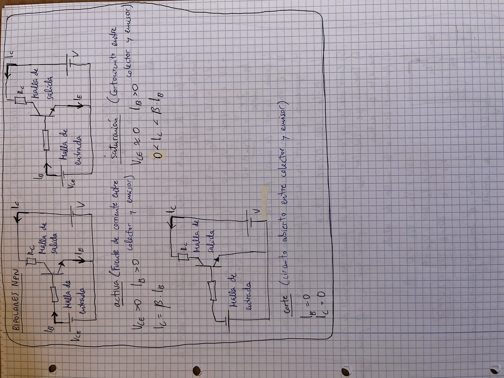
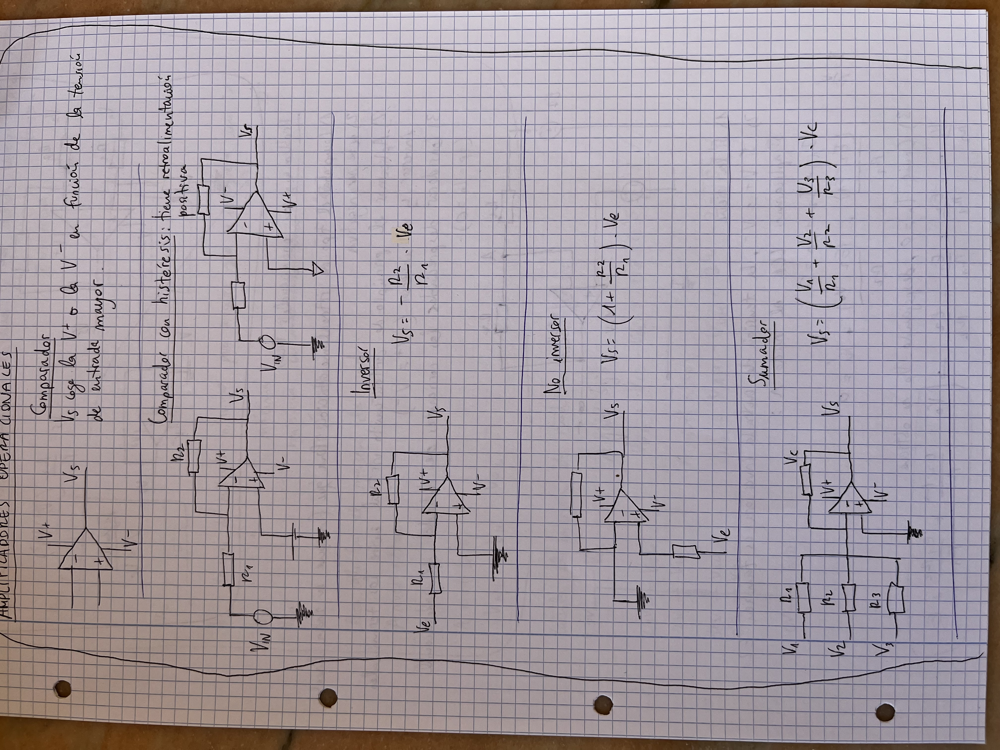
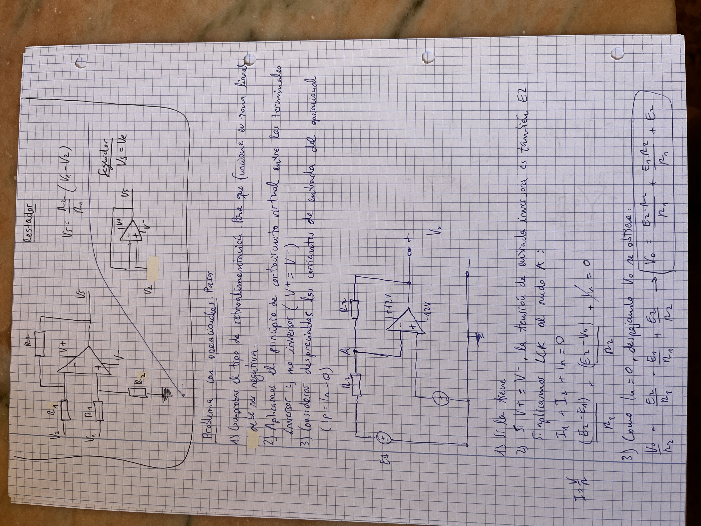
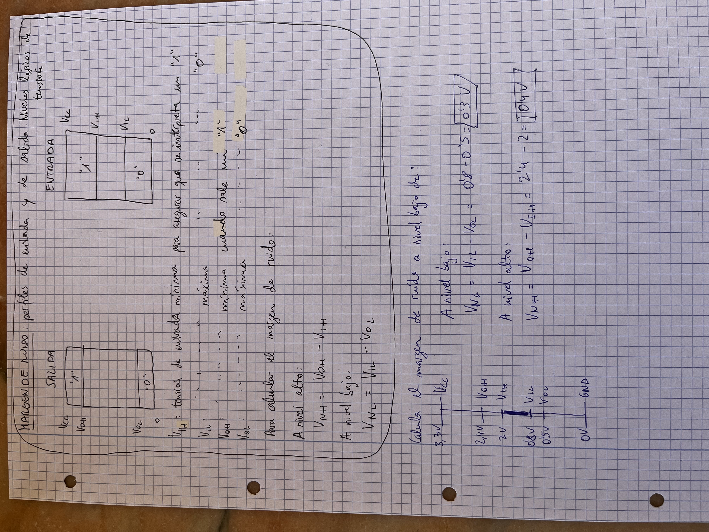

# Métodos generales
## Serie/paralelo

## Diodos

## Diodo Zener

## Gráficas de circuitos

## MOSFET (fuente de corriente, resistencia y corte)

## Bipolares NPN (cortocircuito, corte, activa)

## Amplificadores operacionales

## Margen de ruido

# Algunas preguntas raras

## Aproximaciones de diodos

## Aplicaciones de un diodo
## Rectificador de media onda

## Rectificador de onda completa

## Condensador de filtro

- Rectificador de onda + filtro por condensador

## Fuente conmutada

## Limitadores

