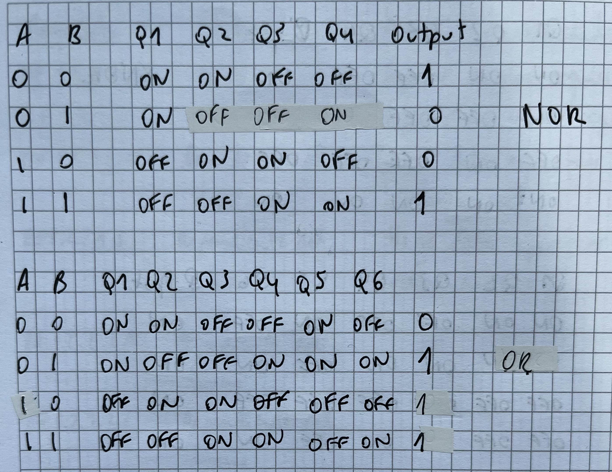

# Tema 5. Puertas CMOS

## Transistores MOSFET canal N y P

- Funciona como un inversor lógico (puerta NOT)
- Tiene problemas relacionados con el consumo

## Consumo de potencia dinámica

## Ejercicio 1 potencia dinámica

## Puertas CMOS

## Ejemplos de puertas CMOS

- La primera es un inversor lógico (NOT)
- La segunda es una puerta NAND
- La tercera es una puerta NOR
- La cuarta es una puerta OR

## Preguntas de repaso

# Tema 6. Familias lógicas

## Propiedades de los sistemas digitales

- Circuitos que manejan señales discretas
- Las entradas y salidas toman valores binarios. 0 es low y 1 es high. El margen de tensiones de estas zonas se define como indeterminado
- La salida binaria es función de las entradas binarias (función lógica)
- Los valores de tensión a las entradas se regeneran a la salida
- Los cambios en las salidas no deben afectar a las entradas (unidireccional)
- La salida de una puerta debe ser capaz de excitar a otras puertas del mismo tipo

## Niveles lógicos de tensión

## Niveles de corriente

## FAN OUT

- Límite de puertas que puedo conectar a la salida de una puerta

## Comparativa CMOS vs TTL

- Los chips CMOS tienen menos coste por su gran capacidad de integración
- Una puerta CMOS puede consistir en 2 transistores MOSFET, mientras que una puerta TTL usa un número mayor de transistores bipolares. Además, un transistor bipolar ocupa más espacio en el silicio que un MOSFET y el diseño de la puerta es más complejo
- TTL requiere de componentes adicionales (resistencias)
- El consumo de energía de un CMOS es mucho más bajo que un TTL
- El consumo de un CMOS se incrementa con la frecuencia
- Los circuitos CMOS tienen mayor inmunidad al ruido que los TTL
- CMOS es más susceptible al daño por carga electrostática que los TTL
- Los retardos de propagación son mayores en CMOS que en TTL
- El FAN OUT de un TTL es 10, mientras que de un CMOS es 50
- Las tensiones de alimentación tienen un margen mayor en CMOS

## Transistores bipolares

## Transistor bipolar NPN

## Ejemplo 1 NPN

## Preguntas de repaso

