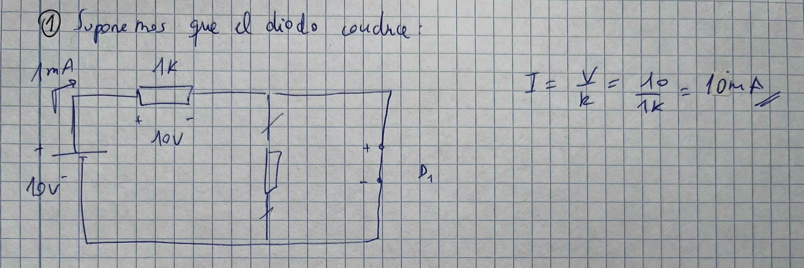
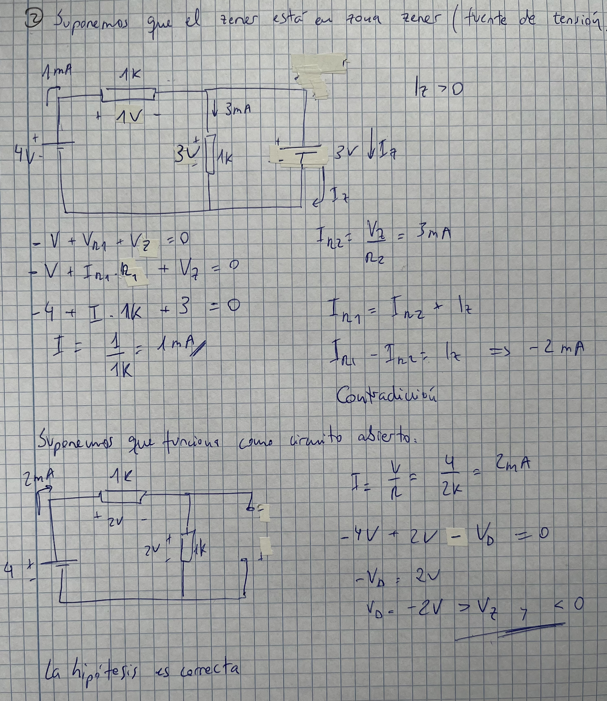

# Tema 1. Magnitudes eléctricas
## Potencia
### Generada vs consumida

## Magnitudes de interés
### Ah y Wh

Vatio.hora -> Julios
Amperio.hora -> Culombios

## Formas de onda

- Se le llama a la dependencia funcional de las variables de un circuito con el tiempo
- **Valor de cresta**: máximo valor que adquiere la función periódica en un tiempo
- **Valor de valle**: mínimo valor que adquiere la función periódica en un tiempo
- **Valor de cresta a valle**: diferencia entre los valores de cresta y valle en un periodo

- **Valor medio o componente de continua**: es la media aritmética de los valores instantáneos de la función durante un periodo.
- **Valor eficaz**: es la raíz cuadrada de la media aritmética de los cuadrados de los valores instantáneos de la función durante un periodo. No puede ser nunca negativo y siempre es mayor o igual que el valor medio

## Circuito eléctrico
## Esquema eléctrico

## Definiciones de un esquema eléctrico

- Nudo: punto de conexión de 3 o más elementos eléctricos
- Rama: tramo compartido entre dos nudos
- Lazo: cualquier camino cerrado en un circuito
- Malla: lazo que no contiene ningún nodo en su interior

## Tipos de circuitos eléctricos

- **De corriente continua**: todas las fuentes tienen un valor constante
- **De corriente alterna (senoidal)**: todas las fuentes son senoidales de la misma frecuencia
- **Régimen permanente**: las entradas de un circuito son periódicas o constantes, la salida acaba siendo periódica o constante al mismo tiempo
- **Régimen transitorio**: el periodo que transcurre desde que en un circuito se cambia alguna característica hasta que se alcanza el régimen permanente. Se produce por la presencia de elementos almacenadores de energía como bobinas y condensadores

## Serie vs Paralelo

- Serie: tienen la misma corriente X elementos
- Paralelo: tienen el mismo voltage X elementos

## Análisis de circuitos
## LTK
- Ley de Tensiones de Kirchoff

## LCK
- Ley de corrientes de Kirchoff

## Ejercicios Tema 1
## Ejercicio 1

## Ejercicio 2

## Ejercicio 3

## Ejercicio 4

## Ejercicio 5

## Ejercicio 6

## Ejercicio 7

## Ejercicio 8

# Tema 2. Componentes pasivos

## Resistencia
## Representación V-I

## Cortocircuito
- Representa un cable
- No tiene voltage V = 0
- No tiene resistencia R = 0
- Pasa corriente
## Representación V-I

## Circuito abierto
- Tiene voltage (a determinar por el circuito)
- La corriente es nula I = 0
- La resistencia es infinita

## Representación V-I

## Tipos de resistencias

## Condensador
## Fases

## Serie vs paralelo

- **Impedancia**: concepto relacionado con el comportamiento de un dispositivo en régimen permanente ante excitaciones de señales alternas senoidales. Expresa la oposición del elemento al paso de la corriente

## Aplicaciones del condensador

- **Acoplamiento**: bloquea la continua y deja pasar la corriente de alterna
- **Desacoplo**: absorbe los cambios bruscos de energía manteniendo estable la tensión
- **Filtrado**: reducen componentes de alterna no deseados o el ruido provocado por la conmutación de circuitos

## Bobina

- Dispositivo que implementa la inductancia eléctrica como elemento de un circuito
- Se opone a cambios bruscos de la corriente (la corriente no puede sufrir discontinuidades)
- En continua a frecuencia cero la impedancia es 0
- Su unidad es el Henrio *H*

## Serie vs paralelo

## Fuente de tensión ideal

- Tiene una corriente (que depende del circuito)
- Tiene una tensión fija

## Característica V-I

## Fuente de corriente ideal

- Tiene una tensión (que depende del circuito)
- Tiene una corriente fija

## Característica V-I

## Preguntas Repaso Tema 2

# Tema 3. Diodos

## Diodo

- Conduce en un solo sentido

## Característica V-I

## ¿Cómo resolverlos?
- Proponer una hipótesis:
	- Funciona como circuito abierto (I = 0, V = ?)
		- Comprobar que V del diodo > 0
	- Funciona como cortocircuito (cable, I = ?, V = 0)
		- Comprovar que el I del diodo sea > 0

## Diodo Zener

- Puede funcionar como una fuente de tensión

## Característica V-I

## ¿Cómo los resolvemos?

- Proponer una hipótesis:
	- Funciona como circuito abierto (I = 0, V = ?)
		- Comprobar que -Vz < Vd < 0
	- Funciona como cortocircuito (cable, I = ?, V = 0)
		- Comprovar que el I del diodo sea > 0
	- Funciona como fuente de tensión (I = ?, V = Vz)
		- Comprobar que Iz sea > 0

## Ejercicios Tema 3

## Ejercicio 1

## Ejercicio 2

## Preguntas de repaso

