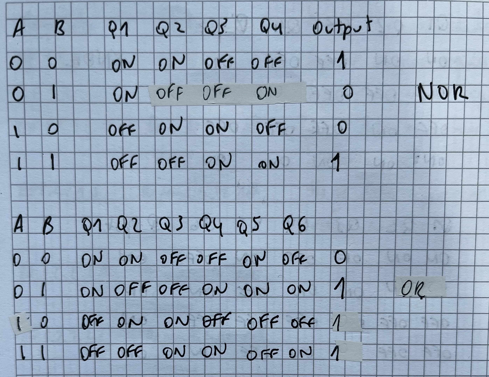

# Tema 5. Puertas CMOS

## Transistores MOSFET canal N y P

- Funciona como un inversor lógico (puerta NOT)
- Tiene problemas relacionados con el consumo

## Consumo de potencia dinámica

## Ejercicio 1 potencia dinámica

## Puertas CMOS

## Ejemplos de puertas CMOS

- La primera es un inversor lógico (NOT)
- La segunda es una puerta NAND
- La tercera es una puerta NOR
- La cuarta es una puerta OR

## Preguntas de repaso

