# TEMA 3 🪞
---
## Paradigma funcional
- Paradigma **declarativo** basado en la utilización de funciones que manejan datos inmutables.
	- Los datos nunca se modifican
	- En lugar de cambiar un dato, se llama a una función que devuelve una copia modificada del dato original
- Un programa será un conjunto de funciones invocándose entre sí
- Las funciones no generan efectos colaterales secundarios

---
## Expresiones Lambda
- En el cálculo lambda, una **expresión lambda** es:
	- Una **abstracción** lambda  **λx.M** (M , N , M1 , M2)
	- Una **aplicación** **M N** donde M y N son expresiones lambda
- Ejemplos (**función identidad** y **función doble**):
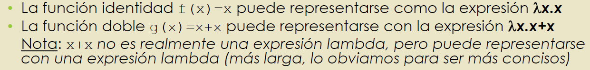

---
## Aplicación (reducción β)
- La aplicación de una función representa su invocación
- **reducción-β** o **sustitución** ejemplos:


---
## Teorema de Church-Rosser
- Establece que el orden en el que se hagan las reducciones no afecta al resultado final
- Los **paréntesis** se usan normalmente para **delimitar términos lambda**, no indican precedencias


---
## Variables libres y ligadas, conversión-α
- En una abstracción **λx.xy**:
	- La variable x está **ligada** (bound)
	- La variable y es **libre** (free)
- En la sustitución sólo se sustituyen las variables libres
- En la conversión-α todas las apariciones de una variable **ligada** en una misma abstracción se pueden renombrar a una **nueva** variable


---
## Conversión-α
- Gracias a ella, podemos aplicar funciones a sí mismas
- Ejemplos:


---
## Lógica booleana
- El literal **true** puede representarse como:
	true = λt.λf.t
- Y **false** como:
	fasle = λt.λf.f
Representan una función que devuelve dos parámetros


---
## Problema de la parada
- Dada la especificación de un programa, demostrar si éste finalizará o no
- Programa que no termina:
	(λx.xx) (λx.xx) -> (λx.xx) (λx.xx)
	
---
## Isomorfismo (Curry-Howard)
- Establece una relación directa entre programas software y demostraciones matemáticas
- Correspondencia entre tipos y proposiciones:


---
## Funciones, Entidades Primer Orden
- El paradigma funcional identifica las funciones como **entidades de primer orden** (funciones de primer orden)
- Esto significa que las funciones son un tipo más, pudiéndose instanciar variables del tipo función:
	- Se pueden asignar, pasar como parámetros y retornarlas como valores
- Se dice que una función es de orden superior si:
	- Recibe alguna función como parámetro
	- Retorna una función como resultado

---
## Delegados
- Es un tipo que representa un método de instancia o de clase (static)
- Las variables de tipo delegado representan un modo de referenciar un método
- Por tanto:
	- El paso de estas variables implican el paso de funciones a otras funciones
- `public delegate int Comparacion(Persona p1, Persona p2)`
- Es posible declarar el siguiente método independiente del cirterio de ordenación:
````c#
static public void OrdenarPersonas(Persona[] vector, Comparacion comparacion)
````
Y hacer uso del delegado del siguiente modo:
````c#
if(comparacion(vector[i], vector[j]) > 0)
	...
````
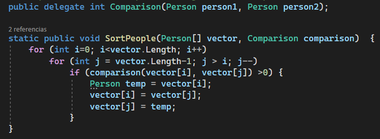
- Función doble aplicación:


---
## Patrón Observer
- Es un patrón de diseño para el uso de delegados
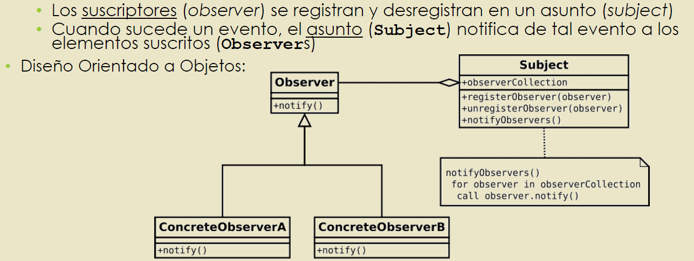
- Una instancia de un delegado puede coleccionar un conjunto de métodos
- Cuando se invoca a un delegado se producirá una invocación a todos los suscriptores registrados en ese delegado


---
## Tipos delegados predefinidos
- Los más usados son:
	- `Func<T>`: método sin parámetros que retorna un T
	- `Func<T1, T2>`: método con un parámetro T1 que retorna un T2
	- `Action`: método sin parámetros ni retorno
	- `Action<T>`: método con un parámetro T sin retorno
	- `Predicate<T>`: método que retorna un bool y recibe un T

Operaciones suma y resta con delegados:


Operaciones suma y resta con función que recibe 2 parámetros y devuelve un entero:


Operación doble aplicación, es par, imprimir en rojo y devolver personas mayores de edad:

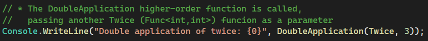
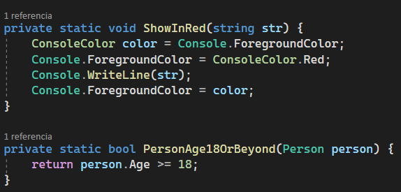
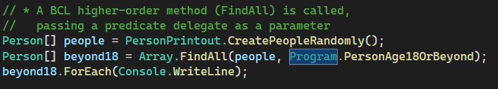

---
## Delegados anónimos
- En funcional, es común escribir la función únicamente en el momento de pasarla
- La primera aproximación fueron los delegados anónimos
- Mala sintaxis


---
## Expresiones lambda
- Permiten escribir el cuerpo de funciones completas como expresiones
- Son una mejora de los delegados anónimos
- Sintaxis:
	- Se especifican los parámetros separados por comas
	- Se pueden anteponer los tipos
	- Si hay más de un parámetro se deben usar paréntesis
	- Si no hay parámetros se indica con `()`
	- El símbolo `=>` indica la separación de los parámetros y el cuerpo de la función
	- Si el cuerpo tiene varias sentencias se separan por `;`
	- En el cuerpo se usa `return` para devolver valores
	- Si el cuerpo es una única sentencia no es necesario escribir `return` ni llaves


- Los tipos de las expresiones lambda promocionan a los tipos de delegados predefinidos (Func, Predicate y Action)


---
## Bucles y recursividad
- La programación funcional pura no posee el concepto de **iteración**, sino que hace uso de la **recursividad**
- Las funciones recursivas se han de expresar como funciones de orden superior que se reciben a sí mismas

---
## Combinador de punto fijo
- Es una función de orden superior que cumple lo siguiente (**función fix**)
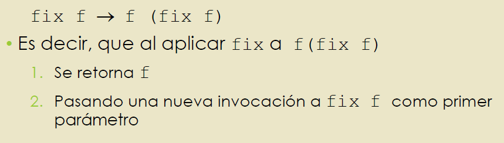
Factorial:
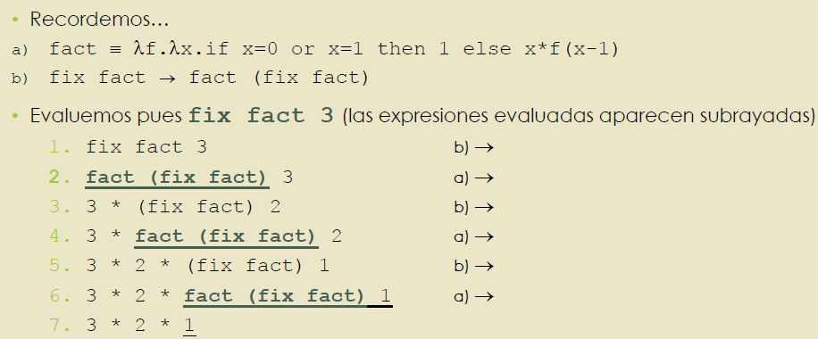

## Cláusulas
- Una **cláusula** (closure) es una función de primer orden junto con su ámbito: una tabla que guarda las referencias a sus variables libres
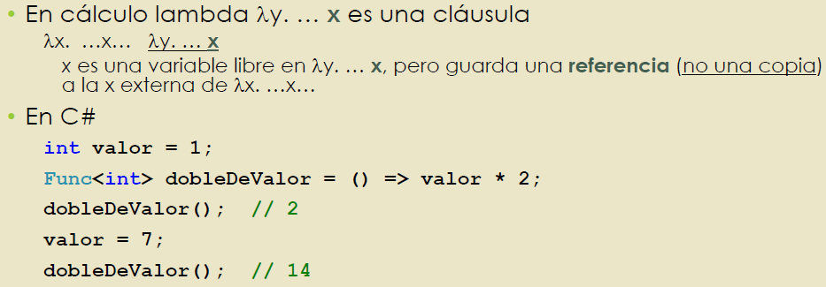
- Pueden representar objetos
- Pueden representar estructuras de control


---
## Currificación
- Es la técnica para transformar una función de varios parámetros en una función que recibe un único parámetro
	- La función recibe un parámetro y retorna otra función que se puede llamar con el segundo parámetro
- Su principal beneficio es la **aplicación parcial**
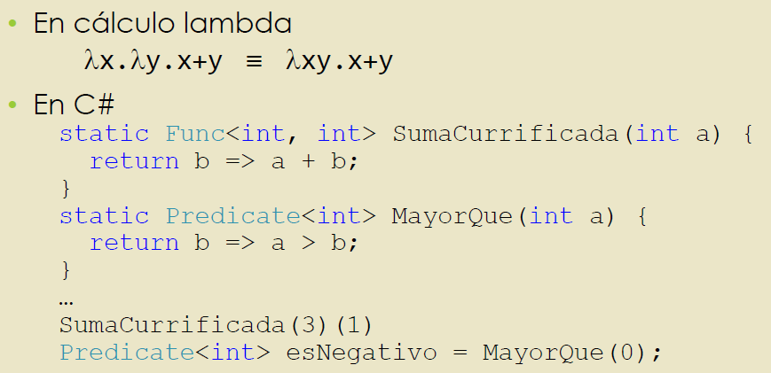


## Aplicación parcial
- Cuando las funciones están currificadas es posible realizar su aplicación (invocación) parcial
- La aplicación parcial consiste en pasar un número menor de parámetros en la invocación de una función


- La aplicación parcial nos permite ahorrar mucho código y reutilizarlo


---
## Continuaciones
- Una continuación representa el **estado de computación** en un momento de ejecución
- El estado de computación está compuesto por:
	- El estado de la pila de ejecución
	- La siguiente instrucción a ejecutar

---
## Generadores
- Un **generador** es una función que simula la devolución de una colección de elementos sin construír toda la colección devolviendo un elemento cada vez que la función es invocada
- Es más eficiente
- Un generador es una función que se comporta como un iterador
- C# implementa los generadores mediante `yield`
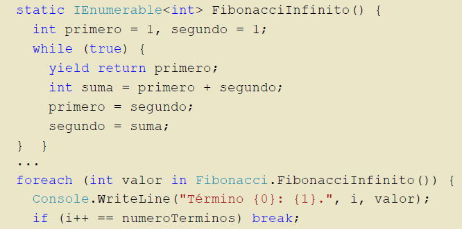

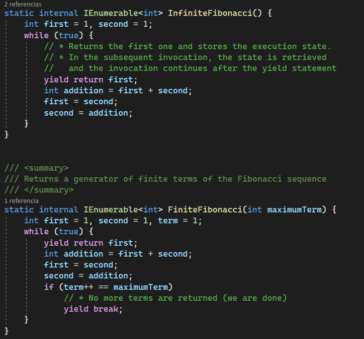


---
## Evaluación perezosa
- La **evaluación perezosa** (lazy) es la técnica por la que se demora la evaluación de una expresión hasta que ésta es utilizada
	- Es lo contrario a la **evaluación ansiosa** (eager)

- Ofrecen menor consumo de memoria, mayor rendimiento, posibilidad de crear estructuras de datos infinitas
- Podemos generar colecciones infinitas con `yield` y hacer uso de los métodos extensores:
	- `Skip`: para saltarse un conjunto de elementos, devolviendo los restantes
	- `Take` : para devolver un número concreto de elementos contiguos desde el inicio de una secuencia


---
## Transparencia referencial
- Se dice que una expresión es referencialmente transparente si ésta se puede sustituir por su valor sin que cambie la semántica (significado) del programa
	- Lo contrario es la opacidad referencial
- Cuando un lenguaje la ofrece, se dice que es funcional puro
- Elementos que hacen que un lenguaje no ofrezca transparencia referencial son:
	- Variables globales mutables
	- Asignaciones destructivas (=, +=, -=, ...) 
	- Funciones impuras (E/S, random, datetime, ...)
- Las cláusulas no ofrecen transparencia referencial pues **guardan las referencias** de los objetos, **no una copia**
- Las **variables mutables** fuera del ámbito de una función hacen que no se obtenga transparencia referencial
- Con las **asignaciones** sucede lo mismo, puesto que la evaluación de una variable depende de sus asignaciones previas
- La utilización de **funciones que no son puras** también implican opacidad referencial

- Una función es pura cuando:
	- Siempre devuelve el mismo valor ante los mismos valores de los argumentos
	- La evaluación de una función no genera efectos secundarios (co-laterales)

---
## Memorización (memoization)
- Técnica de optimización aplicada sobre expresiones con transparencia referencial que dice:
	- Si una expresión posee transparencia referencial, ésta puede sustituirse por su valor
	- Si la expresión es una función pura, ésta puede sustituirse por el valor de retorno
	- La primera vez que se invoca se retorna el valor guardándolo en una caché
	- En sucesivas invocaciones se retornará el valor de la caché, sin ejecutar la función


---
## Pattern matching
- Es el acto de comprobar si la secuencia de un conjunto de elementos siguen algún patrón determinado


---
## Funciones de orden superior típicas
- Una **función de orden superior** es:
	- Aquella que recibe alguna función como parámetro
	- O bien retorna una función como resultado
- Las más típicas son:
	- `Filter`: aplica un predicado a todos los elementos de una colección, devolviendo una nueva colección con los resultados obtenidos
	- `Map`: aplica una función a todos los elementos de una colección, devolviendo otra nueva colección con los resultados obtenidos
	- `Reduce (Fold, Accumulate, Compress o Inject)`: se aplica una función a todos los elementos de una lista, dado un orden, devolviendo un valor

---
## Funciones de Orden Superior en C# (Linq)
- `Filter` -> Where
- `Map` -> Select
- `Reduce` -> Aggregate


- Ejemplos de `Select`-> Map


- Ejemplos de `Where` -> Filter


- Ejemplos de 	`Aggregate` -> Reduce


---
## Otras funciones


---
## Listas por comprensión y LINQ
- Las listas por comprensión son una característica de un lenguaje que permite crear listas basándose en listas existentes. Esto se puede realizar usando LINQ:


---
## Comparación Paradigma Orientado a Objetos vs Funcional
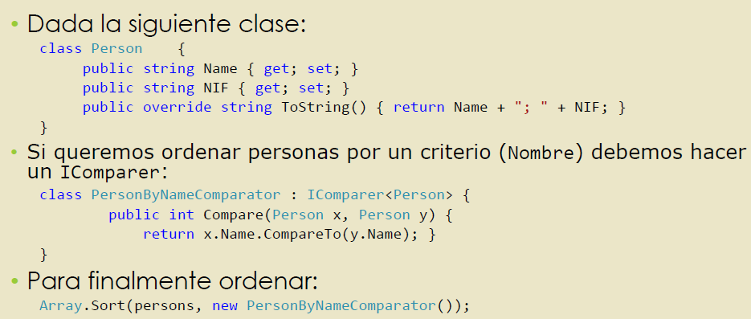
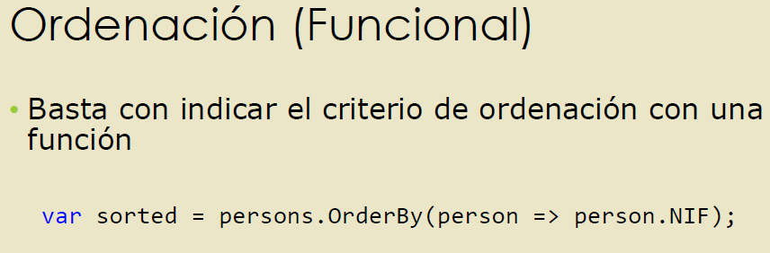
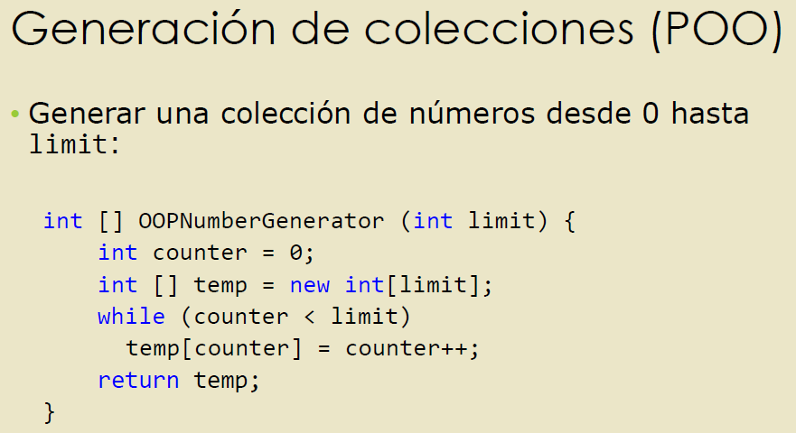
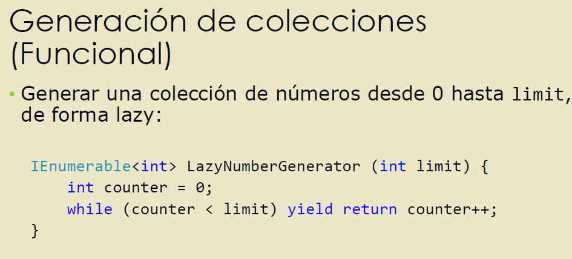
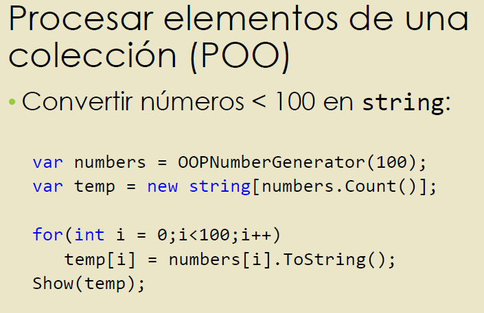
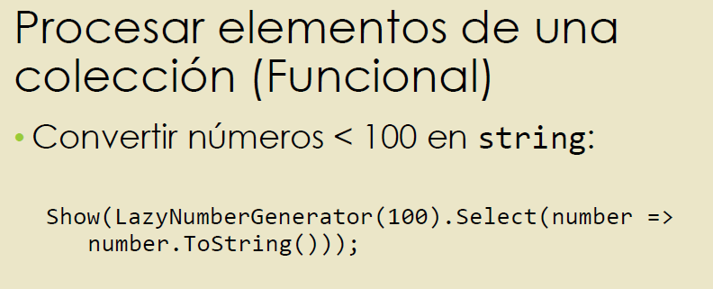
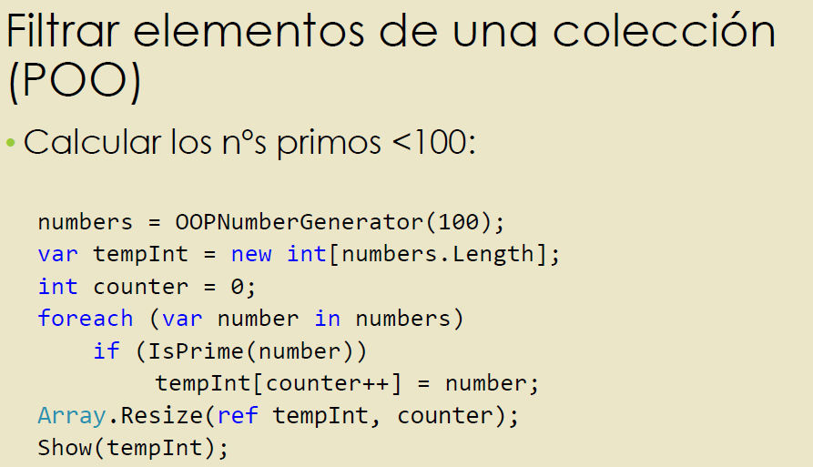
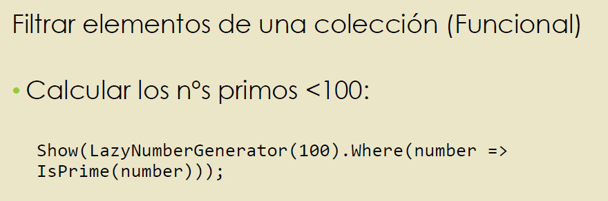
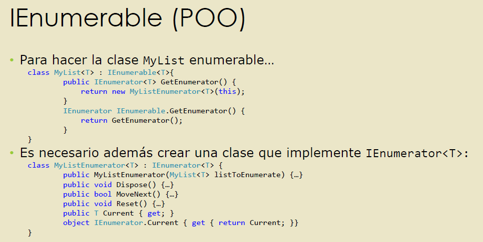
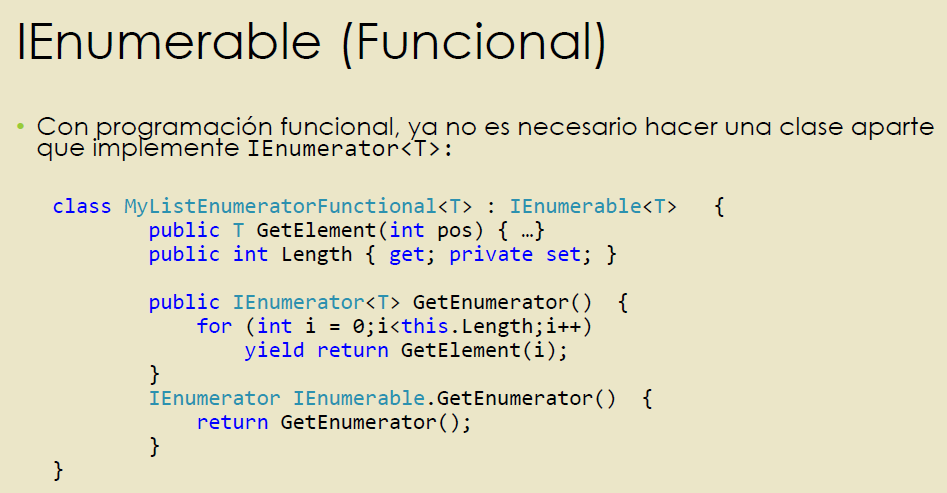

---
Siguiente lección -> [[Fundamentos de la Programación Concurrente y Paralela 🦋]]