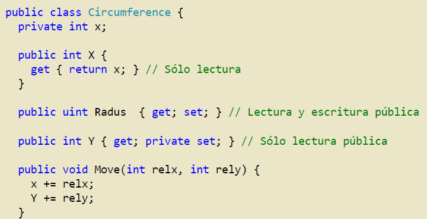
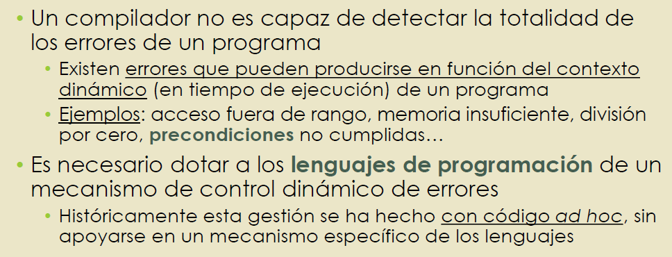
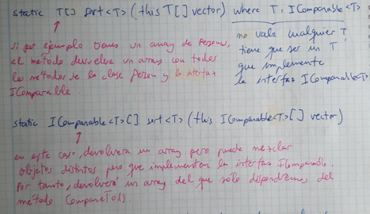

## Paradigma Orientado a Objetos
- Usa los **objetos** (unión de datos y métodos) como principal abstracción, definiendo programas como interacciones entre objetos.

---
## Abstracción
- Expresa las características esenciales de un objeto, las cuales distinguen al objeto de los demás.

---
## Encapsulamiento
- Proceso de almacenar en un mismo compartimento los elementos de una abstracción que constituyen su estructura y su comportamiento
- La **ocultación de la información** permite diferenciar qué partes son disponibles para toda la aplicación y qué partes son internas de la abstracción
- **Beneficios**: El encapsulamiento implica una mayor *mantenibilidad*, *reutilización* y *robustez* (operaciones bien definidas, se evitan errores de inconsistencia)

---
## Propiedades
- Concepto para acceder al estado de los objetos como si de atributos se tratase, obteniendo los beneficios del encapsulamiento:
	- Se oculta el estado interno del objeto, ofreciendo un acceso indirecto mediante las propiedades (**encapsulamiento**)
	- Es más mantenible
- Las propiedades pueden ser de lectura y/o escritura

---
## Modularidad
- Permite subdividir una aplicación en partes más pequeñas, siendo cada una de ellas tan independiente como sea posible
- Cada módulo ha de poder ser compilado por separado para poder reutizarse
- Pueden constituír un módulo:
	- Funciones y métodos
	- Clases y tipos
	- Espacios de nombres y packages
	- Componentes

---
## Acoplamiento y Cohesión
- **Acoplamiento**: nivel de interdependencia entre módulos
- **Cohesión**: nivel de uniformidad y relación que existe entre las distintas responsabilidades de un módulo

En desarrollo del software interesa un **bajo acoplamiento** (poca dependencia entre proyectos) y **elevada cohesión** (cómo de juntos permanecen los elementos de un módulo)

---
## Herencia
- Es un mecanismo de reutilización de código en la que el **estado** de una instancia está definido por la unión (herencia) de las estructuras de las clases base y la derivada              
-> ***en resumido***: los atributos de las clases padre también están en las clases hija y además estas clases hija cuentan con más atributos que no tiene el padre

---
## Polimorfismo
- Mecanismo de generalización que hace que una abstracción más general pueda representar abstracciones más específicas. El tipo general representa por tanto varias formas (*poli morfismo*)

---
## Enlace dinámico
- Los métodos heredados se pueden especializar en las clases derivadas

- Para que exista enlace dinámico en C# tenemos que:
	- Poner la palabra reservada `virtual` al método que reciba el mensaje (al de la clase padre)
	- Redefinir su funcionalidad usando la palabra reservada `override` en los métodos derivados (los de las clases hijas)
- Si se trata de una coincidencia y no queremos que haya polimorfismo, ponemos la palabra `new`

- En C# es **OBLIGATORIO** autorizar la redefinición poniendo o `virtual` u `override`

---
## Clases y métodos abstractos
- Un método abstracto es un método declarado pero no implementado
- Una clase abstracta no tiene por qué tener ningún método abstracto
- Toda clase que posea un método abstracto ha de ser abstracta

---
## Herencia múltiple
- Se produce cuando una clase hereda de más de una clase de forma directa

- Produce dos **conflictos**:
	- **Coincidencia de nombres**
	
	- **Herencia repetida** (se hereda de una misma clase varias veces por distintos caminos)
	
	
---
## Interfaces
- Una **interfaz** es un conjunto de mensajes (y/o propiedades) públicos que ofrecen un conjunto de clases
- Este concepto se ofrece como un **tipo**:
	- Proporcionan **polimorfismo mútliple**
	- Una clase o interfaz puede implementar una o más interfaces

---
## Necesidad de control dinámico
- ad hoc

---
## Excepciones y Asertos
- **Excepciones**: Eventos que se producen en tiempo de ejecución e impiden la ejecución normal de un programa
- En C# todas las excepciones son **unchecked** (RunTimeException en Java)
- No se especifican las excepciones lanzadas por un método (throws en Java)
- **Asertos**: condiciones que se han de cumplir en la correcta ejecución de un programa
- Los **asertos** no se deben usar para detectar errores en tiempo de ejecución. Los asertos han de usarse para detectar aquellas situaciones que nunca deberían ocurrir (**postcondiciones**, **invariantes**, ...)
- Deberían deshabilitarse una vez la aplicación haya sido probada exhaustivamente
- Se encuentran en la clase `Debug.Assert`
- Para más información ver -> [[Invariants, preconditions, postconditions 🦠]]
---
## Genericidad
- Es la propiedad que permite construir abstracciones modelo para otras abstracciones. Ofrece una mayor robustez y un mayor rendimiento
- Existen los siguientes elementos:
	- Clases 

	- Structs
	- Métodos

	- Interfaces
	- Delegados

---
## Genericidad acotada (*bounded*)

- **Genericidad acotada**: Permite hacer que los tipos genéricos sean más específicos
- Método de ordenación (sort):

---
## Inferencia de tipos
- Es la capacidad para deducir automáticamente el tipo de una expresión. Cuanta menos información de tipos provea el programador, más avanzada será la inferencia de tipos

---

Siguiente  lección -> [[Fundamentos del paradigma funcional 🧮]]