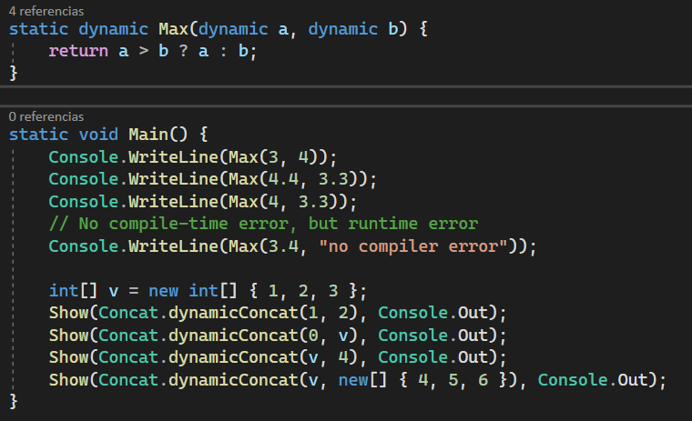
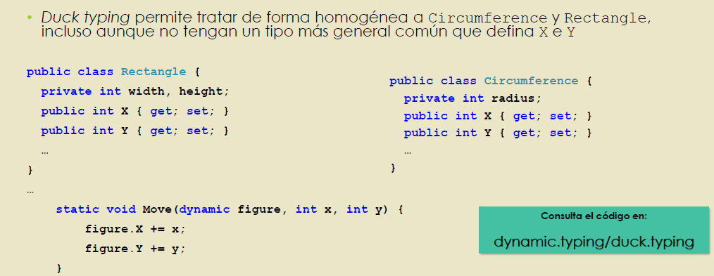

# TEMA 5 👀
---
## Tipado dinámico
- Es el proceso de posponer la comprobación e inferencia de tipos en tiempo de ejecución
- Hay lenguajes:
	- Con tipado **estático** (C, Fortran, Pascal)
	- Con tipado **dinámico** (Python, Ruby, Smalltalk)
	- **Híbridos** (C#, VB, Boo, Objective-C)

- Ventajas:
	- Mayor adaptabilidad y flexibilidad del código
	- Mayor nivel de abstracción
- Inconvenientes:
	- Sin detección de errores de tipo en tiempo de compilación
	- Peor optimización de código

- En C# se usa el tipo `dynamic` que pospone la comprobación e inferencia de tipos al tiempo de ejecución
- Cualquier tipo se puede convertir a `dynamic`
- `dynamic` se puede convertir a cualquier tipo

---
## Duck Typing
- Propiedad de la mayoría de lenguajes con tipado dinámico
- Significa que el estado dinámico de un objeto determina qué operaciones pueden realizarse con él

--
## Multiple Dispatch
- Una de las limitaciones del enlace dinámico es que supone usar **single dispatch**:
	- sólo permite resolver un método dependiendo del tipo de un único objeto (this)
- Cuando queremos que la resolución del método dependa de varios tipos, necesitamos **multiple dispatch**

---
Para más info. ver -> [[Tipado dinámico y Metaprogramación (clase)🍒]]