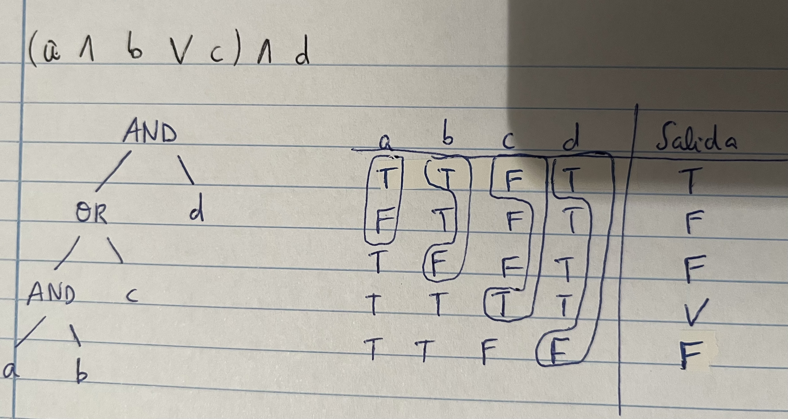
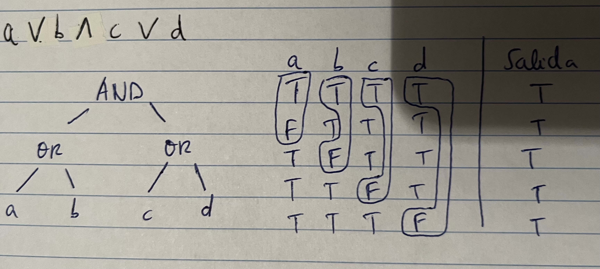
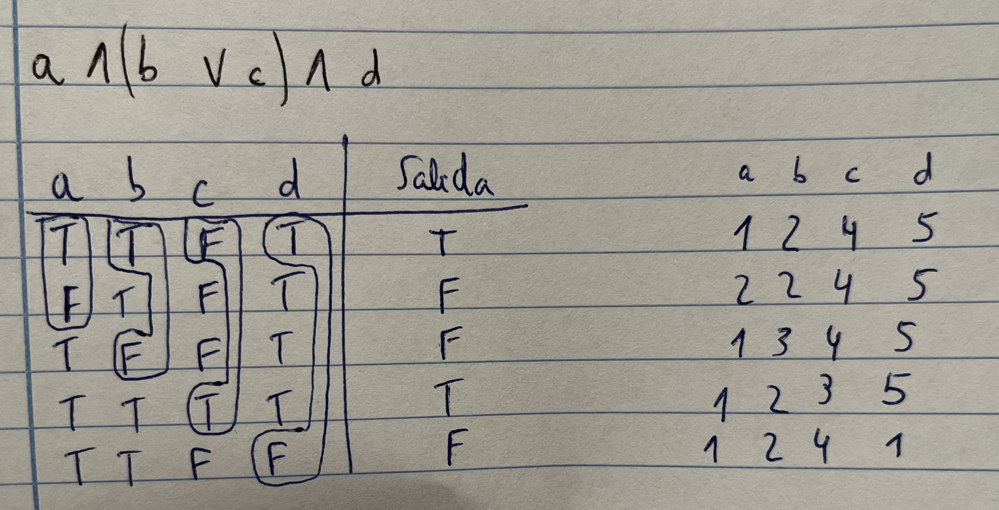

# Preguntas de exámenes

1. ***Diferencia entre fallo, error y defecto. ¿Con qué tipo de pruebas se relacionan?***

- **Error**: acción humana que produce un resultado incorrecto. Las pruebas no son capaces de detectarlos
- **Defecto**: manifestación de un error. Desperfecto en un componente o sistema que puede causar que el software no realice su función requerida. Se identifican mediante pruebas de carácter estático
- **Fallo**: desviación en un componente o sistema de su comportamiento esperado. Se identifican mediante pruebas de carácter dinámico

2. ***Di que está mal o incompleto en la siguiente afirmación: "La denominada pirámide de test sirve para representar los diferentes niveles de prueba, de forma que tenemos que completar todas las pruebas de un nivel para comenzar con el siguiente"***

- La primera parte está incompleta, pues no sólo representa niveles de prueba, sino también tipos de prueba
- La segunda parte está mal, pues no necesitamos completar todas las pruebas de un nivel para comenzar con el siguiente

3. ***¿Qué dice la estrategia de los "Three Amigos"? ¿Qué ventajas ofrece?***

- Esta estrategia consiste en una reunión entre el analista de negocio y/o dueño del producto, los desarrolladores y los testers.
- Sus ventajas son:
	- Se discuten características nuevas y se revisa la especificación
	- Entendimiento y vocabulario compartido
	- Identificación de requisitos no definidos y definición de pruebas
	- Se realizan antes de que la característica se considere lista para el desarrollo y es asignada en un sprint

4. ***¿De qué dos factores principales depende la clasificación en una organización de CMMI? ¿Qué se debe hacer en relación con estos factores para progresar al siguiente nivel?***

- Depende de cuáles son los procesos que estoy cumpliendo, porque cada nivel tiene establecidos una serie de procesos que debes cumplir. Además, depende del nivel de capacidad más bajo de esos procesos
- Para progresar al siguiente nivel se necesita incorporar todos los procesos que incluye el nivel al que se quiere avanzar, es decir, ampliar los procesos (con los de ese nivel) y aumentar el nivel

5. ***Diferencia entre nivel de prueba y tipo de prueba. Nombra tres ejemplos de cada uno. Di si las siguientes frases son verdaderas o falsas***

- **Nivel de prueba**: grupo de actividades de prueba organizadas y gestionadas en conjunto. Ej: *integración, sistema y aceptación*
- **Tipo de prueba**: grupo de actividades de prueba para un componente o sistema enfocadas en un objetivo específico de prueba. Un tipo de prueba puede usarse en uno o más niveles de prueba. Ej: *funcional, de rendimiento, regresión*

- ***a) Un tipo de prueba puede relacionarse con multiples niveles de prueba.*** VERDADERO
- ***b) Un nivel de prueba puede relacionarse con multiples tipos de prueba.*** FALSO

6. ***Además de defectos, ¿qué buscan las pruebas de software?***

Buscan encontrar fallos, además de determinar que el sistema satisface la especificación de requisitos y cumple con su propósito (satisface las necesidades y expectativas del cliente)

7. ***Diferencia entre Verificación y Validación***

- **Verificación**: confirmación, a través de pruebas objetivas, de que se han cumplido los requisitos especificados. Consiste en comprobar el programa frente a sus atributos de calidad
- **Validación**:confirmación, a través de pruebas objetivas, de que se han cumplido los requisitos para un uso concreto. Consiste en comprobar que es lo que el cliente espera

En la **validación** podemos preguntarnos *¿estamos haciendo el producto adecuado?*, mientras que en la verificación podemos preguntarnos *¿estamos haciendo el producto de forma correcta?*

En la **verificación** se comprueba que el sistema cumple con la especificación de requisitos, mientras que en la **validación** se comprueba que las necesidades del usuario se satisfacen

8. ***Define prueba. ¿Qué es para ti un buen caso de prueba?***

- **Definición clásica**: La prueba (testing) es el proceso de ejecutar un programa con la intención de encontrar fallos
- Un buen caso de prueba es el que tiene una alta probabilidad de detectar un nuevo fallo

9. ***Completa la siguiente tabla sobre la presencia de tipos de pruebas en verificación y validación ***

|Tipos de pruebas|Consiste en|Verificación|Validación|
|--|--|--|--|
|Estáticas|Sin ejecutar código|Si|No|
|Dinámicas|Ejecutando código|Si|Si|
|Caja negra|Sin conocer código|Si|Si|
|Caja blanca|Conociendo código|Si|Si|

10. ***Da un resumen sobre la técnica de Partición en Clases de Equivalencia***

- Determinar las condiciones de prueba (test conditions) para las entradas. Completar con las salidas
- Determinar y aplicar técnicas para determinar las situaciones a cubrir (test coverage ítems)
- Decidir si algunas situaciones a cubrir se han de combinar
- Partiendo de las situaciones a cubrir, derivar los casos de prueba
- Comprobar que: Nº situaciones > Nº casos > Nº bases de datos

11. ***¿Qué son las pruebas negativas?***

- Son aquellas que intentar ver si se hace algo que no se debería de poder hacer. Ej: *acceder a los datos bancarios de otra persona en una plataforma bancaria sin tener las credenciales*

12. ***Define Workflow***

- Define un modelo de ramificación estricto, útil para gestionar proyectos largos
- Asigna roles a las ramas y establece cuándo y cómo deben interactuar
	- Master: todo commit que se haga en esta rama debe estar listo para ser subido a producción
	- Development: en esta rama se aloja el código que conforma la siguiente versión planificada del proyecto
	- Una rama por característica o desarrollador
- Las ramas deben mantenerse limpias y organizadas

13. ***¿Qué es Gitflow?***

- Es un conjunto de extensiones útiles para la creación y mantenimiento de flujos de trabajo

14. ***Detalla el procedimiento de las pruebas de caminos simples***

- Formular la especificación en términos de un modelo: diagrama de flujo o de transición de estados
- Se considera el modelo como la condición de entrada
- Las situaciones por cubrir son cada uno de los caminos
- Comprobar cuántos casos de prueba necesitamos
- Derivar casos de prueba para cubrir cada uno de los caminos (secuencia de pasos)
- Casos de prueba como secuencia de pasos

15. ***Detalla el procedimiento de las pruebas de caminos pares***

- Probar con mayor intensidad usando los "pares de caminos"
- Definir casos de prueba para cada uno de los pares
- Se requieren más casos, pero la prueba es más completa

16. ¿Para qué escenario son útiles las combinaciones con Tablas de Decisión? ¿Y con árboles de clasificación?

- Las combinaciones con Tablas de Decisión son útiles para probar reglas de negocio complejas en función de combinaciones de diferentes valores. Cada regla será una situación a cubrir
- Los Árboles de clasificación son útiles cuando hay muchas entradas

17. ***¿Qué son las técnicas estáticas? Di qué dos grandes grupos de técnicas estáticas hay***

- Son aquellas que no requieren ejecución de software. Pueden realizarse muy pronto y sirven para una detección temprana de defectos, lo que reduce el coste. 
- Dos grupos: *revisiones, análisis estático*

18. ***Indica qué debe incluir el Reporting***

Ha de incluir:
- El último objetivo es conseguir que los problemas se solucionen. Hay que vender el report (Bug advocacy)
- Título corto
- Resumen conciso del problema
- Detalles sobre el proceso llevado a cabo para reproducir el problema y lo que se observa frente a lo que se debería
- Proporcionar la máxima información con las mínimas palabras
- Proporcionar información adicional (configuración, datos para reproducción...)
- Nunca usar genericidades como "no funciona", pues podemos obtener respuestas como "a mi si"

19. ***¿En qué consiste TDD? ¿Qué significa? ¿Cuáles son sus ventajas?***

- Significa Test Driven Development
- Consiste en definir las pruebas antes de ponerse a codificar. Requiere disciplina por parte de los programadores
- Sus ventajas son
	- Incremental al extremo
	- Regresión y refactorización

20. ***¿En qué consiste BDD? ¿Qué significa?***

- Significa Behaviour Driven Development
- Es similar a TDD pero las pruebas son de más alto nivel
- Consiste en definir el comportamiento deseado que se traduce a pruebas ejecutables
- Consta de un lenguaje cercano al cliente
- Las pruebas siguen un patrón: Dado... Cuando... Entonces...

21. ***Indica si las siguientes afirmaciones son ciertas o falsas***

a) Las técnicas basadas en clases de equivalencia son técnicas de caja negra y las técnicas basadas en condiciones son de caja blanca.
FALSO. Ambas técnicas pueden ser de caja blanca y de caja negra

b) Las técnicas anteriores son para validación y las técnicas estáticas son para verificación.
FALSO. Las técnicas anteriores son dinámicas, que se usan tanto para verificación como para validación. Las estáticas si que son exclusivas de la verificación

22. ***¿Qué debería hacer una empresa que quiere mejorar su perfil de madurez en la metodología CMMi?***

- Debería satisfacer todas las metas apropiadas del área o conjunto de áreas de proceso que son objeto de la mejora

23. ***Además de BDD y TDD ¿qué otras pruebas se realizan en Scrum y cuándo? Explica en qué consisten***

- Scripted Testing y Explanatory Testing. Se usan antes de entregar la release
- **Scripted Testing**: las acciones a realizar por el tester son prescritas en el caso de prueba. La preparación (diseño e implementación) están claramente separadas de la ejecución
- **Explanatory Testing**: el aprendizaje, diseño y ejecución son simultáneos. Es necesario personal muy experimentado. No tienen por qué documentarse todas las técnicas, aunque sí se registrarán los resultados

24. ***¿En qué consiste el estándar ISO/IEC 29119?***

- Proporciona las directrices para las pruebas cubriendo todos los aspectos del ciclo de vida:
	- Composición consistente de definiciones, procesos, procedimientos y técnicas para las pruebas de software
	- Soluciona la dispersión existente actual
	- Cubre los huecos no cubiertos por otros estándares existentes
	- Adoptado por los comités de normalización nacionales

25. ***¿Qué dos técnicas se usan? Explícalo con tus propias palabras***

En primer lugar, cobertura de transiciones. Vemos el modelo e identificamos las transiciones, de manera que los casos de prueba cubras las transiciones. De ahí sacaríamos dos casos de prueba.

Ahora, si aplicamos MCDC:

|a=0|b=0|a=0 AND b=0|SALIDA|
|--|--|--|--|--|
|T|T|T|1-3|MODELO DE TRANSICIONES|
|T|F|F|1-4|MCDC|
|F|T|F|2-4x|MODELO DE TRANSICIONES|

Con MCDC podemos sacar el caso extra

26. ***Probar todos los pares de caminos usando todos los casos de prueba necesarios mínimos***

Pares de transiciones:
- S0-S1-S2
- S1-S4-S5
- S4-S5-S1
- S5-S1-S2
- S5-S1-S4
- S1-S2-S3
- S1-S2-S5

Caminos:
- S0-S1-S4-S5-S1-S2-S3
- S0-S1-S2-S5-S1-S4-S5-S1-S2-S3

Con dos caminos se recorren todos los pares de transiciones

27. Probar todos los pares de transiciones usando todos los casos de prueba necesarios/mínimos

Pares de transiciones:
- S0-S1-S2
- S0-S1-S4
- S1-S4-S5
- S4-S5-S1
- S5-S1-S2
- S5-S1-S4
- S1-S2-S3

Caminos:
- S0-S1-S4-S5-S1-S2-S3
- S0-S1-S2-S3

Con dos caminos recorremos todos los pares de transiciones

28. ***Aplicar MCDC a la expresión: (a AND b OR c) AND d***

NOTA: la V es un True, que se me coló `-_^`

29. ***Aplicar MCDC a la expresión: a OR b AND c OR d***

30. ***Aplicar MCDC y Valores límite: a=1 AND (b=2 OR c<4) AND d > 4***

31. ***Di qué tipos de prueba existen***

- Funcionales
- No funcionales (otros atributos de calidad)
	- Interoperabilidad
	- Seguridad
	- Rendimiento, carga, estrés
	- Usabilidad, accesibilidad
	- Fiabilidad, Eficiencia, Portabilidad
- Relativas a cambios
	- Confirmación (retest): defectos han sido solucionados
	- Regresión: los cambios no han afectado a otras partes

32. ***Di qué niveles de prueba existen***

NOTA: recordar CISA

- **Componente**: por separado, funcionalidades individuales
- **Integración**: interfaces entre componentes e interacciones intrasistema
- **Sistema**: comportamiento del sistema global, funcional y no funcional
- **Aceptación**: determinar si el sistema está listo para funcionar

33. ***Estrategias para los casos de prueba***

- **Minimizada (each choice)**: por defecto. Implica no combinar. Se cubren todas las situaciones con el menor número de casos de prueba
- **Base choice**: permite probar la sensibilidad ante pequeños cambios. Se elige una combinación base y el resto son iguales salvo un cambio en las situaciones
- **Combinaciones parciales**: algunas condiciones de prueba son más importantes que otras
- **Multiple combination**: fuerza bruta. Se combina todo con todo

34. ***Explica la diferencia entre caso de prueba lógico y físico***

- **Lógico**: describe en términos lógicos las circunstancias en las que se probará el comportamiento del sistema, incluyendo las situaciones a cubrir
- **Físico**: elaboración concreta del caso lógico. Valores exactos de entradas, salidas y configuración

35. ***Dibuja la pirámide de test***

36. ¿Para qué se usan los Mocks?

Se usan cuando tenemos que probar un sistema con un servicio externo que aún no está implementado, o cuando queremos probar la lógica de negocio independiente a ese servicio. El Mock se usa para sustituir a ese componente o API

# Preguntas de cuestionarios

1. 

2. 

Con el menor esfuerzo:
- S0-S1-S2-S4-S1-S2-S3-S1-S4

3. 

4. 

5. 

- Ninguna es correcta

6. 

- Aunque es una práctica más de Kanban, es útil utilizarla en Scrum
- Se puede usar, entre otros, para realizar el "Backlog Grooming"

7. 

8. 

- Ninguna es cierta