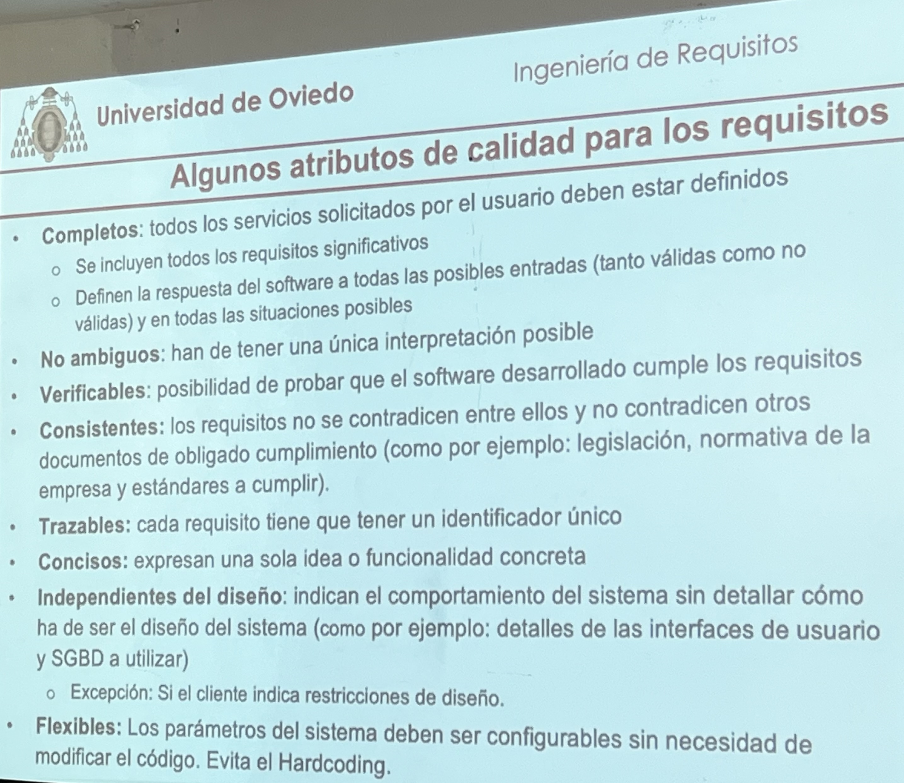

# Taller 1 

- La parte más difícil de construir de un sistema software es decidir qué construir
- Se parte de un problema/necesidad real y además propuesto por un cliente (no informático) que lo expresa en sus propios términos y necesidades, y que incluso pueden no ser realistas
- **Objetivo**: Queremos obtener una solución de calidad desde el punto de vista de la Ingeniería de Requisitos

## ¿De dónde obtener los requisitos?

- De los StakeHolders
- Del producto referencia

## Ejemplo de funcionalidad

- El sistema debe comprobar que el valor introducido por el comprador es un entero positivo <= número de unidades disponibles para el artículo que solicite

## Normas de un requisito

- Los requisitos deben tener un identificador único
- No es lo mismo expresar una funcionalidad que un requisito
- El ingeniero de requisitos deberá descubrir funcionalidades no obvias y por tanto, requisitos cuya obtención no es trivial

## Algunos atributos de calidad para los requisitos

- **Completos**: todos los servicios solicitados por el usuario deben estar definidos
    - Se incluyen todos los requisitos significativos
    - Definen la respuesta del software a todas las posibles entradas (tanto válidas como no válidas) y en todas las situaciones posibles
- **No ambiguos**: han de tener una única interpretación posible
- **Verificables**: posibilidad de probar que el software desarrollado cumple los requisitos
- **Consistentes**: los requisitos no se contradicen entre ellos y no contradicen otros documentos de obligado cumplimiento (como por ejemplo: legislación, normativa de la empresa y estándares a cumplir).
- **Trazables**: cada requisito tiene que tener un identificador único
- **Concisos**: expresan una sola idea o funcionalidad concreta
- **Independientes del diseño**: indican el comportamiento del sistema sin detallar cómo ha de ser el diseño del sistema (como por ejemplo: detalles de las interfaces de usuario y SGBD a utilizar)
	-  **Excepción**: Si el cliente indica restricciones de diseño.
- **Flexibles**: Los parámetros del sistema deben ser configurables sin necesidad de modificar el código. Evita el Hardcoding.

# Taller 2

