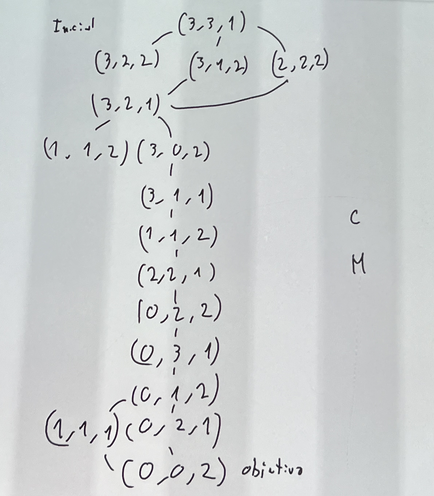
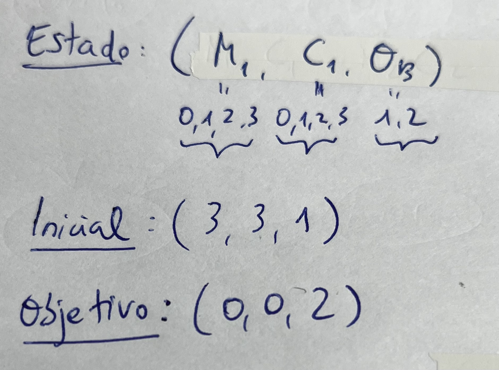

# El problema de los misioneros y los caníbales

# El problema de las N-reinas

# Seminario 2

- Para ayudarnos a hacer trazas, usar herramienta [AIspace](http://www.aispace.org)

# Problemas de clase
## Ejercicio 1

- Se trata de un ejercicio de propiedades formales de A* en un problema abstracto

## Ejercicio 2

## Ejercicio 3

## Ejercicio 4

## Ejercicio 5

## Ejercicio 6

## Ejercicio 7

## Ejercicio 8

## Ejercicio 9

## Ejercicio 10

