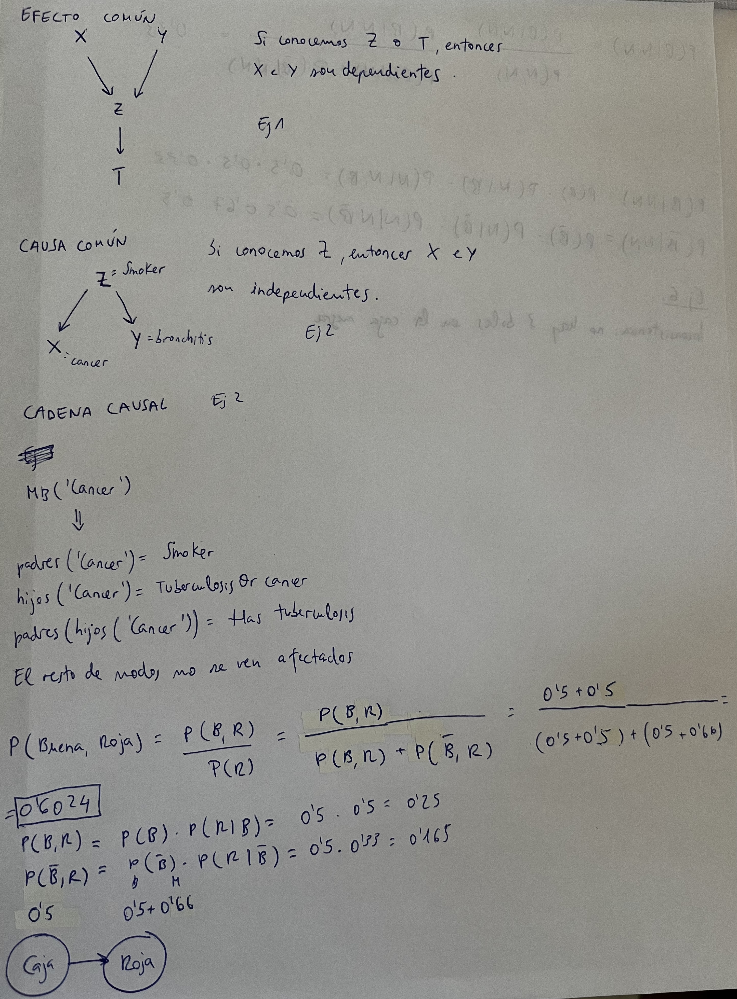
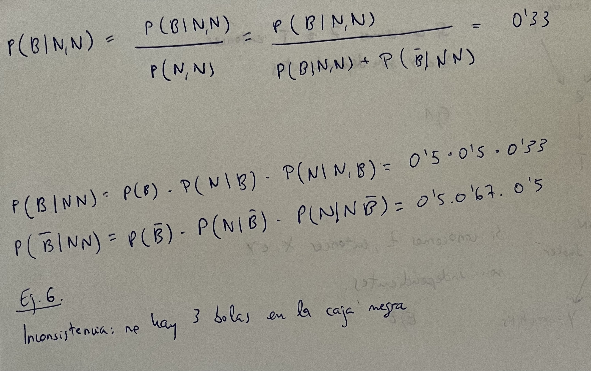

# 1. Bloque de búsqueda

# Lab 1

## Guía para instalar aima-python

- [Descargarlo de aquí como .zip](https://github.com/aimacode/aima-python)
- Descomprimirlo
- Dentro de la carpeta pegar el fichero `search4e-Busqueda_2023_2024.ipynb` del campus
- Meterlo en la carpeta del aima descargada
- Darle doble click
- Seleccionar el kernel (Python 3.9.10)
- Ejecutar


## Ejercicio 2


- Comprobar que el coste es el indicado en el Word

- Para cambiar si usa el h0, el h1 o el h2 modificar aquí:


- Modificamos el h2:

````python
# Mi solución
sum = 0;

for i in range(9):

	if node.state[i] != 0:
	
	sum += abs(i//3 - self.goal.index(node.state[i])//3) + abs(i%3 - self.goal.index(node.state[i])%3)

return sum

#------------------------------------------------------------

# Solución del profe
sum = 0;

for i in range(9):

	if (i!=0):
	
	X1, Y1 = (node.state.index(i)%3, node.state.index(i)//3) #board positions of the i tilde in node.state
	
	Xg, Yg = (self.goal.index(i)%3, self.goal.index(i)//3) #board positions of the i tilde in goal.state
	
	sum += abs(X1-Xg) + abs(Y1-Yg)

return sum
````

- h2 es el más eficiente en tiempo

## Ejercicio 4


- Hay que modificar esta función:


- Solución:
````python
ok = False

  

while not ok:

	node = frontier.pop()
	
	if node.path_cost > reached[node.state].path_cost:
	
		DUMMY_NODES += 1
	
	else:
	
		ok = True
````

## Ejercicio 5

- Solución
````python
# Reexpansion control, number of states reexpanded

if node.state in expanded:

	STATES_REEXPANDED += 1

else:

	expanded[node.state] = True

# counting expansions

NODES_EXPANDED += 1
````

## Ejercicio 6


- Para ejecutar el PA* usamos la función weighted_astar_search


# Lab 2


# Lab 3

- El elitismo consiste en conservar los mejores que tengamos (no perder una mejor solución, sino mantenerla)
	- Lo que pretende conseguir es que las diferencias entre los buenos y los malos sean más grandes
	- Para escalar el fitness podemos elevar dos números a una potencia muy grande, para que su diferencia sea mayor (por ejemplo)

# Lab 4

# Lab 5 

## Ejercicio 1

- La probabilidad de que tenga cáncer de pulmón es 48,87%
- Como ha viajado al extranjero, ahora la probabilidad es un 37,15%
	- Se ha decrementado porque ha aumentado la probabilidad de que tenga tuberculosis debido a su viaje en el extranjero





# Lab 6

- Media MB se refiere a Markov Blanket

- Hacer para cada una de las redes **5 veces**:
	- Generar evidencia random
	- Generar variables de interes aleatorias
	- Hacer  para cada algoritmo la misma evidencia y la misma variable de interés
- Hacer la media de las 5 veces por cada
- Usar método setSampleSize(10000) <- para indicar cuántas muestras se usen para los cálculos
- Usar setSeed() para establecer la misma ejecucion

- Hacerlo para: HuginPropagation, LogicSampling y LikelihoodWeighting

- Con diabetes **no hacer VEPropagation** porque tarda pila


# Lab 7

## Ejercicio 1

- Depende del dominio en el que estemos.
	- Parece asumible (porque es un dominio médico)

## Ejercicio 2

- Son bastante parecidos (39% - 28%)
- Estas diferencias se deben a las muestras de la prueba, no al algoritmo

## Ejercicio 3

- Usar la seccion de filtro de excel
1. 15,4%
2. 39,47%

## Ejercicio 4

- Como la probabilidad es muy pequeña, el error es muy grande (y en ponderación es unas 4 veces menor)
	- Ponderación de la verosimilitud es mejor que muestreo estocástico

## Ejercicio 5

- Hay dos valores distintos: 0,0098 y 0,0049

- Se nos va a preguntar sobre el punto 3 Aprendizaje de redes

