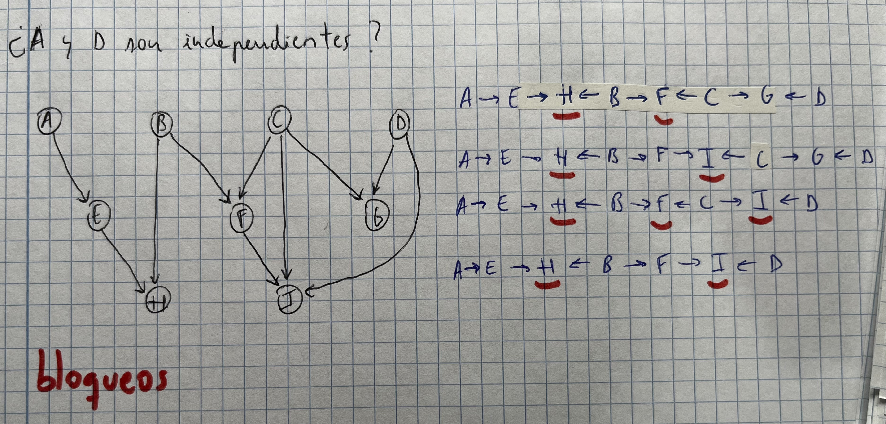

# Búsqueda heurística
## Instrucciones para definir un espacio de búsqueda

1. Definir los estados
2. Definir las reglas para, a partir de un estado, generar más
3. Definir los costes de pasar de uno a otro
4. Definir cómo vamos a reconocer el estado inicial
5. Definir cómo vamos a reconocer el estado final

## Definición de heurístico

- ***Heurístico***: función que aproxima siempre por debajo, el coste desde el estado en el que estamos hasta el estado final. Si el heurístico se pasa, no sería admisible.


## Propiedades de un heurístico

- Debe estar bien **construido**/**definido**
	- h(n) >= 0 para cualquier nodo
	- h(n) = 0 en los nodos objetivo
- Ha de ser **admisible**
	- h(n) <= h* para todo n
	- *Pequeño truco: sabemos el coste óptimo desde un principio, porque es un problema pequeño*
	- *Si el heurístico no fuese admisible, no se puede garantizar que siempre nos lleve a la solución óptima*
- Ha de ser **monótono**/**consistente**(si hay varios costes diferentes entre caminos)
	- h(n1) <= h(n2) + C(n1, n2) para todo n1,n2
	- *C(n1, n2) es el coste de ir del nodo 1 al nodo 2*

## Heurístico más informado

- El heurístico más informado es quel que:
	- h(n) <= h* (lo más cerca posible)

## ¿Cómo construir un heurístico?

- Aplicando el **método de la relajación del problema**
	- Consiste en hacerse un listado de las condiciones que me indican en el problema y quitar una o varias de ellas

## Condición de expansión

- `h(n) + g*(n) <= C*`, cumple la condición **necesaria pero no suficiente** para que se pueda expandir
- `h(n) + g*(n) < C*`, cumple la condición **suficiente** de expansión

- La función que decide si un nodo se expande: `f(n) = g*(n) + h(n)`

## Resumen Condición de expansión

- Si `h(n) + g*(n) > C*` *NO SE EXPANDE*
- Si `h(n) + g*(n) <= C*` *IGUAL SE EXPANDE*
- Si `h(n) + g*(n) < C*` *SE EXPANDE SEGURO*

# Algoritmos Genéticos

## Conceptos

- Los algoritmos genéticos se basan en permutaciones

> (1 2 3 4 5)

- **Variaciones**: Influye el orden (1 2 3) (2 3 4)
- **Combinaciones**: No influye el orden (2 5 3) (5 1 3)
- **Permutaciones**: todas las posibles combinaciones

## Fases de un algoritmo genético

1. Encontrar una codificación
2. Generar una población inicial
3. Encontrar un mecanismo para obtener nuevas soluciones
4. Necesitamos una función de evaluación
5. Hay que tener un criterio de selección

## Ejemplos de cruce


- Genero un nuevo cromosoma cogiendo parte del primero y el resto **en orden** del otro


- Este coge aleatoriamente elementos de uno y de otro y los va mezclando

- *Nota: es mejor el 0x1 porque si ya tenemos una solución no la perdemos en el cromosoma hijo*

## Ejemplos de mutación


## Teoría de los Esquemas

- **Longitud:** distancia desde el primer símbolo fijo hasta el último


- Para contar el número de asteriscos, hay que contar el número por la izquierda y por la derecha hasta encontrar un número

## Convergencia, exploración y explotación

- **Convergencia**: velocidad en la que el algoritmo genético se acerca a la solución óptima. Se espera que un algoritmo converja lo antes posible
- **Exploración**: mete mucha búsqueda de azar
- **Explotación**: se trabaja sobre un grupo con una buena tendencia a ser solución.
	- Problema: estancamiento de soluciones (*problema de los máximos*)


# Posibles preguntas de teoría extra

1. **¿Cuáles son las dos principales consecuencias que tienen los heurísticos consistentes en el comportamiento del algoritmo A*?**

	- Si un heurístico h es consistente o monótono, entonces h es admisible, lo que se traduce en que el algoritmo A* es admisible y en consecuencia siempre encuentra la solución óptima
	- Si un heurístico h es consistente o monótono, entonces cuando el algoritmo A* que lo usa elige un nodo n para ser expandido, ocurre que g(n) = g*(n). Esto se traduce en que no hay que rectificar el camino desde el inicial hasta n o bien reexpandir n, y de esa forma la búsqueda será más eficiente

2. **Explica el cometido del operador de selección en un algoritmo genético y explica qué influencia podría tener en el fenómeno de convergencia prematura. Pon algún ejemplo de operador de selección que conozcas.**

El operador de selección es el encargado de elegir los cromosomas de la población actual que van a ser cruzados para dar lugar a nuevos cromosomas hijos. Un ejemplo es el operador de torneo, que elige a un determinado número de cromosomas aleatorio y de entre ellos selecciona al mejor de todos.
El operador de selección tiene un gran influencia en en el fenómeno de convergencia prematura, ya que si siempre elige a los mejores cromosomas de la población, la diversidad genética caería rápidamente y la evolución de la población se estancaría muy pronto, dando lugar a dicho fenómeno.

3. **En un paso intermedio de la ejecución de un algoritmo A* que emplea un heurístico admisible h, ABIERTA contiene un nodo n tal que, en ese momento, f(n) > C*. ¿Podemos asegurar que el nodo n no se va a expandir?**

No podemos asegurar que el nodo n no se va a expandir. El motivo es que n se podría rectificar en etapas posteriores de la búsqueda, haciendo que g(n) se reduzca y que f(n) = g(n) + h(n) <= C* por lo que el nodo n se podría expandir, al ser h un heurístico admisible.

# Redes bayesianas

## ¿Qué entra en esta parte?

1. Hacer una red bayesiana
2. Dependencias (será D dependiente de A...)
3. Muestreo estocástico
4. Calcular alguna probabilidad sencilla
5. Condición de Markov (independencia)
6. Criterio de d-separación

## Probabilidad condicionada


## Criterios de independencia
## Manto de Markov


- Viene dado por sus padres, hijos y padres de los hijos

## Condición de Markov


- Si conocemos sus padres, el nodo es independiente de todos sus descendientes

## Criterio de d-separación

- Dos nodos son independientes si todos los caminos que los unen están bloqueados en algún punto



- Dos variables son **independientes** si todos los caminos que las unen están bloqueados en algún punto
- Dos variables son **condicionalmente dependientes** si conocemos a alguno de sus descendientes
- Dos variables son **marginalmente independientes** y **dependientes** si:


### Ejercicio

- A y B son marginalmente independientes
- A y C son condicionalmente independientes dada C
- D y E son condicionalmente independientes dada A
- A y B son condicionalmente dependientes dada E


### Aclaración


## Muestreo estocástico

- Consiste en sacar una serie de muestras al azar, donde sólo una parte de las muestras son útiles

## Pregunta sobre muestreo estocástico


Para realizar el proceso de muestreo, primero hay que establecer un orden topológico. Para esta red, un posible orden sería {A, E, B, D, C, F, G}. Con este orden hay que muestrear cada variable según su tabla de probabilidad condicional teniendo en cuenta el valor de sus padres, si los tiene, que ya han sido asignados para la muestra actual.

La aproximación de la probabilidad pedida es la proporción de las muestras en las que se cumple que E es cierto, C es falso y G es cierto (valor Ns), en relación con las muestras en las que G es cierto (valor Nc), es decir:


## Muestreo con ponderación de la verosimilitud

- Todas las muestras son útiles
- Hay que hacer la muestra en orden topológico


# Aprendizaje automático

- Hay dos tipos:
	- **Supervisado**: tenemos datos como guía
	- **No supervisado**: nuevos datos
- **Supervisado**: 
	- **Clasificación**: hacer una frontera de división y clasificar
	- **Regresión**: elaborar un modelo en función de variables para hacer una aproximación lo mejor posible
- **No supervisado**:
	- **Clustering**: dividir muchos datos en grupos similares

- **Sobreajuste**: tienes unos datos muy concretos y cuando llega un dato nuevo al modelo falla.
	- El sobreajuste no lo podemos justificar cuando el error de entrenamiento es mayor que el de test
	- Existe sobreajuste si el error de test es mayor que el de entrenamiento

- El aprendizaje automático se divide en dos fases:
	- Creación de los modelos
	- Evaluación (cómo es de bueno el modelo), por la que se suele empezar

## Pregunta sobre Bootstrap


El esquema de validación Bootstrap consiste en usar el mismo número de instancias para el entrenamiento que el número total de las que se disponen. Sin embargo, para tener la posibilidad de validar el modelo entrenado con instancias no usadas en el entrenamiento, se realiza un muestreo con reemplazo de forma que varias instancias aparecerán repetidas.

Como con este esquema se usan para el aprendizaje el mismo número de instancias que el total, es muy complicado para situaciones en las que el conjunto de datos es pequeño.

Algunas de las variantes que pueden usar el esquema bootstrap son:
- Validar solamente con las instancias que no se usaron para entrenar
- Usar todas las instancias originales, pero ponderadas de forma que las instancias usadas en el entrenamiento tendrán menos peso que las que no

## ¿Cómo cuantificar la bondad de un modelo?

- Hay que saber construir la matriz de confusión (que sirve para cosas binarias y problemas de clasificación)
- Después, para cada clase hay que obtener:
	- **TP**: los que el clasificador *clasifica* como X y acierta (Predicho = Real)
	- **FP**: los que el clasificador *clasifica* como X y falla (Predicho != Real)
	- **TN**: los que el clasificador *no clasifica* como X y no son X
	- **FN**: los que el clasificador *no clasifica* como X y son X


- Una vez obtenida, podemos sacar las siguientes métricas:
	- **Accuracy**: *(TP + TN)/(TP + TN + FP + FN)*
	- **Sensitivity o recall**: *TP/(TP + FN)*
	- **Specificity**: *TN/(TN + FP)*
	- **Precision**: *TP/(TP + FP)*


## Curva ROC

- Se encaja en un cuadrado de 1x1


## Ejercicio raro de curva ROC


## Árboles de decisión

- Lo importante es saber el orden en el que metemos las variables
- Para ello existe la entropía, que se calcula:


- Vamos a generar una serie de métricas:
	- Ganancia de información
	- Gain ratio
	- Índice de GINI


- Recordar los algoritmos C.4 y el ID3

- Entropía: probabilidad de error que tú tienes sabiendo lo que es verdad (haciendo trampa)

````java
AAAAAAAAA //entropía baja
AAAAABBBB //entropía alta
AAAABBBB //entropía alta
AAAABBBBB //entropía alta
````

## Ejercicio árboles de decisión


# Redes neuronales

- La neurona más simple es el **perceptrón**
- El perceptrón consta de una serie de entradas y una única salida


- Cada una de las entradas tiene un peso (el w0, w1...)
- La salida va a ser una función con la suma de cada uno de los pesos por el valor de la variable:


- Una **red neuronal** está construida por una serie de perceptrones donde cada uno de ellos forma una capa. Tenemos:
	- Capa de entrada
	- Capa(s) oculta(s) (que reciben 1 o varias entradas)
	- Unidad de salida


- El perceptrón está limitado al uso de funciones booleanas (como AND, OR...). Sólo sirve para problemas linealmente separables.

## Ejercicio: simular la función AND con un perceptrón

- Sólo se necesita un perceptrón


## Función sigmoidea


## Algoritmo de propagación hacia atrás
## Ejercicio 1 de propagación hacia atrás


## Ejercicio 2 propagación hacia atrás


