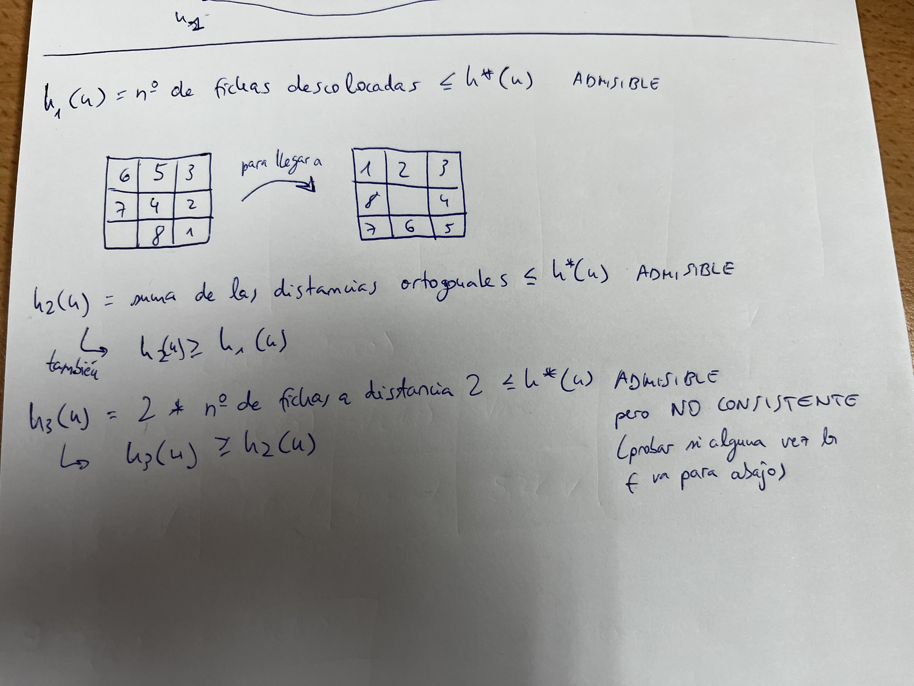

- Se refiere a lo contrario de búsqueda a ciegas
- Los algoritmos de búsqueda heurística se fijan en lo que representan los estados y van a definir las funciones f en función del contenido de esos estados.

# Introducción

- **Heurístico**: estrategia de resolución de problemas que usa conocimiento específico sobre esos problemas

## Clases de problemas

### P
- Problemas fáciles, que se resuelven con algoritmos de complejidad polinomial
### NP
- Son problemas no deterministas polinomiales, es decir, si nos dan una solución, podemos determinar en tiempo polinomial el coste de dicha solución
### NP-duros y NP-completos
- Nadie encontró un algoritmo polinomial que los resuelva de forma exacta. Son difíciles de resolver

# El algoritmo A*

- La función h la tenemos que definir nosotros
- g*(inicial) = 0, por ello: f*(inicial) = h*(inicial)
- g(n) es una función que se define en los nodos que vamos encontrando con valor n.PATH-COST
- h(n) es el heurístico donde dado un nodo nos dé una estimación de lo que va a costar hacer la solución con dicho nodo

## Ejemplos de herurísticos

## Propiedades de la función h importantes a recordar

- Una **h bien definida** ha de cumplir: 
	- h(n) >= 0 para todo n
	- h(obj) = 0 (h para cualquier objetivo es 0)
- Un heurístico es **admisible** si:
	- h(n) <= h*(n) para todo n
	- La consecuencia es que A*(h) es admisible (**admisibilidad**)
	- Una h que vale siempre es aquel que h(n) = 0
- Si tenemos dos heurísticos para el mismo problema que cumplen:
	- h1(n) <= h2(n) <= h*(n) para todo n
	- h2 domina o está más informado que h1 porque está más cerca de h* (**dominancia**)
	- Resulta que A*(h2) expande menos nodos que A*(h1)
- **Monotonía o consistencia**:

## Propiedades formales del Algoritmo A*

## Admisibilidad

## Admisibilidad (Condiciones de expansión)

- Al expandir el nodo, si f(child) > C >= C*, podemos prescindir de ese nodo

## Dominancia

## Consistencia y monotonía

## Consistencia y monotonía (Consecuencias)

- Dominancia amplia también se conoce como **dominancia no estricta**
- g(n) es el coste acumulado
- h(n) es el coste actual del nodo expandido
- f(n) = g(n) + h(n)

# Diseño de heurísticos

## Estimación de cotas inferiores razonando a partir del conocimiento del problem

- Para probar si un heurístico **no es consistente**, ver si la gráfica de la f va hacia arriba y hacia abajo constantemente

## El método de la Relajación del Problema

## Aplicación del método de la Relajación del problema al problema del 8-puzzle

## Aplicación del método de la Relajación del problema al problema TSP

- TSP = problema del viajante de comercio
- Esto es el problema que representa un estado intermedio

## Aplicación al problema TSP (forma de las soluciones del problema real y de los problemas relajados)

- El grafo residual es el grafo de conexiones quitando las ciudades visitadas intermedias y los lazos entre medias (los azules oscuros representan el grafo relajado)
- Estamos pensando en estados
- El problema que representa un estado es ir desde la ciudad final hasta el inicial 
- Las líneas rojas son los caminos de coste mínimo

## Aprendizaje de heurísticos

## Ejemplo de uso de regresión en el 15-puzzle

